# Desafio
Foi pedido a criação de um Script no Linux, ***processamento_de_vendas.sh***, que: *Cria um diretório chamado vendas, cria um subdiretório chamado backup, faça uma copia do arquivo* **dados_de_vendas.csv** *para o subdiretório backup e renomear o arquivo para* **dados-yyyymmdd.csv** *e, dentro do diretorio backup, renomea-lo para* **backup-dados-yyyymmdd.csv**. *Dentro da pasta* **backup** *criar um arquivo* **relatorio.txt** *que contenha:*
- data do sistema atual: yyyymmdd
- data do primeiro registro
- data do ultimo registro
- quantidade total de intens diferentes vendidos
- mostrar as 10 primwiras linhas do arquivo **backup-dados-yyyymmdd.csv**

Compactar os arquivos **backup-dados-yyyymmdd.csv** e **dados_de_vendas.csv** em ***.zip*** e apagar o arquivo **backup-dados-yyyymmdd.csv** do diretorio ***backup*** e o **dados_de_vendas.csv** do diretorio ***vendas***.

Agendar uma execução de quatro dias no crontab às 15:27 h 

Ao final, criar outro Script ***consolidados_de_processamento_de_vendas.sh*** que una todos os relatorios gerados. Apos a execução dos 4 dias do ***processamento_de_vendas.sh***, executar esse Script manualmente para unir os relatorios gerados

### Na pasta ```dados_de_vendas_alteracao.csv``` está todas as alterações realizadas na pasta ```dados_de_vendas.csv``` ao decorrer do desafio

# Etapa 1
Criando o código do executavel ***processamento_de_vendas.sh***
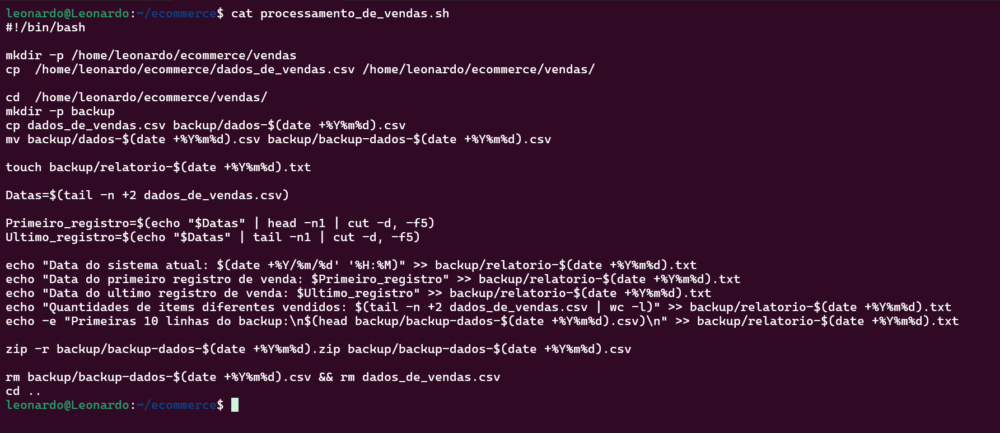
esse Script faz:
- cria uma pasta **vendas** dentro da pasta **ecommerce** e copia o arquivos **dados_de_vendas.csv** para ela
- Entra no diretorio vendas, cria o subdiretorio backup, copia e renomeia o arquivo **dados_de_vendas** para **backup-dados-yyyymmdd**
- Cria um relatorio com a data atual ***relatorio-yyyymmdd.txt***
- e preenche esse relatorio com as seguntes ações
    - Data atual do sistema.
    - Primeiro e ultimo registro de venda.
    - Quantidade de items diferentes vendidos.
    - Primeiras 10 (dez) linhas do arquivo **backup-dados-yyyymmdd**.

- Apos isso, zipa o arquivo **backup-dados-yyyymmdd** para **backup-dados-yyyymmdd.zip**

- E remove os arquivos **backup-dados-yyyymmdd** e **dados_de_vendas.csv** do diretorio **vendas**

## Modelo do Primeiro relatorio criado
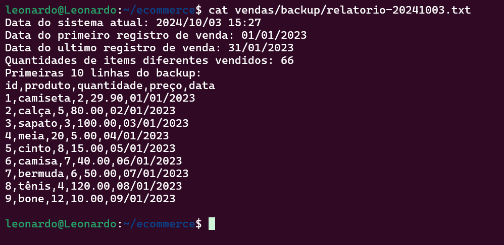
Assim fica os relatorios devidamente preenchidos. Também foram criados mais 3 relatorios com a alteração do arquivos **dados_de_vendas.csv**.
# Etapa 2
Apos a primeira execução, temos de mudar os dados do arquivo **dados_de_vendas.csv** manualmente, para novos items vendaveis.

## Mudanças no arquivo dados_de_vendas
#### arquivo original
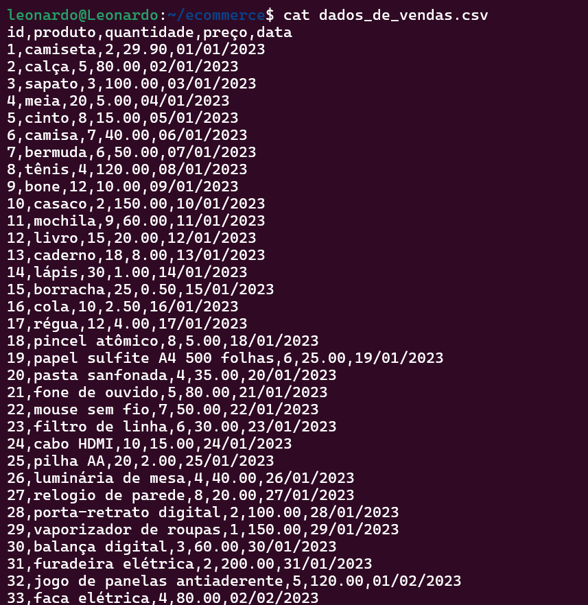
#### Primeira mudança (Instrumentos musicais e afins)
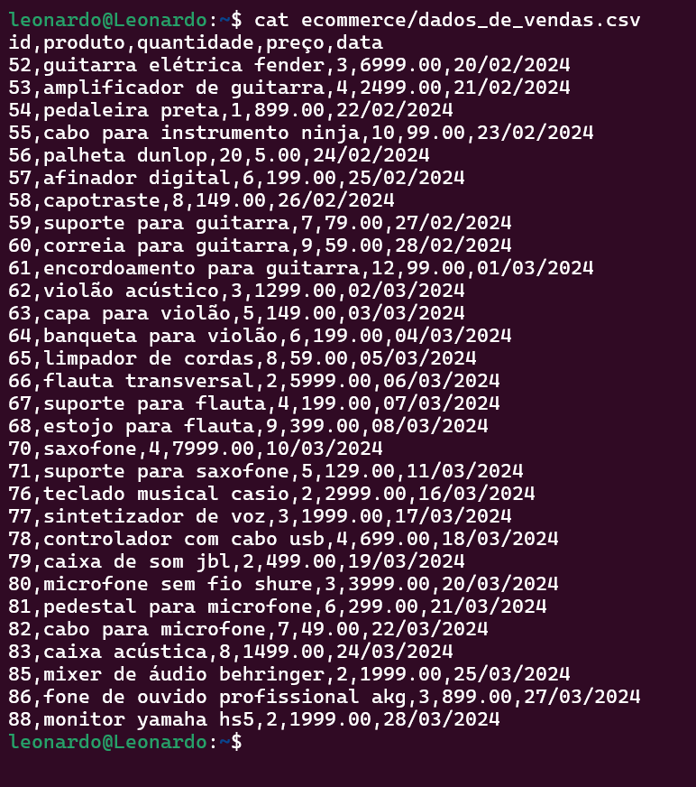
#### Segunda mudança (Cesta basica)
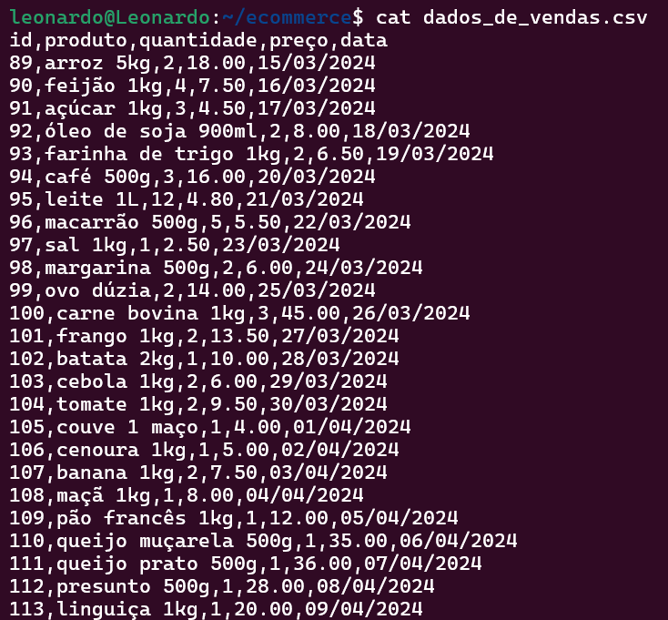
#### Terceira e ultima mudança (PC's e itens relacionado a tecnologia)
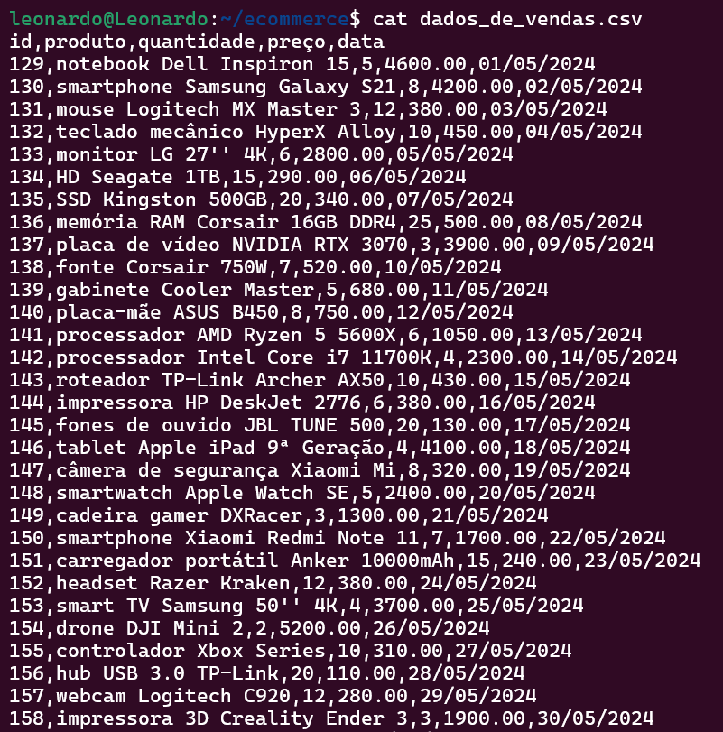
# Etapa 3
Conseguinte, também foi criado mais relatorios com cada uma das mudanças a cima informadas

### Relatorio criado com itens de instrumentos musicais e afins
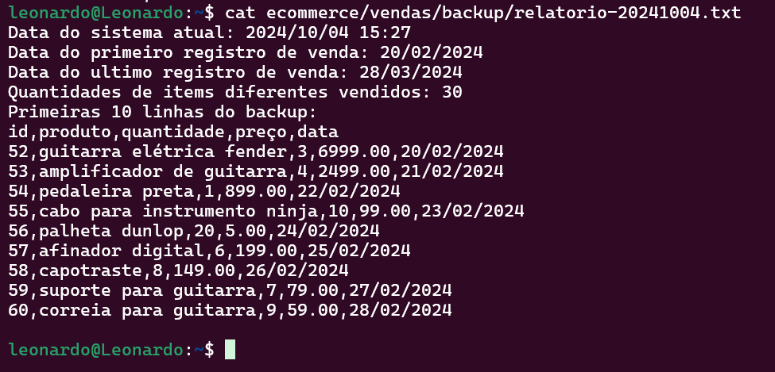
### Relatorio criado com itens de cesta basica
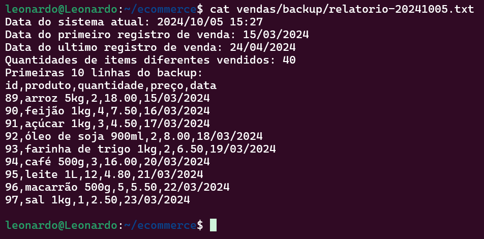
### Relatorio criado com itens de tecnologia e afins
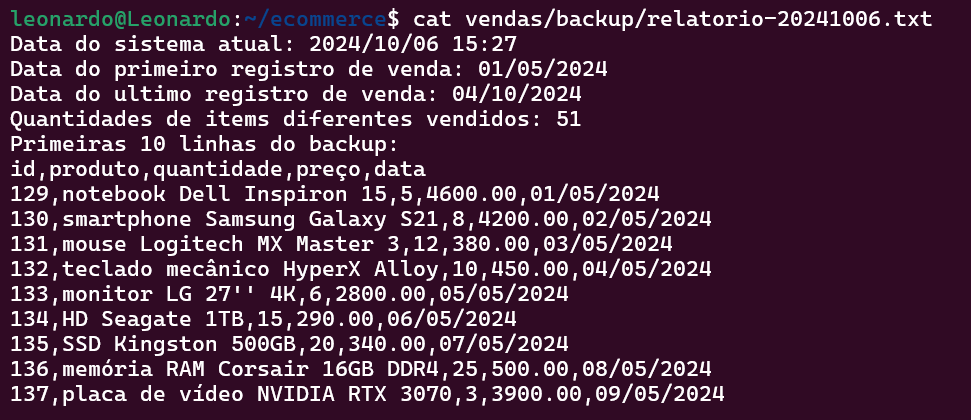
Contando com o ```Modelo do primeiro relatorio``` são 4 no total.
# Etapa 4
Para essa etapa, tivemos que automatizar o script. Para isso foi agendado um horario no crontab, para que o Script seja executado de maneira automatica.
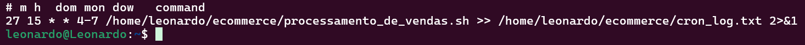 
Esse crontab está agendado para ser execuar o script ```processamento_de_dados.sh``` na seguinte formatação: às 15:27 horas, em qualquer dia do mes, em qualquer mes, entre os dias da semana de quarta à domingo'.
``` 
crontab 27 15 * * 4-7 /home/leonardo/...
```
# Etapa 5
Apos as 4 execuções, deve-se criar um executavel chamado **consolidador_de_processamentos_de_vendas.sh** que irá unir todos os 4 relatorios em um arquivo ***relatorio_final.txt***

### Código do consolidador
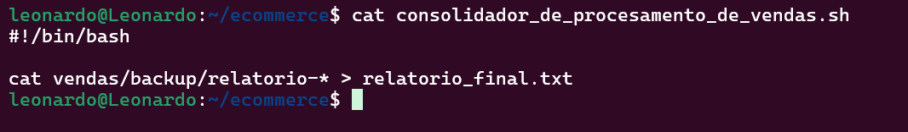
Esse código pega todos os arquivos relatorios- (idependente do que vier depois do " - ") e armazena no arquivo ```relatorio_final.txt```

Parte do **relatorio_final.txt**

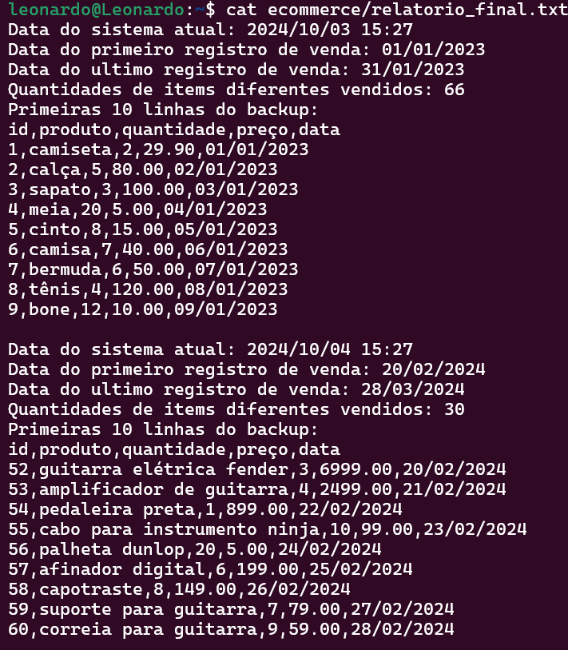

## Criações dos arquivos na pasta ecommerce

Aqui está a criação de cada arquivo visualizada com o ```tree``` na pasta ```ecommerce```

1. Primeira execução do crontab

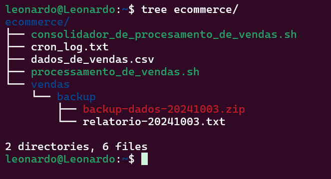

2. Segunda execução do crontab

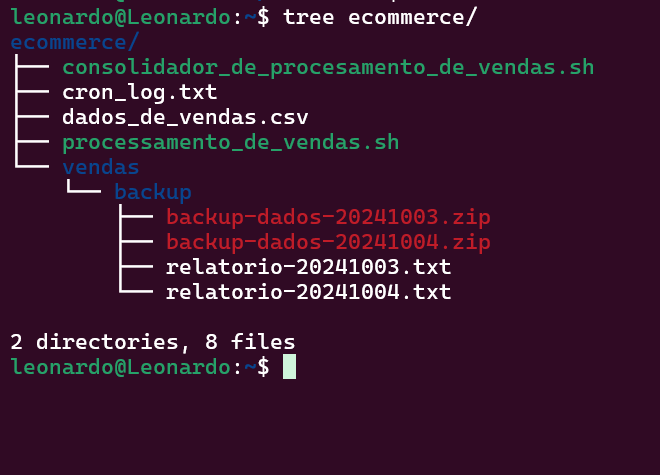

3. Terceira execução do crontab

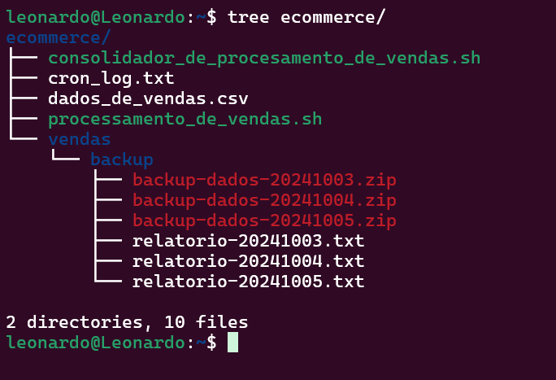

4. Quarta execução do crontab

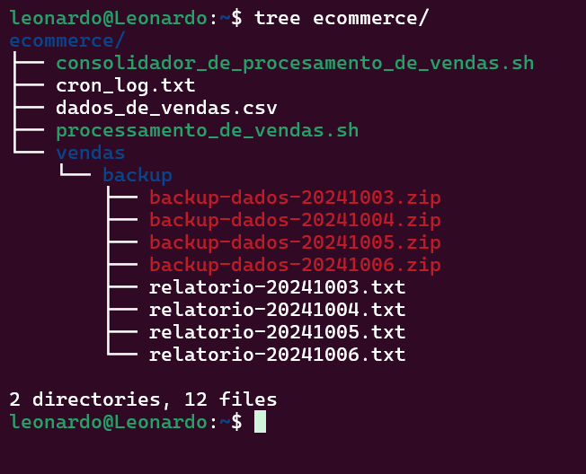

5. Criação do ```relatorio_final.txt``` e conclusão do desafio.

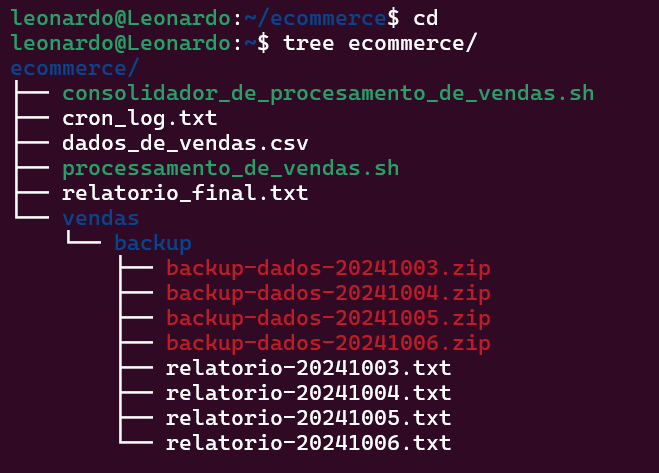
