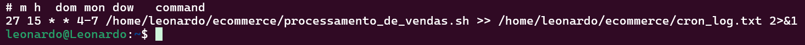
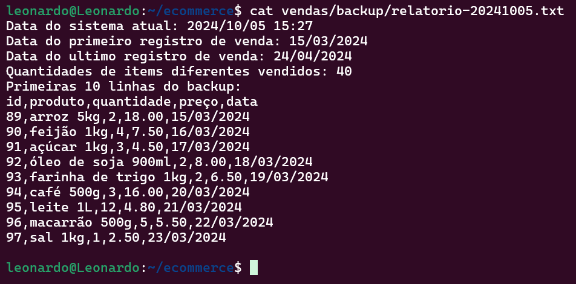
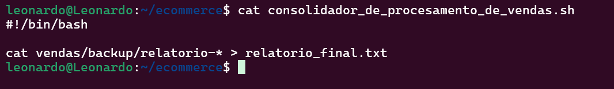

# Sprint 1
Nesta Sprint, foram abordados cursos de Linux, Git e GitHub.
### Resumo
- **Linux**: Foram vistos alguns de seus principais comandos, além de suas respectivas *flags* e como usá-los corretamente. Exemplo: ```mkdir -p```, que, com a flag ```-p```, verifica a existência de um diretório, além de, se necessário, criar estruturas de pastas mais complexas.

- **Git**: Também foram abordados seus principais comandos e flags, como clonar repositórios, fazer commits e, além disso, boas práticas de organização de repositórios pessoais, criação de branches, etc.

# Evidências
### Essas evidências estão relacionadas ao desafio da Sprint 1.
[Clique aqui](https://github.com/L3onVictor/PB-LEONARDO-OLIVEIRA/tree/main/Sprint1/Desafio) para ver a pasta de desafios com mais detalhes.

Script para gerar relatórios:


Agendamento da execução do script (Crontab):



Pasta **ecommerce**:


### Criação dos relatórios e backups a cada execução
1. Primeira execução no Crontab:


2. Segunda execução no Crontab:


3. Terceira execução no Crontab:


4. Quarta e última execução no Crontab:


### Geração dos relatórios
1. Primeiro relatório:


2. Segundo relatório:


3. Terceiro relatório:



4. Quarto e último relatório gerado:


### Mudanças na pasta **dados_de_vendas.csv**
1. Pasta **dados_de_vendas.csv** sem mudanças:


2. Primeira alteração do arquivo:


3. Segunda alteração:


4. Terceira e última alteração:


Código para gerar o relatório final:



Exibindo parte do **relatorioFinal.txt**:


### Última execução do script junto ao consolidador:


# Exercícios
Não houve exercícios na Sprint 1.

# Certificados
Não houve certificados obrigatórios na Sprint 1.
