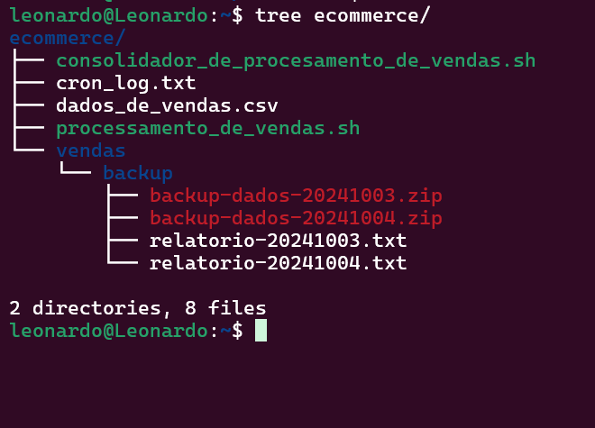
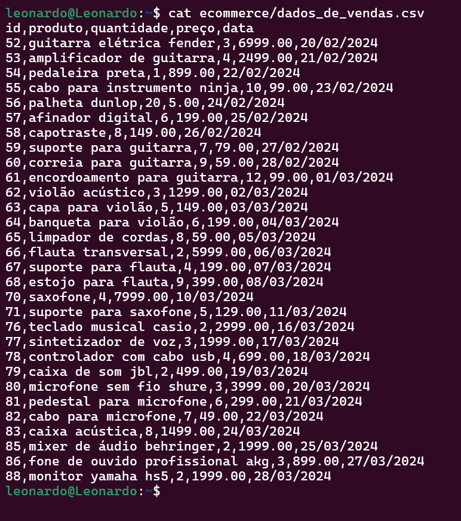

# Sprint 1
Nessa Sprint foi visto Cursos de Linux, Git e github.
### resumo
- **linux**: foi visto alguns de seus principais comandos, além de suas respectivas *flags* e como usa-los corretamente, ex: ```mkdir -p```, que, com a flag ```-p``` verifica a existencia de um repositorio, além de, se necessario, cria estruturas de pastas mais complexas.

- **Git**: Também foi visto seus principais comandos e suas *flags*,clonar repositorios, fazer commits e, também, boas praticas de organização de repositorios pessoais, criação de branchs, etc...
# Evidências
 ### Essas evidências são relacionadas ao desafio da sprint 1.
 [Clique aqui](https://github.com/L3onVictor/PB-LEONARDO-OLIVEIRA/tree/main/Sprint1/Desafio) Para ver a pasta de desafios com mais detalhes

Script para gerar relatorios


Agendamento da execução do script (Crontab)


Pasta **ecommerce**


### Criação dos relatorios e backups a cada execução
1. Primeira execução no contrab


2. Segunda execução do contrab



3. Terceira execução no contrab


4. Quarta e ultima execução no contrab


### Geração dos relatorios

1. Primeiro Relatorio


2. Segundo relatorio


3. Terceiro relatorio


4. Quarto e ultimo relatorio gerado


### Mudanças na pasta **dados_de_vendas.csv**
1. Pasta dados_de_vendas.csv sem mudanças


2. Primeira alteração do arquivo



3. Segunda alteração


4. Terceira e ultima alteração


Código para gerar o relatorio final


Exibindo parte do relatorioFinal.txt


### Ultima execução do script junto ao consolidador

# Exercícios
Não houve exercicios na sprint 1

# Certificados
Não houve certificados na Sprint 1
