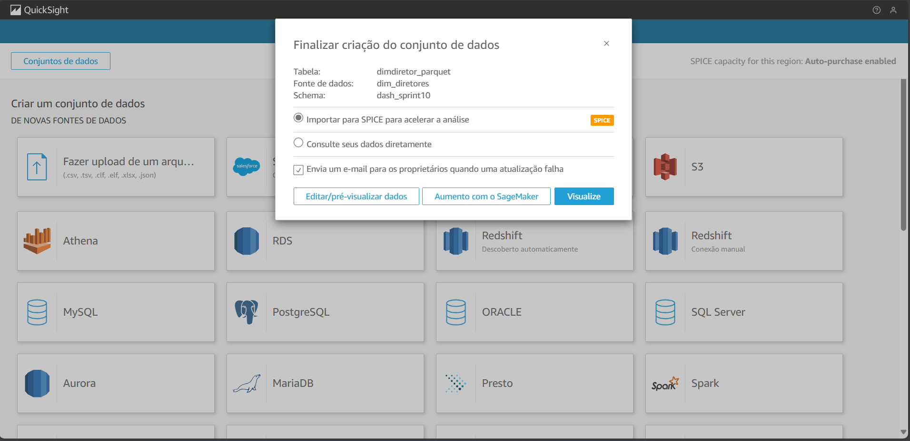

# Desafio 
Nessa Sprint estaremos realizando a ultima entrega do desafio final. Ela consiste em utilizarmos os dados da camada **Refined** para criarmos um dashboard utilizando o *QuickSight* para a elaboração de algumas análise oriunda desses dados.

## Etapa 1 - Criando a conta no QuickSight

Antes de tudo, pesquisaremos, na interfase da AWS, pelo serviço *QuickSight*

Agora, na tela inicial, vamos criar uma conta

Desmarcamos a opção de **Pixel Perfect** para evitarmos custos adicionais e confirmamos

Apôs finalizarmos, a conta é criada com sucesso

## Etapa 2 - Adicionando os dados no QuickSight
Nessa etapa iremos adicionar os dados no QuickSight para que posteriormente realizarmos uma análise com os mesmos

Na tela inicial do QuickSight, no canto superior direito, clicamos em **Nova análise**

Na proxima janela, escolheremos a fonte de onde os dados serão retirados (No nosso caso *Athena*)

Escolhemos o nome da fonte de dados

Selecionamos o banco de dados que contém as tabelas e, em seguida, escolhemos as tabelas que iremos utilizar(Apenas uma por vez)

Aôs isso apertamos em **visualize** para criamor o dash com aqueles dados selecionados anteriormente.

**OBS:** E preciso realizar essa etapa para cada tabela que você queira utilizar no QuickSight

Apôs realizarmos isso com as demais tabelas, iremos realizar os **joins** para referenciarmos as informações e unirmos em uma análise só.

## Etapa 3 - Realizando os joins nas tabelas

Com todas as tabelas já adicionadas ao QuickSight, vamos realizar os *joins* entre elas

No canto esquerto apertaremos em **Adicionar um novo conjunto de dados**

Apôs adicionarmos todas as tabelas voltamos à tela inicial e criaremos um novo conjuto

Agora, iremos realizar os Joins com cada uma das tabelas adicionadas anteriormente. Selecionamos uma chave primaria para servi de chave estrangeira para referenciarmos as demais tabelas

Assim ligando-as entre si

Com isso temos todas as tabelas interligadas e podemos iniciar a análise e a montagem dos graficos

## Etapa 4 - Criação dos gráficos

A criação dos graficos com o QuickSight é bem intuitiva, cabendo apenas selecionarmos os gráficos que queremos usar e as suas metricas, sendo assim, criei um dash que repondesse as seguintes perguntas:

1. Qual a média de **Orçamento** e **Bilheteria** (Orçamento) dos 15 filmes mais populares dos gênero de comédia e animação (15 de cada respectivo gênero)

2. O diretor que dirigiu esse filme, sua note média e o seu orçarmento. O que o orçamento implica nas avaliações dos filmes?

3. Qual o pais que produziu filmes mais populares?

4. Qual o faturamento dos filmes ao decorrer dos anos? 

Com isso o DashBoard acaba ficando da seguinte maneira

O PDF do dash se encontra na pasta [Desafio](../Desafio/dashboard_Leonardo.Oliveira.pdf) caso queira baixa-lo

Com isso o Desafio é finalizado.