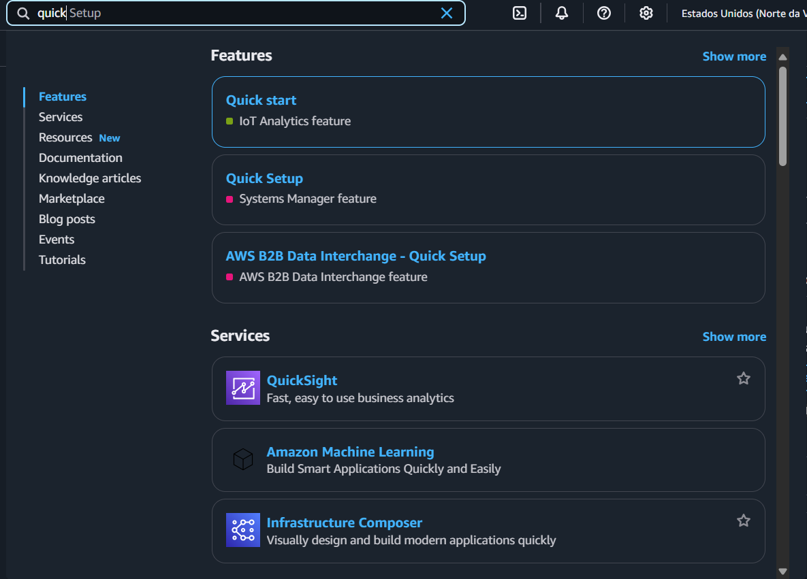
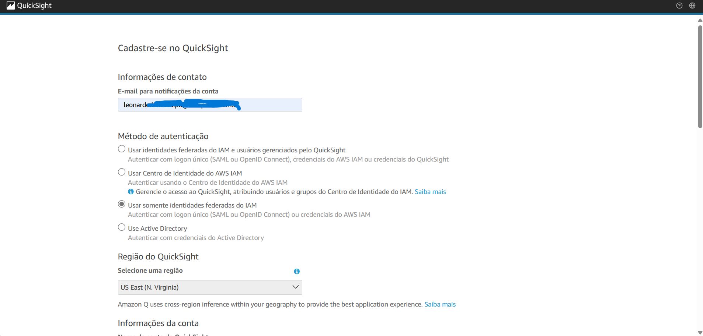
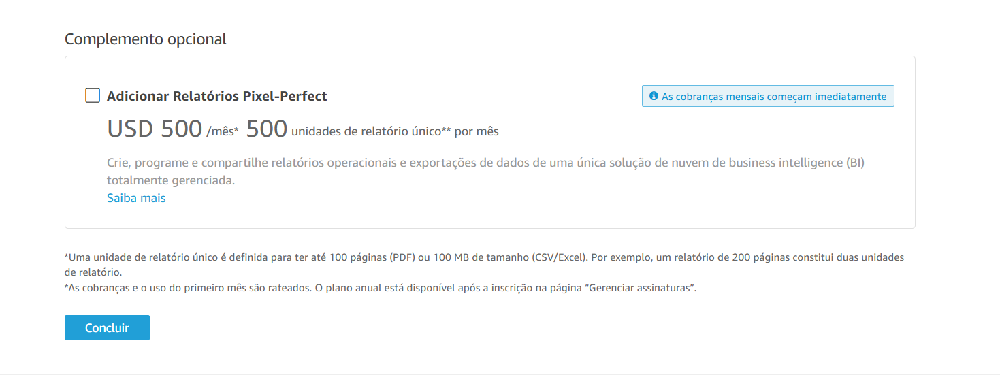
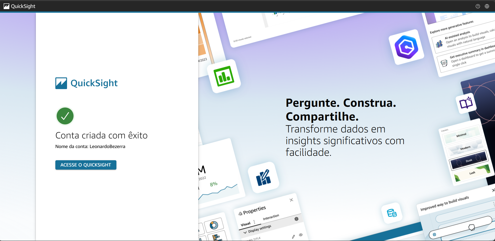
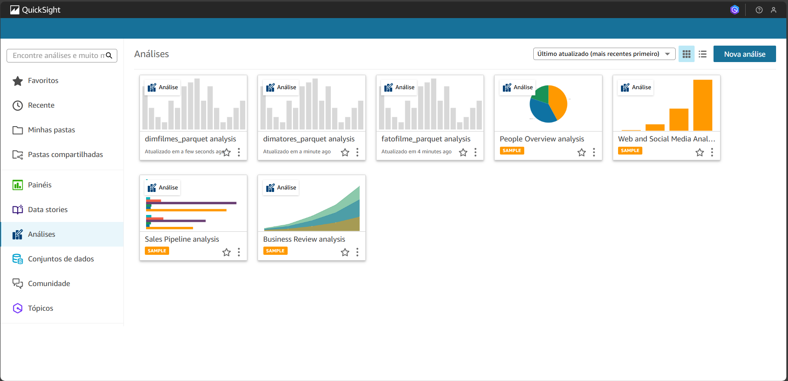
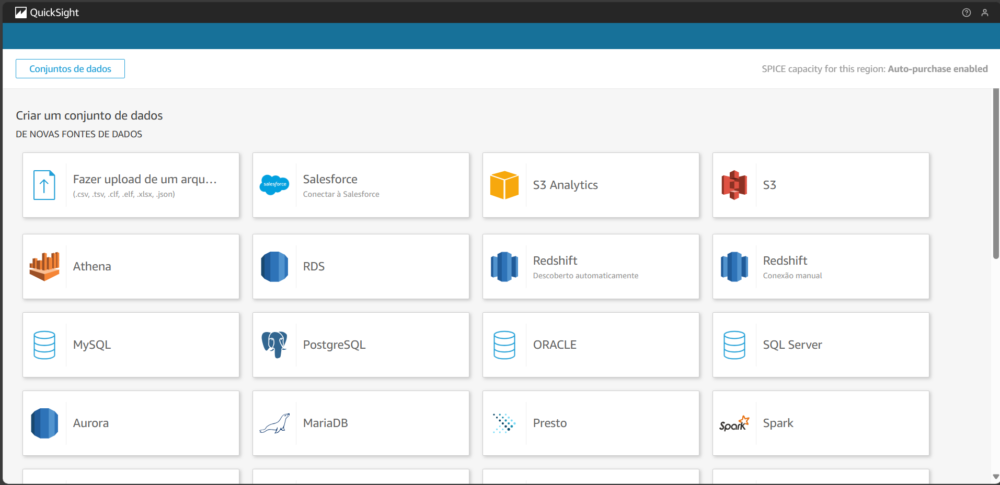
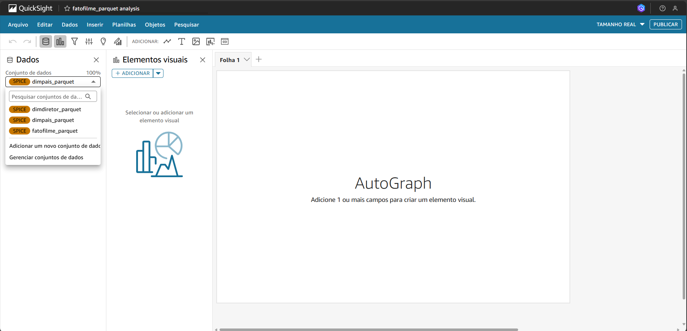
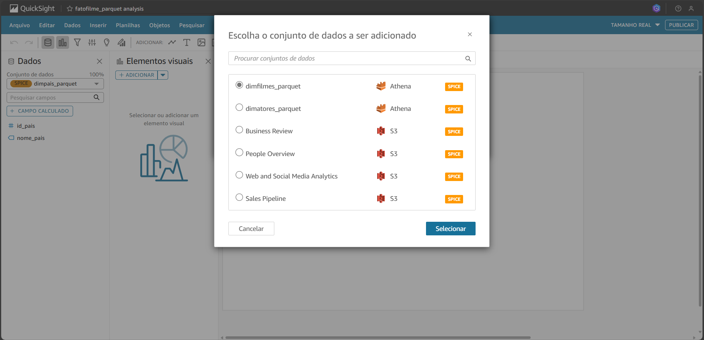
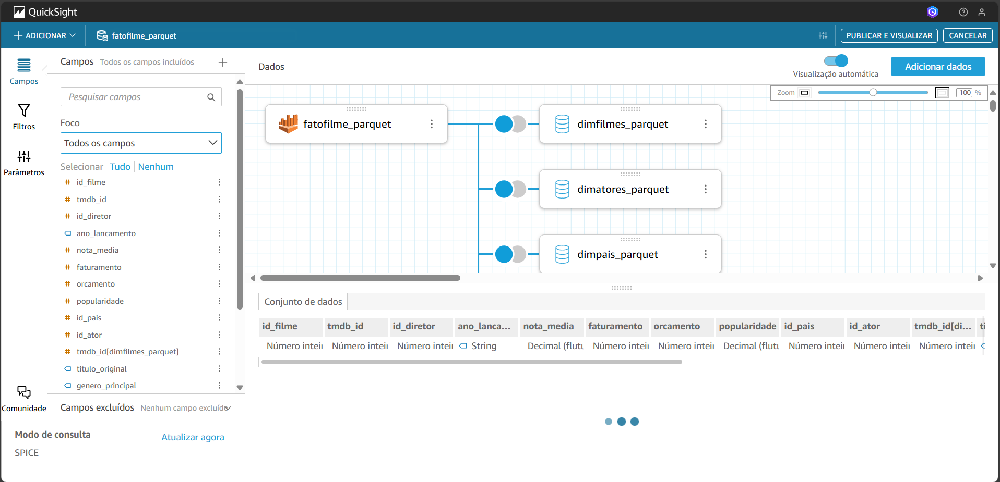
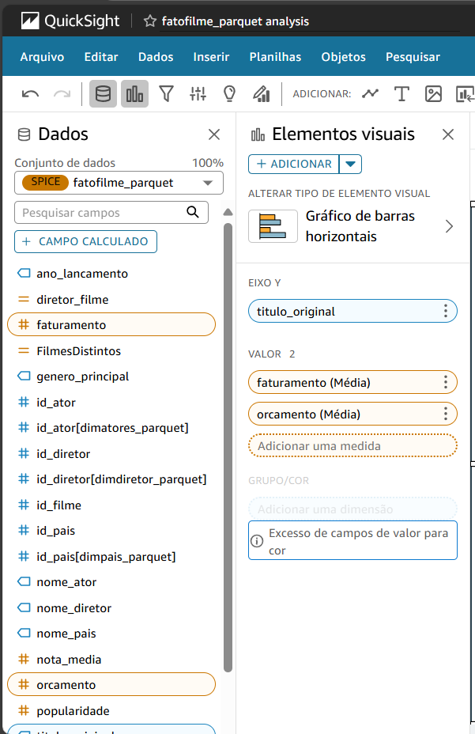

# Sprint 10
Na ultima Sprint, realizaremos, também, a nossa ultima entrega do desafio final. Quinta entrega.

Ela consiste em organizarmos um dashboard com o resultado gerado das Sprints anteriores, utilizando o quicksight da AWS 

### **cursos**
>  Complete Introduction to Amazon QuickSight:
- Entenda o fluxo de uso do QuickSight, desde o carregamento de dados, preparação para análise, agregações, filtros e visualizações, até o compartilhamento do seu relatório com outras pessoas.

- Aprenda como carregar e preparar dados para análise.

- Aprenda a calcular diferentes métodos de agregação - Médias, Valores mais altos, Valores mais baixos e número de Valores Únicos.

- Crie KPIs para exibir métricas-chave.

- Use cálculos de tabela para calcular porcentagens, totais acumulados, classificações e diferenças entre cálculos.

- Use filtros e controles para filtrar visualizações e relatórios com apenas alguns cliques do mouse.

- Crie novos cálculos e campos de dados a partir de fórmulas do QuickSight.

- Crie gráficos poderosos de análise de tendências para ajudar na previsão.

- Aprenda a obter análises poderosas a partir de uma variedade de visualizações e tipos de gráficos.

- Aprenda a criar relacionamentos entre tabelas de dados.

- Crie histórias de dados e altere os temas usados na análise.

- Crie e compartilhe painéis de dados poderosos em minutos.
## Evidências
As evidencias estão relacionadas a pasta [Desafio](./Desafio/) <- Clique aqui para saber mais.

Pesquisando o quicksight na AWS

Tela inicial do quicksight

Criando conta no quicksight

Desmarcando a opção Pixel Perfect

Conta criada com sucesso

Criando análise

Escolhendo a origem do dado

Adicionando dados

Dados adicionados

Adicionando mais conjuntos de dados

Realizando o joins das novas fontes

Joins realizados

Iniciando análise

Dash final

## Exercicios

Não houve exercicios nessa Sprint

## Certificados

Não houve cursos da AWS nessa Sprint