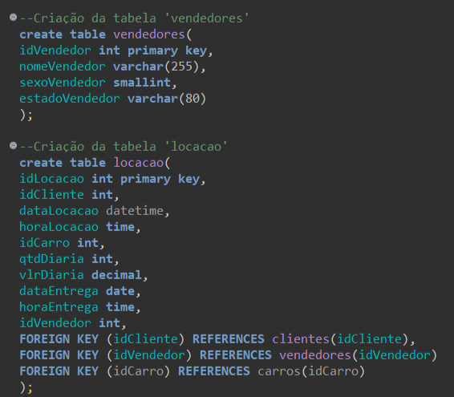
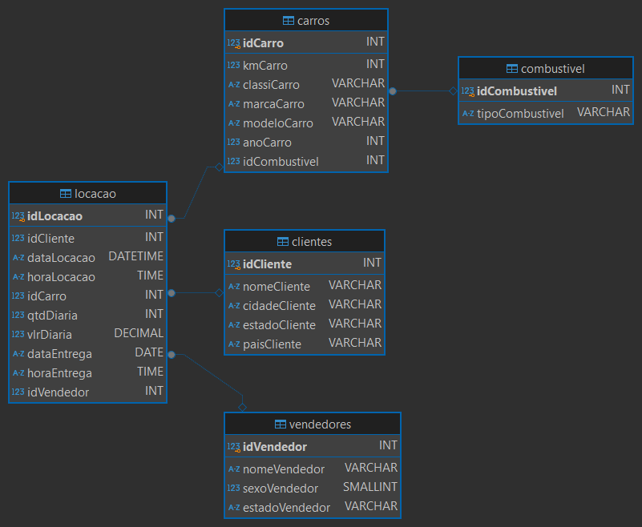
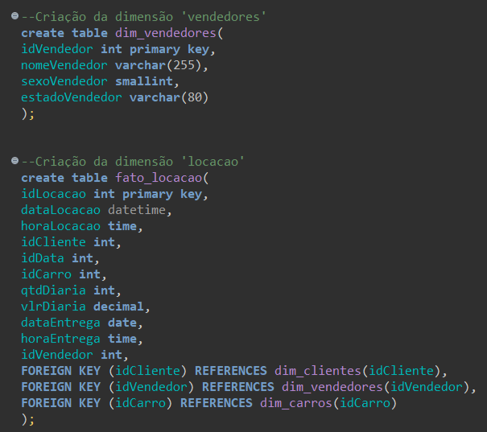
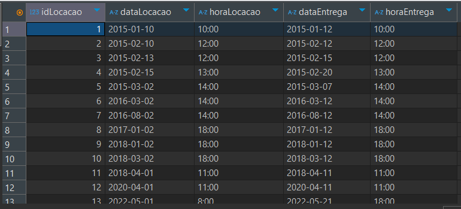
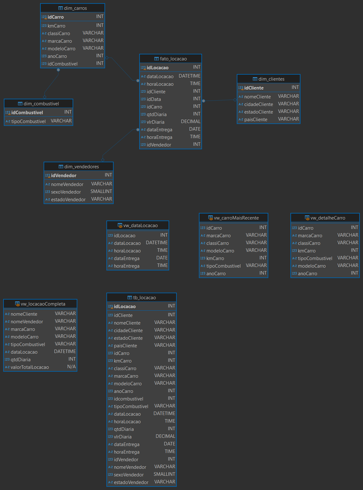

# Desafio 
Foi solicitado a normalização de um banco de dados, a criaçao de um modelo relacional depois de sua normalização e, posteriormente, a elaboração de um modelo dimensional e, também, a criação de um diagrama desse mesmo modelo. As normalizações devem seguir a primeira forma normal (1FN), segunda forma normal (2FN) e a terceira forma normal (3FN). 
Que são, respectivamente:
1. 1FN: Remoção de atributos repetidos.
2. 2FN: Separação de dependências parciais.
3. 3FN: Eliminar dependências transitivas.

Após a normalização, será feito um modelo logico relacional e a criação das tabelas, depois de sua realização, será elaborado dimensões, utilizando essas tabelas anteriormente criadas, e um modelo dimensional, como explicado a cima.
# Etapa 1
Criando as tabelas do modelo relacional: 


- a parte dos ```drop table if exists``` é apenas para manter um script e não dar erro se o codigo for executado por uma segunda vez

Criando a tabela combustivel e carros:


- na tabela **carros** há uma chave estrangeira 
```sql
foreign key (idCombustivel) references combustivel(idCombustivel)
```
- Que serve para conectar a tabela combustivel à tabela carros.

Criando a tabela vendedores e a tabela locação:



- A tabela **locacao** possui algumas chaves estrageiras para fazer a ligação entre as demais tabelas.

Inserções nas tabelas do moledo relacionais:


- Aqui é onde todas as informações da tabela que foi nos fornecida, ***Concecionaria.sqlite***, são passadas para as tabelas normalizadas
- Exemplo:
 ```sql
INSERT INTO clientes (idCliente, nomeCliente, cidadeCliente, estadoCliente, paisCliente)
SELECT idCliente, nomeCliente, cidadeCliente, estadoCliente, paisCliente
FROM tb_locacao
GROUP BY idCliente;
```
- Aqui a tabela **cliente** está recebendo todas as informações (idCliente, nomeCliente, cidadeCliente, estadoCliente, paisCliente) da tabela **tb_locacao** e assim sucessivamente


- na tabela **locacao** 
```sql
INSERT INTO locacao (idLocacao, idCliente, dataLocacao, horaLocacao, idCarro,qtdDiaria,vlrDiaria, dataEntrega, horaEntrega, idVendedor)
SELECT idLocacao, idCliente, date(SUBSTRING(CAST(dataLocacao AS text ), 1, 4) || '-' || 
SUBSTRING(CAST(dataLocacao AS text),5,2) || '-' ||
SUBSTRING(CAST(dataLocacao AS text),7,2)) AS dataLocacao, horaLocacao, idCarro, qtdDiaria, vlrDiaria, 
DATE(SUBSTRING(dataEntrega, 1,4) || '-'|| 
SUBSTRING(dataEntrega,5,2) || '-' ||
SUBSTRING(dataEntrega, 7,2)) AS dataEntrega, horaEntrega, idVendedor
FROM tb_locacao 
GROUP BY idLocacao;
```
- as **substring** estão sendo utilizadas apenas para formatar as datas de maneira mais atrativa, além de popular a tabela locacao com os dados da tabela tb_concecionaria

Diagrama modelo relacional:



- Aqui está o diagrama relacional com todas as normalizações e ligações realizadas.

# Etapa 2
Criação das dimensões clientes, combustivel e carros


- Aqui é criado as dimensões dim_clientes, dim_combustibel e dim_carros, respectivamente.
- o carro também está referenciando o combustivel.

Criação da dimensão vendedor e da tabela fato_locacao


- Aqui a fato também está referenciando as demais tabelas.

Criação do Modelo dimensional


# Etapa 3
Ademais, também elaborei algumas views para o modelo dimensional, que estão junto ao arquivo **Desafio_TabelaDim.sql**

Diagrama das views


## Exemplo de funcionamento das views  

- view para mostrar o carro com o ano mais recente:
```sql
CREATE VIEW vw_carroMaisRecente AS SELECT
idCarro,
marcaCarro,
classiCarro,
modeloCarro,
kmCarro,
comb.tipoCombustivel,
anoCarro
FROM dim_carros AS carro LEFT JOIN dim_combustivel AS comb
ON carro.idCombustivel = comb.idCombustivel
ORDER BY carro.anoCarro DESC 
LIMIT 1;
```


- view para mostrar todas as datas das locacoes
```sql
CREATE VIEW vw_dataLocacao AS SELECT 
idLocacao,
dataLocacao,
horaLocacao,
dataEntrega,
horaEntrega
FROM fato_locacao;
```


    
    - Aqui as datas estão formadatas com o uso do substring, já explicado anteriormente.

- View para mostrar detalhes de todos os carros cadastrados
```sql
CREATE view vw_detalheCarro AS SELECT 
idCarro,
marcaCarro,
classiCarro,
kmCarro,
combustivel.tipoCombustivel,
modeloCarro,
anoCarro
FROM dim_carros AS carro LEFT JOIN dim_combustivel AS combustivel
ON carro.idCombustivel = combustivel.idCombustivel;
```


- por ultimo, a view para mostrar as locações realizadas
```sql
CREATE VIEW vw_locacaoCompleta AS SELECT 
    cliente.idCliente,
	cliente.nomeCliente,
	vendedor.idVendedor,
    vendedor.nomeVendedor,
    fato.idLocacao,
    carro.marcaCarro,
    carro.modeloCarro,
    comb.tipoCombustivel,
    fato.dataLocacao,
    fato.qtdDiaria,
    (fato.qtdDiaria * fato.vlrDiaria) AS valorTotalLocacao
FROM fato_locacao AS fato
JOIN dim_clientes AS cliente ON fato.idCliente = cliente.idCliente
JOIN dim_vendedores AS vendedor ON fato.idVendedor = vendedor.idVendedor
JOIN dim_carros as carro ON fato.idCarro = carro.idCarro
JOIN dim_combustivel AS comb ON carro.idCombustivel = comb.idCombustivel;
```


# Etapa 4

### Aqui estão todos os diagramas (Completos) gerados e os arquivos com as querys para suas determinadas tabelas.

Diagrama relacional


- [Script da normalização](Desafio_NormalizacaoTabela.sql)

Diagrama dimensional e conclusão do desafio.


- [Script do modelo relacional](Desafio_TabelaDim.sql)