# Sprint 2
Nessa Sprint foi visto a linguagem **SQL** e consecitos de **modelagem de dados**

### Resumo
- **SQL:** Foram vistos varios conceitos de ***SGBD*** (Sistema de Gerenciamento de Banco de Dados), comandos basicos, funções agregadas, manipulações de tabelas, criações, inserções e uniões das mesmas etc...

- **Modelagem de dados:** Também foi mostrado conceitos basicos, tipos de modelagens (relacional e dimensional, além de suas caracteristicas e usabilidades), **ETL** e **ELT** (Extractn transform and load e Extract Load and Transport, respectivamentes), que são conseitos de exportação de tabelas, dentre outros topicos abordadeos.

# Evidências
### Essas evidências estão relacionadas ao desafio da Sprint 2.
[Clique aqui](Desafio) para ver a pasta de desafios com mais detalhes.

Diagrama Modelo dimensional:

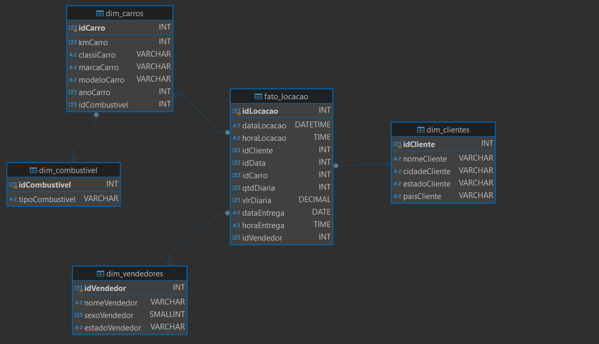

Views do modelo dimensional:

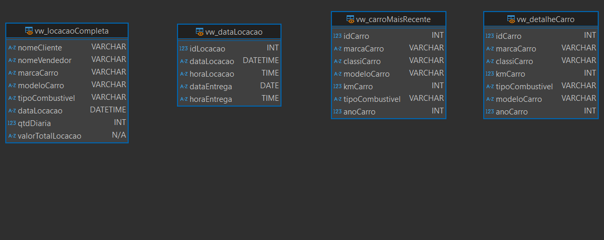

Diagrama Modelo relacional:

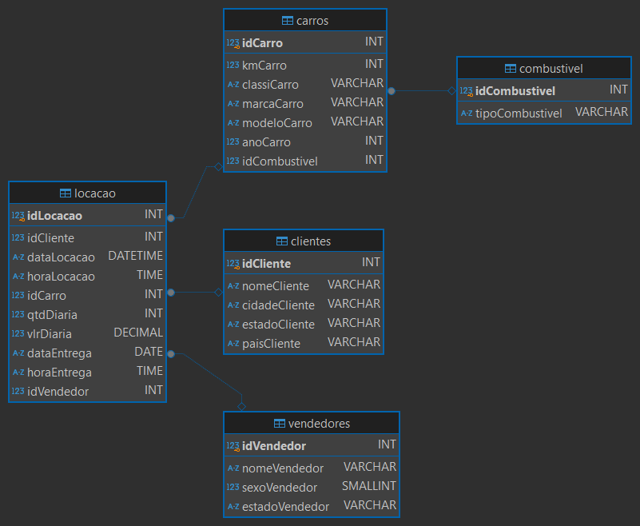

Criação da tabela cliente:

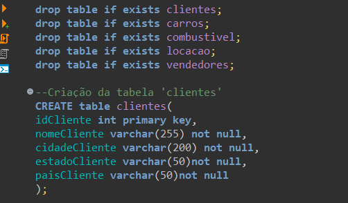

Criação das tabelas Combustivel e carros:

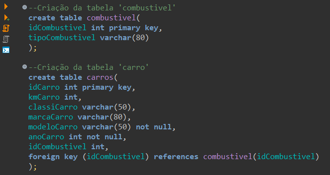

Criação das tabelas vendendores e locacao:

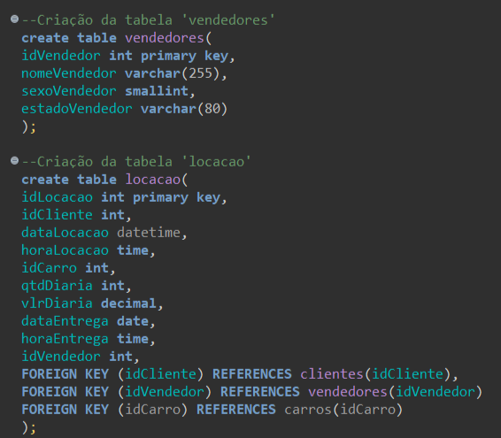

Inserindo dados nas tabelas do modelo relacional:

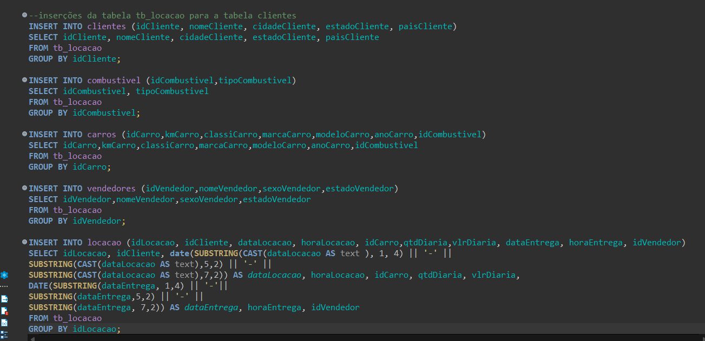

Criando a dimensão cliente, combustivel e carro:

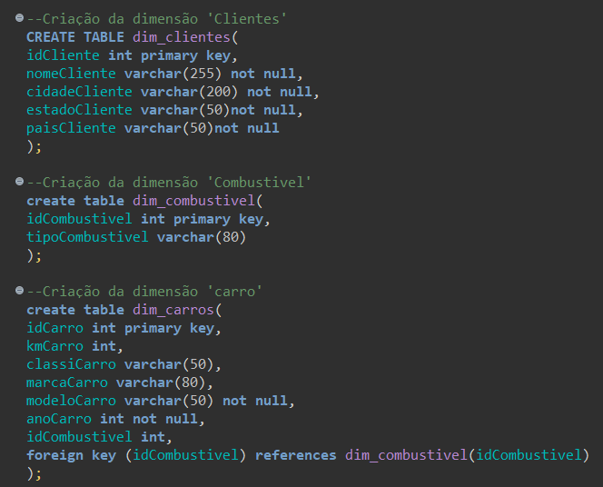

Criando a dimensão vendedores e a tabela fato_locacao:

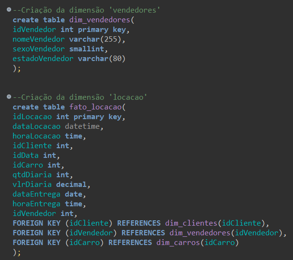

Inserindo dados na dimensões:

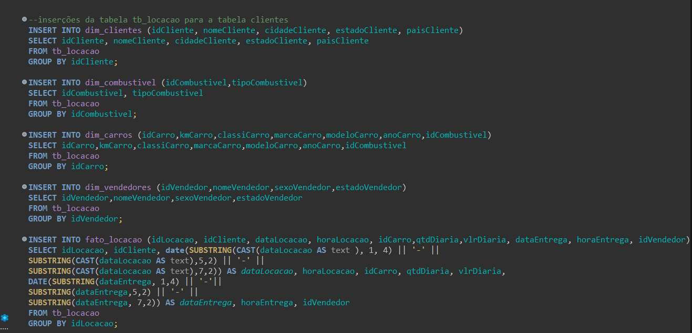

View do detalhes de carros:

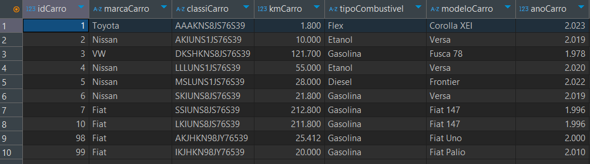

View do carro mais novo:

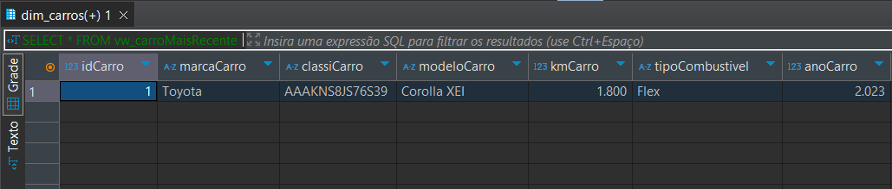

View das datas de todas as Locações:

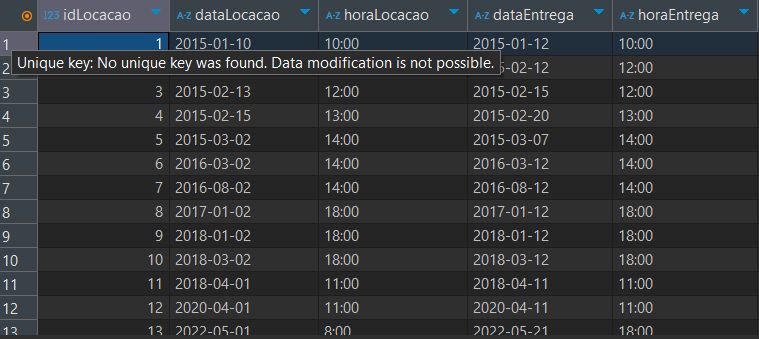

View de todas as locações realizadas:

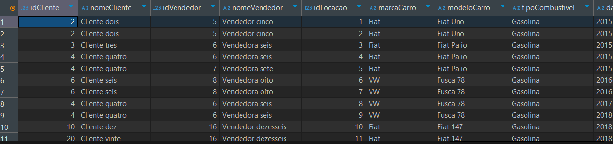

Diagrama Relacional completo:

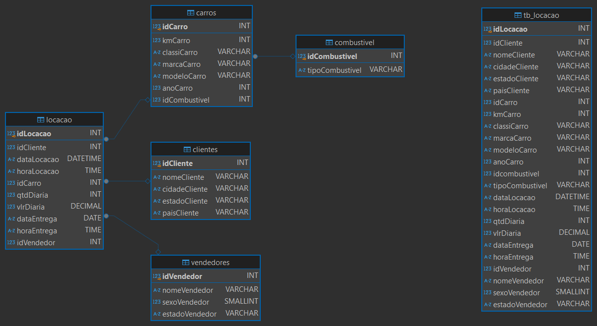

Modelo dimensional completo:

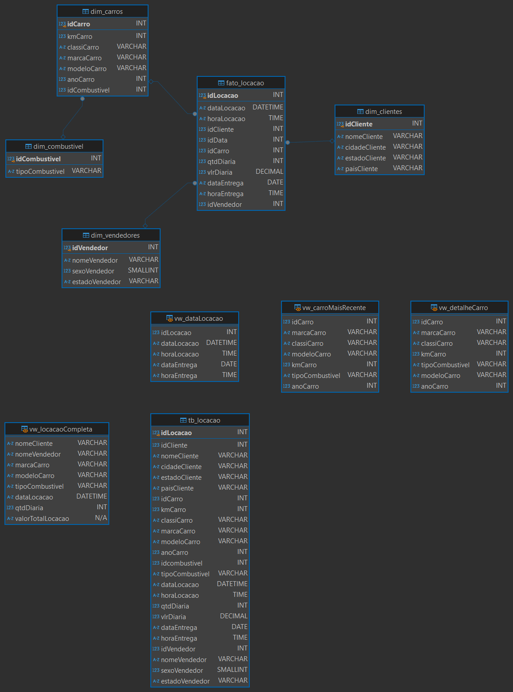

# Exercicios
- Do 1 ao 7 são relacionados ao exercicios do arquivo **biblioteca.sqlite**
1. Exercicio:

> E01:
 Apresente a query para listar todos os livros publicados após 2014. Ordenar pela coluna cod, em ordem crescente, as linhas.  Atenção às colunas esperadas no resultado final: cod, titulo, autor, editora, valor, publicacao, edicao, idioma.

Código: 
``` SQL
SELECT * from livro
WHERE publicacao > '2015-*-*'
ORDER by cod
```

[Aquivo do exercicio 01](exercicios/E01.sql)

2. Exercicio:

> E02:
Apresente a query para listar os 10 livros mais caros. Ordenar as linhas pela coluna valor, em ordem decrescente.  Atenção às colunas esperadas no resultado final:  titulo, valor.

Código:
```sql
select titulo, valor from livro
order by valor desc LIMIT 10
```
[Aquivo do exercicio 02](exercicios/E02.sql)

3. Exercicio:
> E03:
 Apresente a query para listar as 5 editoras com mais livros na biblioteca. O resultado deve conter apenas as colunas quantidade, nome, estado e cidade. Ordenar as linhas pela coluna que representa a quantidade de livros em ordem decrescente.

Código:
 ```sql
SELECT count(livro.cod) as quantidade, nome, endereco.estado, endereco.cidade
from editora inner join livro on editora.codeditora = livro.editora
inner join endereco on endereco.codendereco = editora.endereco
group by editora.codeditora, editora.nome, endereco.estado, endereco.cidade
order by quantidade desc limit 5
```
[Aquivo do exercicio 03](exercicios/E03.sql)

4. Exercicio:
> E04:
Apresente a query para listar a quantidade de livros publicada por cada autor. Ordenar as linhas pela coluna nome (autor), em ordem crescente. Além desta, apresentar as colunas codautor, nascimento e quantidade (total de livros de sua autoria).

Código: 
```sql
select nome, codautor, nascimento, count(livro.cod) as quantidade
from autor left join livro on autor.codautor = livro.autor
GROUP by autor.nome
order by autor.nome
```
[Aquivo do exercicio 04](exercicios/E04.sql)

5. Exercicio:
> E05:
Apresente a query para listar o nome dos autores que publicaram livros através de editoras NÃO situadas na região sul do Brasil. Ordene o resultado pela coluna nome, em ordem crescente. Não podem haver nomes repetidos em seu retorno.

Código: 
```sql
select autor.nome 
from livro 
inner join autor on autor.codautor = livro.autor 
INNER join editora on editora.codeditora = livro.editora 
INNER join endereco on editora.endereco = endereco.codendereco 
where endereco.estado not in ('PARANÁ', 'RIO GRANDE DO SUL')
GROUP by autor.nome
order by autor.nome 
```
[Aquivo do exercicio 05](exercicios/E05.sql)

6. Exercicio:
> E06 :
Apresente a query para listar o autor com maior número de livros publicados. O resultado deve conter apenas as colunas codautor, nome, quantidade_publicacoes.

Código:
```sql
select codautor, nome, count(livro.titulo) as quantidade_publicacoes
from autor left join livro on autor.codautor = livro.autor 
GROUP by codautor 
order by quantidade_publicacoes desc 
limit 1
```
[Aquivo do exercicio 06](exercicios/E06.sql)

7. Exercicio:
> E07:
Apresente a query para listar o nome dos autores com nenhuma publicação. Apresentá-los em ordem crescente.

Código:
```sql
select nome
from autor left join livro on autor.codautor = livro.autor 
GROUP by codautor 
having count(livro.titulo) = 0
order by nome
```
[Aquivo do exercicio 07](exercicios/E07.sql)

- Os exercicios do 8 ao 16 são relacionados ao arquivo **Loja.sqlite**

8. Exercicio:
> E08:
Apresente a query para listar o código e o nome do vendedor com maior número de vendas (contagem), e que estas vendas estejam com o status concluída.  As colunas presentes no resultado devem ser, portanto, cdvdd e nmvdd.

Código:
```sql
select tbvendas.cdvdd, tbvendedor.nmvdd 
from tbvendedor left join tbvendas on tbvendedor.cdvdd = tbvendas.cdvdd
and tbvendas.status = 'Concluído'
group by tbvendedor.nmvdd 
order by count(tbvendas.cdpro) DESC 
limit 1
```
[Aquivo do exercicio 08](exercicios/E08.sql)

9. Exercicio:
> E09:
Apresente a query para listar o código e nome do produto mais vendido entre as datas de 2014-02-03 até 2018-02-02, e que estas vendas estejam com o status concluída. As colunas presentes no resultado devem ser cdpro e nmpro.

Código:
```sql
SELECT cdpro, nmpro from tbvendas
where status = 'Concluído' and dtven BETWEEN '2014-02-03' and '2018-02-02'
group by cdpro, nmpro 
order by COUNT(cdpro) DESC 
limit 1
```
[Aquivo do exercicio 09](exercicios/E09.sql)

10. Exercicio:
> E10:
A comissão de um vendedor é definida a partir de um percentual sobre o total de vendas (quantidade * valor unitário) por ele realizado. O percentual de comissão de cada vendedor está armazenado na coluna perccomissao, tabela tbvendedor. 
>
> Com base em tais informações, calcule a comissão de todos os vendedores, considerando todas as vendas armazenadas na base de dados com status concluído.
>
> As colunas presentes no resultado devem ser vendedor, valor_total_vendas e comissao. O valor de comissão deve ser apresentado em ordem decrescente arredondado na segunda casa decimal.

Código:
```sql
select tbvendedor.nmvdd as vendedor, 
SUM(tbvendas.qtd * tbvendas.vrunt) as valor_total_vendas,
round(SUM((tbvendas.qtd * tbvendas.vrunt) * (tbvendedor.perccomissao / 100.0)), 2) as comissao
from tbvendedor left join tbvendas 
on tbvendedor.cdvdd = tbvendas.cdvdd 
and tbvendas.status = 'Concluído'
group by tbvendedor.nmvdd
order by comissao desc
```
[Aquivo do exercicio 10](exercicios/E10.sql)

11. Exercicio:
> E11:
Apresente a query para listar o código e nome cliente com maior gasto na loja. As colunas presentes no resultado devem ser cdcli, nmcli e gasto, esta última representando o somatório das vendas (concluídas) atribuídas ao cliente.

Código:
```sql
select nmcli, cdcli, SUM(vrunt*qtd) as gasto
from tbvendas
where status = 'Concluído'
group by cdcli 
order by gasto desc limit 1
```
[Aquivo do exercicio 11](exercicios/E11.sql)

12. Exercicio:
> E12:
Apresente a query para listar código, nome e data de nascimento dos dependentes do vendedor com menor valor total bruto em vendas (não sendo zero). As colunas presentes no resultado devem ser cddep, nmdep, dtnasc e valor_total_vendas.
>
>
> Observação: Apenas vendas com status concluído.

Código:
```sql
select tbdependente.cddep, tbdependente.nmdep, tbdependente.dtnasc,
sum(tbvendas.qtd*tbvendas.vrunt) as valor_total_vendas
	from tbvendedor inner join tbdependente
		on tbvendedor.cdvdd = tbdependente.cdvdd
		left join tbvendas on tbvendedor.cdvdd = tbvendas.cdvdd
		where tbvendas.status = 'Concluído'
		group by tbdependente.cddep 
		HAVING valor_total_vendas <> 0
		order by valor_total_vendas limit 1
```
[Aquivo do exercicio 12](exercicios/E12.sql)

13. Exercicio:
> E13:
Apresente a query para listar os 10 produtos menos vendidos pelos canais de E-Commerce ou Matriz (Considerar apenas vendas concluídas).  As colunas presentes no resultado devem ser cdpro, nmcanalvendas, nmpro e quantidade_vendas.

Código:
```sql
select cdpro, 
nmcanalvendas, 
nmpro, 
SUM(qtd) as quantidade_vendas 
from tbvendas
where tbvendas.status = 'Concluído'
group by cdpro, nmcanalvendas, nmpro 
order by quantidade_vendas limit 10
```
[Aquivo do exercicio 13](exercicios/E13.sql)

14. Exercicio:
> E14:
Apresente a query para listar o gasto médio por estado da federação. As colunas presentes no resultado devem ser estado e gastomedio. Considere apresentar a coluna gastomedio arredondada na segunda casa decimal e ordenado de forma decrescente.
>
> Observação: Apenas vendas com status concluído.

Código:
```sql
select estado, ROUND(avg(qtd*vrunt), 2) as gastomedio
from tbvendas
where status = 'Concluído'
group by estado 
order by gastomedio desc
```
[Aquivo do exercicio 14](exercicios/E14.sql)

15. Exercicio:
> E15:
Apresente a query para listar os códigos das vendas identificadas como deletadas. Apresente o resultado em ordem crescente.

Código:
```sql
select cdven 
from tbvendas
where deletado = 1
```
[Aquivo do exercicio 15](exercicios/E15.sql)

16. Exercicio:
> E16:
Apresente a query para listar a quantidade média vendida de cada produto agrupado por estado da federação. As colunas presentes no resultado devem ser estado e nmprod e quantidade_media. Considere arredondar o valor da coluna quantidade_media na quarta casa decimal. Ordene os resultados pelo estado (1º) e nome do produto (2º).
>
> Obs: Somente vendas concluídas.

Código:
```sql
select estado, nmpro, round(avg(qtd), 4) as quantidade_media
from tbvendas 
where status = 'Concluído'
group by estado, nmpro 
order by estado, nmpro 
```
[Aquivo do exercicio 16](exercicios/E16.sql)

### Exercicio II
- 01: Foi pedido uma query que obtenha os 10 livros mais caros e, também, que exportassemos o arquivo para **.csv**

Query: 
```sql
SELECT cod AS CodLivro, 
titulo, 
autor.codautor , 
autor.nome AS NomeAutor, 
Valor,
editora.codeditora , 
editora.nome AS NomeEditora
FROM livro
LEFT JOIN autor  ON autor.codautor = LIVRO.autor
LEFT JOIN editora ON editora.codeditora = LIVRO.editora 
GROUP BY livro.cod, livro.titulo 
ORDER BY LIVRO.valor DESC 
LIMIT 10
```

[Arquivo da query01](exercicios/queryTabela1.sql)

[Arquivo .csv Gerado](exercicios/ExportacaoDados01.csv)

- 02: Na segunda parte do exercicio foi pedido, também, uma query que gerasse as 5 editoras que mais venderam livros.

query:
```sql
select codeditora,
nome as NomeEditora,
count(livro.cod) as QuantidadeLivros
from editora 
left join livro on editora.codeditora = livro.editora
GROUP BY codeditora, nome 
HAVING count(livro.cod) > 0
order by QuantidadeLivros DESC 
limit 5
```

[Arquivo da query02](exercicios/queryTabela2.sql)

[Arquivo .cvs gerado](exercicios/ExportacaoDados2.csv)

# Certificados

