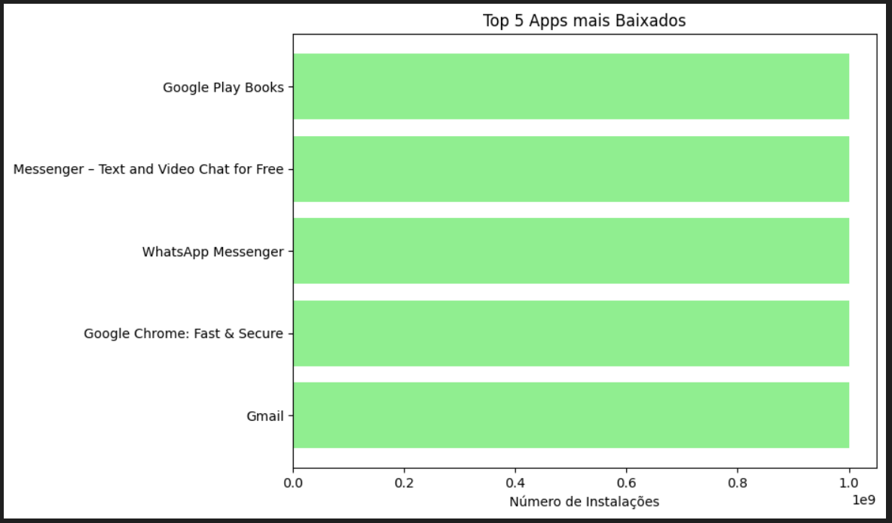
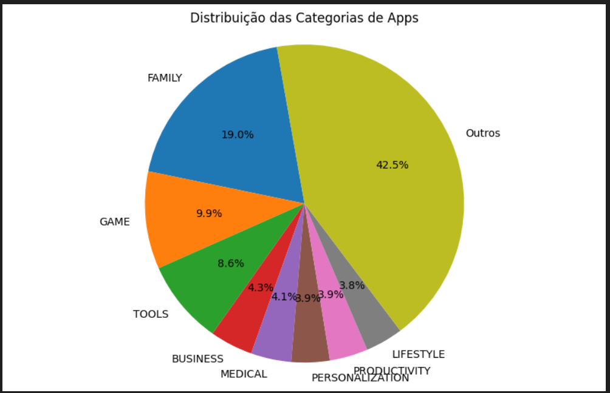
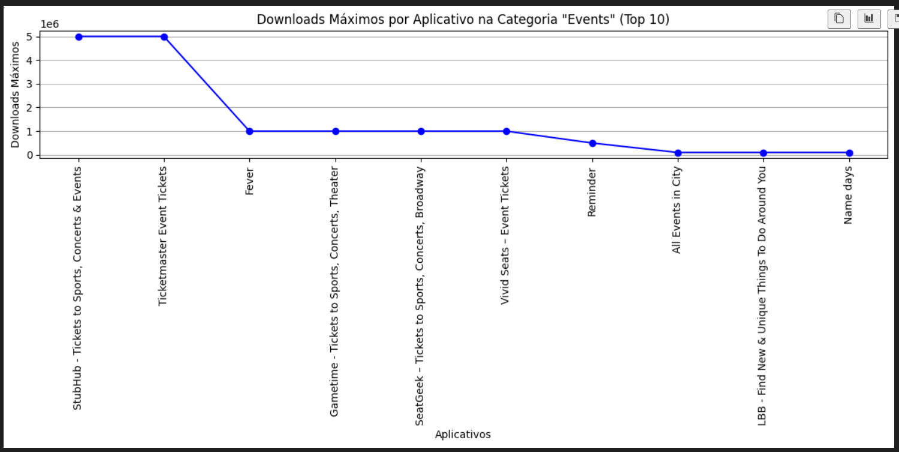
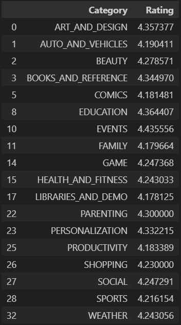
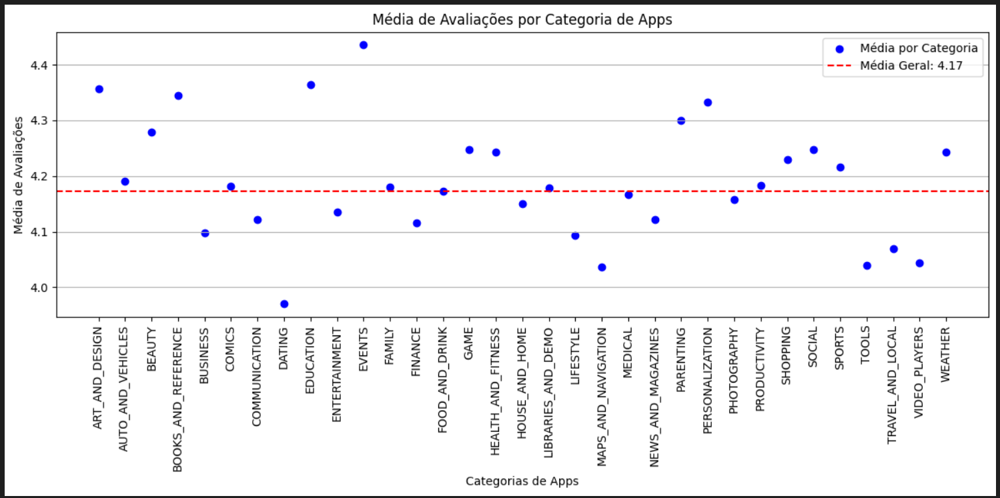

# Desafio
Foi solicitado a criação de graficos e a formatação do arquivo **googleplaystore.csv**.
dividindo em etapas cada ação executada.
# Etapa 1
Na primeira etapa foi feito a instalação de 2 bilbliotecas
- pandas
- matplotlib
No terminal do vscode.

```shell
pip install pandas && pip install matplotlib
```

O arquivo do desafio também contém informações sobre a sua elaboração. Tudo o que se refere a esse readme, está localizado no arquivo de resolução do desafio.

[clique aqui](desafio_sprint3.ipynb) para ver a pasta de do desafio e ter mais detalhes sobre a sua realização.

# Etapa 2
Aqui foi pedido a remoção de dados duplicados do arquivo original
isso foi feito com o seguinte código:
```python
import pandas as pd

df = pd.read_csv('googleplaystore.csv')

df_drop_duplicates = df.drop_duplicates(subset=['App'])
```

O código cria um dataframe que lê o arquivo csv
```python
df = pd.read__csv('googleplaystore.csv')
```

em sequencia apaga os dados duplicados com base no nome dos apps com o comando **df.drop_duplicates(subset='app')** e armazena no dataframe **df_drop_duplicates**

# Etapa 3
Aqui foi onde os graficos foram criados

## Grafico com o top 5 apps por número de instalações
```py
# Importação das bibliotecas Pandas e Matplotlib
import pandas as pd 
import matplotlib.pyplot as plt

# Armazenamento do dataframe sem dados duplicados em um novo dataframe
df = df_drop_duplicates

# Formatação de elementos contidos na coluna 'Installs'
df['Installs'] = df['Installs'].str.replace('+','').str.replace(',','')
df = df[~df['Installs'].str.lower().str.contains('free', na=False)].copy()
df['Installs'] = df['Installs'].astype(int)

# Ordenação dos top 5 apps por quantidade de instalação
topApps = df.nlargest(5, 'Installs')

# Criação do grafico de barras
plt.figure(figsize=(8, 6))
plt.barh(topApps['App'], topApps['Installs'], color='lightgreen')
plt.xlabel('Número de Instalações')
plt.title('Top 5 Apps mais Baixados')
plt.gca().invert_yaxis()
plt.show()
```

Grafico de barras gerado:




## Grafico de pizza (pie chart) de todas as categorias de apps existentes no dataset de acordo com sua frequência

```python
import pandas as pd
import matplotlib.pyplot as plt

# Importação do dataframe sem duplicados para um novo dataframe
df_categories = df_drop_duplicates

# Calculo para a transformação dos dados em porcentagens '%'
count = df_categories['Category'].value_counts()
total_categorias =  count.sum()
porcentagem = count / total_categorias * 100

# As categorias com a porcentagem abaixo de 3,6% Serão armazenadas como 'Outros'
categoria_porcentagem = count[porcentagem >= 3.6]
categoria_porcentagem['Outros'] = count[porcentagem < 3.6].sum()


# Criação do grafico de pizza
plt.figure(figsize=(10, 6))
plt.pie(categoria_porcentagem, labels=categoria_porcentagem.index, autopct='%1.1f%%', startangle=100)
plt.title('Distribuição das Categorias de Apps')
plt.axis('equal')
plt.show()
```

Grafico de pizza gerado:



## App mais caro do dataset
```py
import pandas as pd

# Importação para um novo dataframe
df = df_drop_duplicates

# Formatação na coluna de preços 'Price'
df['Price'] = df['Price'].str.lower().replace('everyone', pd.NA)
df['Price'] = df['Price'].replace({'\\$':''}, regex=True)
df['Price'] = df['Price'].str.strip()

# Remoção de dados nulos 'NaN'
df = df.dropna(subset='Price')

# Passando todos os valores para float
df.loc[:,'Price'] = df['Price'].astype(float)

# Pegando o app de maior preço
precos = df['Price'].max()
mais_caro = df[df['Price'] == precos]

print(f"O app mais caro é: {mais_caro['App'].values[0]} que custa {precos}")
```

Saída do código:
**O app mais caro é: I'm Rich - Trump Edition, que custa R$:400.0.**

## Todos os apps classificados como **Mature 17+**
```py
import pandas as pd

# Importação do dataframe
df = df_drop_duplicates

# Verificação para apenas ser armazenado os dados da coluna 'Content Rating
# que os valores são 'Mature 17+
app_maior_17 = df[df['Content Rating'] == 'Mature 17+'].shape[0]

print(f'Existem {app_maior_17} Apps para maiores de 17 anos')
```

Saída do código: **Existem 393 Apps para maiores de 17 anos**

## Top 10 apps por número de reviews
```py
import pandas as pd

# Importação do dataframe e a copia, para não mexermos no arquivo original
df = df_drop_duplicates
df_avaliacao = df_drop_duplicates.copy()

# Função para a formatação de valores com 'M'
# exemplo: de 3M para 3000000
def convert_reviews(review):
    if isinstance(review, str):
        if 'M' in review:
            return int(float(review.replace('M', '').strip()) * 1_000_000)
        else:
            return int(review.replace(',', '').strip())
    else:
        return review 
    
# aplicando a função
df_avaliacao['Reviews'] = df_avaliacao['Reviews'].apply(convert_reviews)

# Ordenando a tabela
top_10 = df_avaliacao.nlargest(10, 'Reviews')
# Aqui constam os valores a ser exibido no display
top_10_nomes = top_10[['App', 'Reviews']]

display(top_10_nomes)
```

Saída gerada:


# Etapa 3
Aqui tivemos que criar mais 2 calculos (Um de valor e outro de Lista) distintos e, também, elaborar mais 2 graficos com esses calculos anteriormente citados.

## Calculo de valor, para mostrar a media de downloads dos apps da categória **EVENTS**
```py
import pandas as pd
import matplotlib.pyplot as plt

# Calculo de valor que mostra a media de instalção dos top 10 apps da categoria Eventos 
df_events = df_drop_duplicates.copy()

# Armazenando os apps da categoria 'EVENTS' e formatando sua entrada
df_events = df_events[df_events['Category'] == 'EVENTS']
df_events['Installs'] = df_events['Installs'].replace('Free', pd.NA, regex=True).astype(float)
df_download = df_events.groupby('App')['Installs'].max().reset_index()

# Ordenando os top 10 mais baixados da categoria
df_downloads = df_download.sort_values(by='Installs', ascending=False).head(10)

# Calculando a media de downloads de apps do tipo 'EVENTS'
media_downloads = df_downloads['Installs'].mean()
print(f"A média de downloads dos 10 aplicativos principais é: {media_downloads:.0f}")

# Criando o gráfico de linhas do top 10 apps mais baixados da categoria events
plt.figure(figsize=(12, 6))
plt.plot(df_downloads['App'], df_downloads['Installs'], marker='o', color='blue', linestyle='-')
plt.title('Downloads Máximos por Aplicativo na Categoria "Events" (Top 10)')
plt.xlabel('Aplicativos')
plt.ylabel('Downloads Máximos')
plt.xticks(rotation=90)
plt.grid(axis='y')
plt.tight_layout()
plt.show()
```

Saída e grafico desse Script:

- Valor: **A média de downloads dos 10 aplicativos principais é: 1480000**

- Grafico de linha do top 10 mais baixados:




## Calculo de Lista, que mostra todas as categorias que ficaram abaixo da media de avaliações 'Rating'
```py
import pandas as pd
import matplotlib.pyplot as plt

# Calculo de lista que mostra todas as categorias de apps que estão acima da media de avaliações
df_avaliacao = df_drop_duplicates.copy()

# Formatação da entrada de valores
df_avaliacao['Rating'] = pd.to_numeric(df_avaliacao['Rating'].replace(19., pd.NA), errors='coerce')
df_avaliacao = df_avaliacao[df_avaliacao['Category'] != '1.9']

# Calculando a media de avaliação de todas as categorias 
# E Armazenando as categorias que ficaram abaixo da media.
media_geral = df_avaliacao['Rating'].mean()
categoria = df_avaliacao.groupby('Category')['Rating'].mean().reset_index()
categoria_maior_media = categoria[categoria['Rating'] > media_geral]

display(categoria_maior_media)

# Criando o gráfico de dispersão da avaliação de todas as categorias
plt.figure(figsize=(12, 6))
plt.scatter(categoria['Category'], categoria['Rating'], color='blue', label='Média por Categoria')
plt.axhline(y=media_geral, color='red', linestyle='--', label=f'Média Geral: {media_geral:.2f}')
plt.title('Média de Avaliações por Categoria de Apps')
plt.xlabel('Categorias de Apps')
plt.ylabel('Média de Avaliações')
plt.legend()
plt.xticks(rotation=90)
plt.grid(axis='y')
plt.tight_layout()
plt.show()
```

Saída e grafico desse Script:

- Saída:



- Grafico:



### Finalização do desafio da Sprint 3