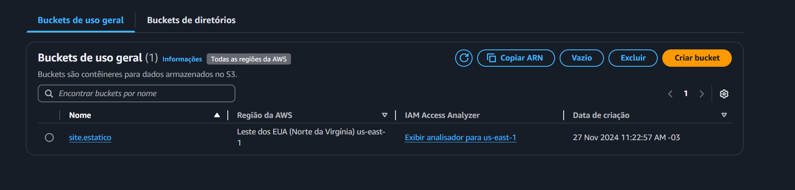
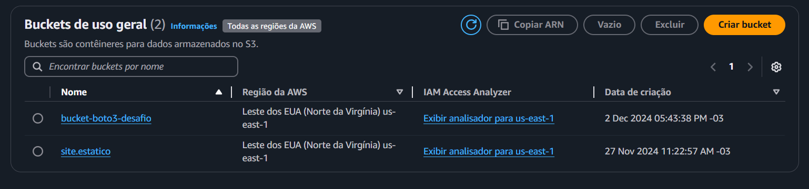
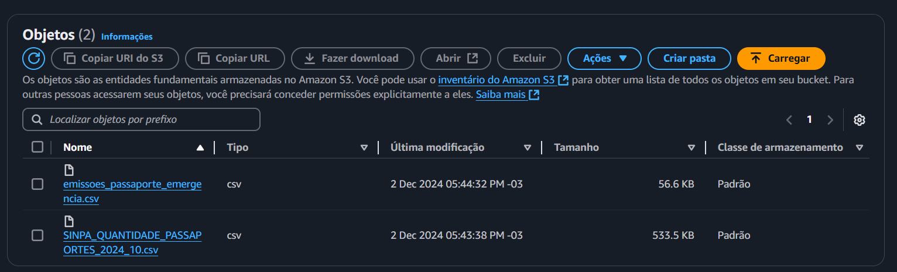

# Desafio
Nesse desafio foi pedido um Script em python que contenha:
- Um Cláusula que filtra dados usando ao menos dois operadores lógicos
- Duas funções de Agregação
- Uma função Condicional
- Uma fur ção de Conversão
- Uma função de Data
- Uma função de String

Esse Script deve ser feito com base em um arquivo do banco de dados do governo, O arquivo escolhido por mim foi:

[SINPA_QUANTIDADE_PASSAPORTES_2024_10.csv](SINPA_QUANTIDADE_PASSAPORTES_2024_10.csv)

Que é um arquivo .csv da Policia Federal que contém dados sobre as amissoes de passaportes nacionais

Poteriormente a criação do Script, deveriamos usar a biblioteca do boto 3 para subirmos o arquivo original e o arquivo depois de analisado e com suas alterações após passar pelo Script


# Etapa 1

Para o meu Script, resolvi filtrar os passaportes que foram emitidos depois de 2020 e que são de emergência, também criei outra coluna chamada de **DEMANDA**  

```py
# Importando a biblioteca pandas
import pandas as pd

# trazendo o arquivo para um dataframe
data = pd.read_csv("Sprint5/Desafio/SINPA_QUANTIDADE_PASSAPORTES_2024_10.csv",  sep=';', encoding='latin1')


# Copiando o data frame para emissoes
# Clausulas condicionais com dois operadores lógicos
emissoes = data[(data['ANO'] >= 2020) & (data['TIPO_PASSAPORTE'].str.contains('EMERGÊNCIA', case = False, na=False))].copy()


# clausula condicional
emissoes['DEMANDA'] = emissoes['QTD'].apply(lambda x: 'ALTA DEMANDA' if x > 100 else 'BAIXA DEMANDA')


# Função de agregação (soma por ano e estado)
emissoes_grup = emissoes.groupby(['ANO', 'UF'])['QTD'].sum().reset_index()


# Função de agregação para calcular a media de passaportes de emergencia emitidos
media_emergencia = emissoes.groupby('ANO')['QTD'].mean().reset_index()
media_emergencia.rename(columns={'QTD': 'MEDIA_PASSAPORTES_EMERGÊNCIA'}, inplace=True)


# Fazendo o merge para adicionar a coluna de média no dataframe `emissoes_grup`
emissoes_grup = pd.merge(emissoes_grup, media_emergencia, on='ANO', how='left')
emissoes = pd.merge(emissoes, media_emergencia, on='ANO', how='left')
emissoes['MEDIA_PASSAPORTES_EMERGÊNCIA'] = emissoes['MEDIA_PASSAPORTES_EMERGÊNCIA'].round(2)


# Função de conversão convertendo ANO para string
emissoes_grup['ANO'] = emissoes_grup['ANO'].astype(str)


# Função de string convertendo tipo de passaporte para maiúsculas
emissoes['TIPO_PASSAPORTE'] = emissoes['TIPO_PASSAPORTE'].str.lower()


# Função DATA
emissoes['ANO'] = pd.to_datetime(emissoes['ANO'], format='%Y').dt.strftime('%y')


# Função de ordenação
emissoes_grup = emissoes_grup.sort_values(by='QTD', ascending=False)
emissoes = emissoes.sort_values(by='QTD', ascending=False)

emissoes.to_csv("emissoes_passaporte_emergencia.csv", index=False, sep=';', encoding='utf-8-sig')
```

Com isso foram utilizados todas as clausulas e funções e a saida do novo arquivo ficará:
> ANO;MES;UF;TIPO_PASSAPORTE;QTD;DEMANDA;MEDIA_PASSAPORTES_EMERGÊNCIA
> 
> 24;7;SP;passaporte de emergência - icao;317;ALTA DEMANDA;20.95
>
> 24;10;SP;passaporte de emergência - icao;265;ALTA DEMANDA;20.95
>
> 23;12;SP;passaporte de emergência - icao;242;ALTA DEMANDA;8.2
>
> 24;9;SP;passaporte de emergência - icao;236;ALTA DEMANDA;20.95
>
> 24;1;SP;passaporte de emergência - icao;227;ALTA DEMANDA;20.95
>
> 24;8;SP;passaporte de emergência - icao;222;ALTA DEMANDA;20.95
>
> 24;4;SP;passaporte de emergência - icao;212;ALTA DEMANDA;20.95
>
> 24;6;SP;passaporte de emergência - icao;198;ALTA DEMANDA;20.95
>
> 24;5;SP;passaporte de emergência - icao;194;ALTA DEMANDA;20.95
>
> 24;3;SP;passaporte de emergência - icao;176;ALTA DEMANDA;20.95

# Etapa 2
Aqui foi instalado a biblioteca **boto3** e, depois de fazermos as configurações necessarias, poderemos iniciar o código que criará, e subirá os arquivos para o bucket da aws

antes disso, podemos ver que não há buckets criados ainda (Apenas o bucket que foi utilizado no exercicio dessa Sprint)


Ao executarmos o seguinte trecho de código, O Bucket será criado

```py
# Importando as bibliotecas pandas e boto3
import boto3
import pandas as pd

# Entra na seção do usuario e acessa o item s3
session = boto3.Session(profile_name='207567778397_AdministratorAccess')
s3 = session.client('s3')

# Nome do bucket
nome_bucket = 'bucket-boto3-desafio'

# Criando o Bucket com o nome informado
s3.create_bucket(Bucket=nome_bucket)

print(f"Bucket {nome_bucket} criado com sucesso!")
```

com isso o Bucket é criado


Porém não há nenhum arquivo armazenado no Bucket. Para colocarmos os csv's devemos usar o seguinte código

```py

# Arquivo que será subido para o bucket
arquivo = 'SINPA_QUANTIDADE_PASSAPORTES_2024_10.csv'

# Subindo o arquivo de databases para o Bucket
s3.upload_file(arquivo, nome_bucket, arquivo)
print(f'O arquivo: {arquivo} foi enviado ao Bucket')
```

Com isso é subido o arquivo csv original para o bucket. 

Agora vejamos o código inteiro

```py
import boto3
import pandas as pd

# Entra na seção do usuario e acessa o item s3
session = boto3.Session(profile_name='207567778397_AdministratorAccess')
s3 = session.client('s3')

# Nome do bucket
nome_bucket = 'bucket-boto3-desafio'

# Criando o Bucket com o nome informado
s3.create_bucket(Bucket=nome_bucket)

print(f"Bucket {nome_bucket} criado com sucesso!")

# Arquivo que será subido para o bucket
arquivo = 'SINPA_QUANTIDADE_PASSAPORTES_2024_10.csv'

# Nome do arquivo que será baixado do Bucket
download = 'SINPA_dowload'

# Subindo o arquivo de databases para o Bucket
s3.upload_file(arquivo, nome_bucket, arquivo)
print(f'O arquivo: {arquivo} foi enviado ao Bucket')

# Baixando o arquivo de emissões de passaporte com o nome SINPA_dowload
s3.download_file(nome_bucket, arquivo, download)
print(f'O arquivo {download} foi baixado com sucesso')
print()
print("O arquivo será analisado...")

# trazendo o arquivo para um dataframe
data = pd.read_csv(download,  sep=';', encoding='latin1')


# Copiando o data frame para emissoes
# Clausulas condicionais com dois operadores lógicos
emissoes = data[(data['ANO'] >= 2020) & (data['TIPO_PASSAPORTE'].str.contains('EMERGÊNCIA', case = False, na=False))].copy()


# clausula condicional
emissoes['DEMANDA'] = emissoes['QTD'].apply(lambda x: 'ALTA DEMANDA' if x > 100 else 'BAIXA DEMANDA')


# Função de agregação (soma por ano e estado)
emissoes_grup = emissoes.groupby(['ANO', 'UF'])['QTD'].sum().reset_index()


# Função de agregação para calcular a media de passaportes de emergencia emitidos
media_emergencia = emissoes.groupby('ANO')['QTD'].mean().reset_index()
media_emergencia.rename(columns={'QTD': 'MEDIA_PASSAPORTES_EMERGÊNCIA'}, inplace=True)


# Fazendo o merge para adicionar a coluna de média no dataframe `emissoes_grup`
emissoes_grup = pd.merge(emissoes_grup, media_emergencia, on='ANO', how='left')
emissoes = pd.merge(emissoes, media_emergencia, on='ANO', how='left')
emissoes['MEDIA_PASSAPORTES_EMERGÊNCIA'] = emissoes['MEDIA_PASSAPORTES_EMERGÊNCIA'].round(2)


# Função de conversão convertendo ANO para string
emissoes_grup['ANO'] = emissoes_grup['ANO'].astype(str)


# Função de string convertendo tipo de passaporte para maiúsculas
emissoes['TIPO_PASSAPORTE'] = emissoes['TIPO_PASSAPORTE'].str.lower()


# Função DATA
emissoes['ANO'] = pd.to_datetime(emissoes['ANO'], format='%Y').dt.strftime('%y')


# Função de ordenação
emissoes_grup = emissoes_grup.sort_values(by='QTD', ascending=False)
emissoes = emissoes.sort_values(by='QTD', ascending=False)


emissoes.to_csv("emissoes_passaporte_emergencia.csv", index=False, sep=';', encoding='utf-8-sig')

print("Analise finalizada")

# Caminho do arquivo gerado
arquivo_saida = "emissoes_passaporte_emergencia.csv"

# Upload do arquivo para o bucket
s3.upload_file(arquivo_saida, nome_bucket, arquivo_saida)
print(f"O arquivo {arquivo_saida} foi enviado para o bucket {nome_bucket} com sucesso!")
```

Com esse código, além da criação do bucket ele também enviará o arquivo csv original, fará o download do mesmo e executará o Script para analisar e alterar esse arquivo, em sequência, criara um novo arquivo **emissoes_passaporte_emergencia.csv** e subirá o mesmo para o bucket da aws, como na imagem a seguir.



Assim o Bucket terá o arquivo csv original e o feito atraves do Script python. Sendo eles, respectivamentes.

[Arquivo csv original](SINPA_QUANTIDADE_PASSAPORTES_2024_10.csv)

[Arquivo csv feito com o script](emissoes_passaporte_emergencia.csv)

Com isso o desafio é finalizado!
