# Sprint 5
Nessa Sprint foram vistos os fundamentos de Computação em Nuvem utilizando a Amazon Web Services, além do aws Cloud Quest

Cusros AWS:

> Cloud Practitioner: 
- Fundamentos da Computação em Nuvem
- Primeiros Passos na Nuvem
- Soluções de Computação
- Conceitos de Rede
- Bancos de Dados na Prática
- Conectar VPCs
- Primeiro Banco de Dados NoSQL
- Sistemas de Arquivos na Nuvem
- Aplicativos de Auto-Recuperação e Escalabilidade
- Aplicações Web Altamente Disponíveis
- Conceitos Principais de Segurança
- Economia de Nuvem

> Curso-padrão de preparação para o exame: AWS Certified Cloud Practitioner (CLF-C02 - Português):
- Conheça o exame AWS
- Conheça as questões no estilo do exame
- Conheça os tópicos do exame
- Prepare-se para o exame
    - Conceitos de nuvem
    - Segurança e conformidade
    - Tecnologia e serviços em nuvem
    - Cobrança, preços e suporte

# Evidências
### Essas evidências estão relacionadas ao ***Desafio*** e ***Exercicios***.
[clique aqui](desafio) para ver a pasta **Desafios** com mais detalhes.

Acessando S3
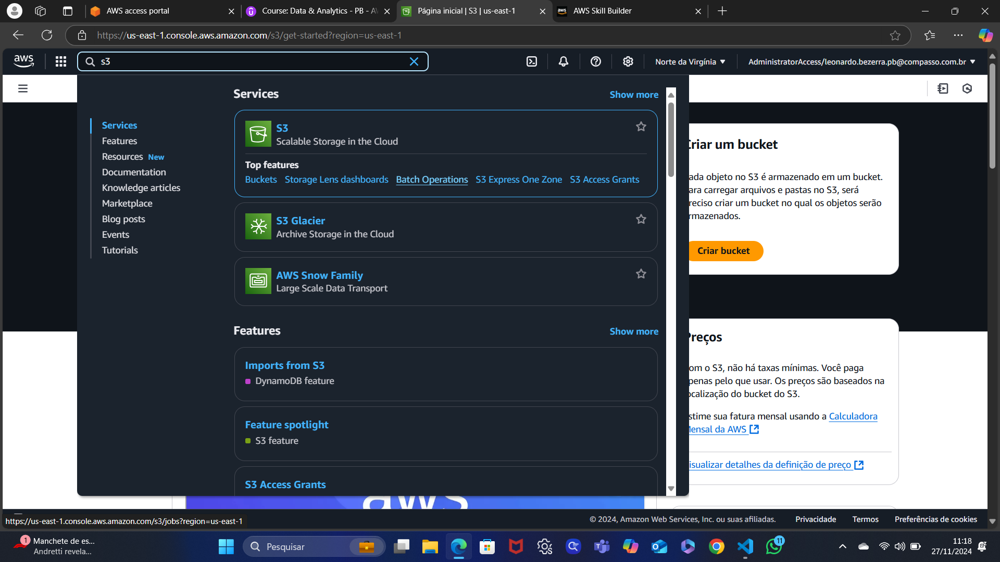

Criando o bucket
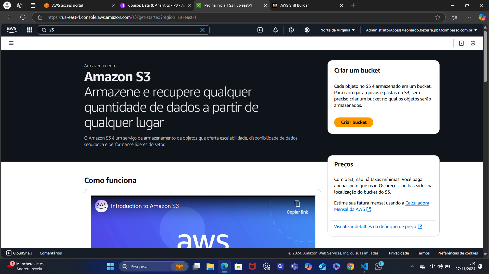

Nomeando o Bucket
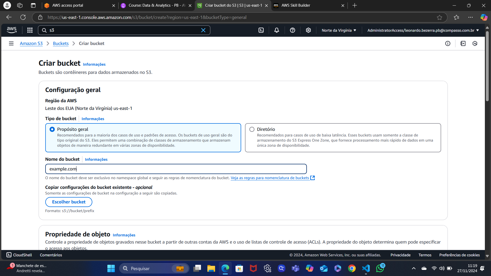

Finalizando a criação
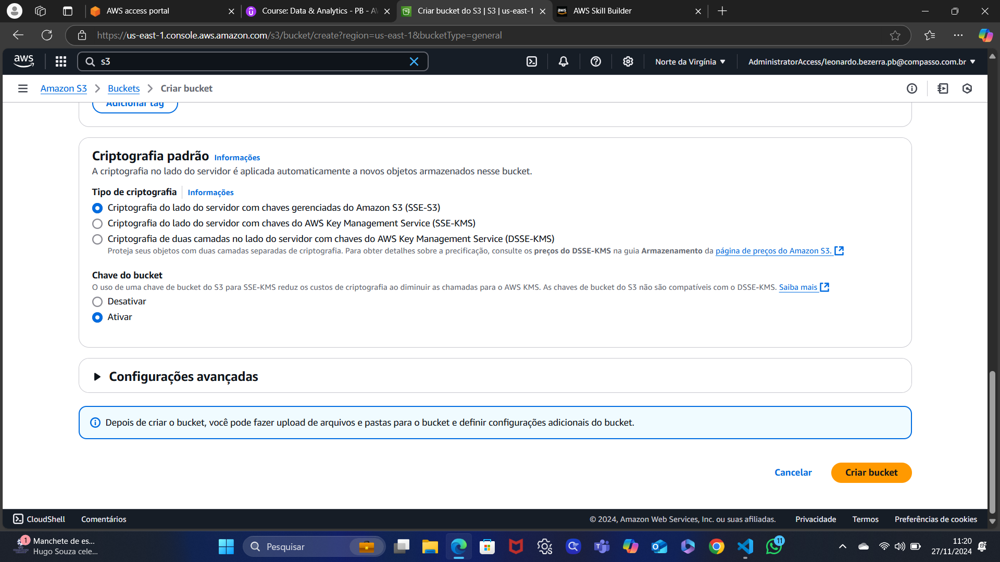

Bucket criado
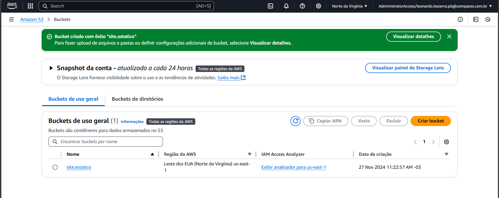

Bucket sem index inserido
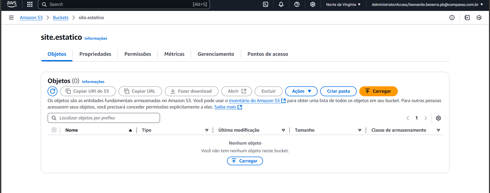

Criando uma hospedagem para o site estatico
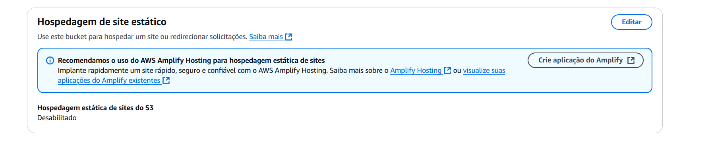

Noemando a hospedagem
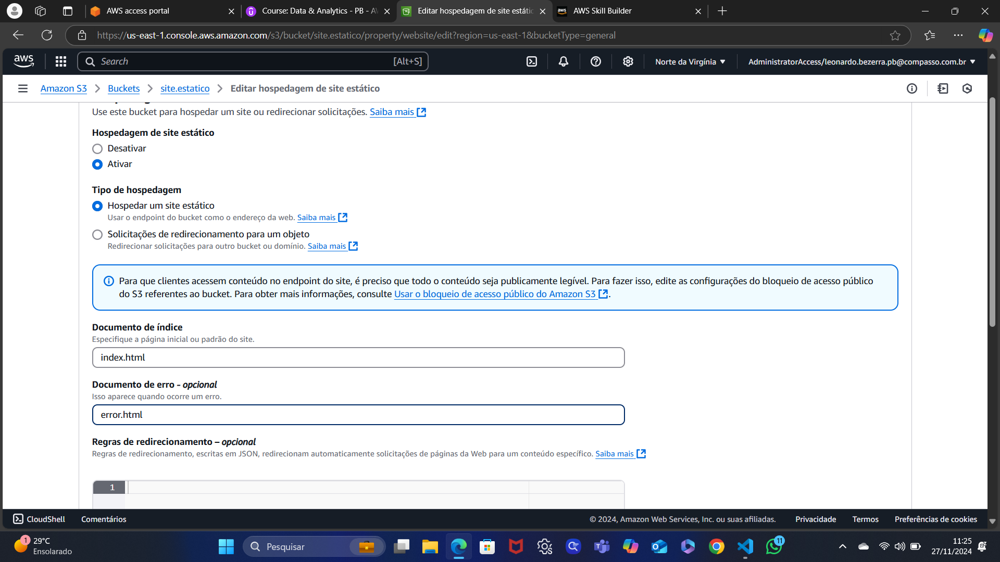

Erro ao encontrar site
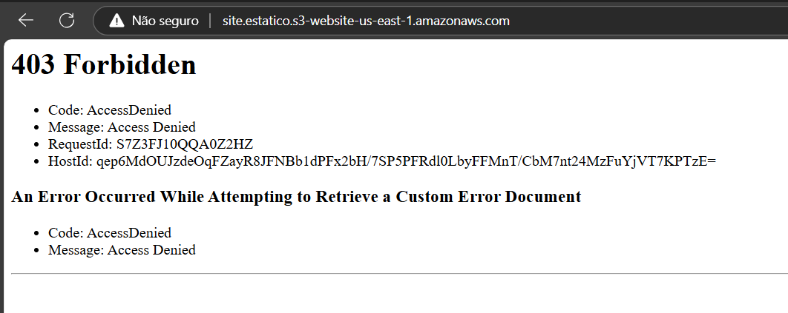

Configurando a privacidade do site
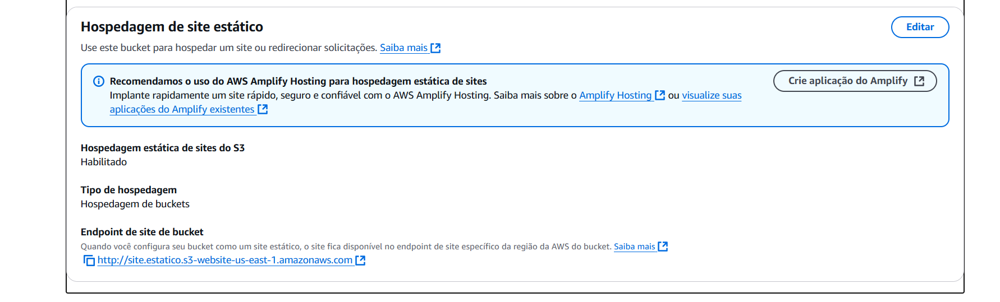

Acesso ao público bloqueado
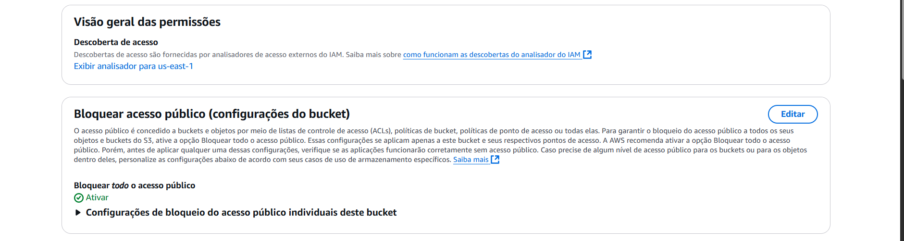 

site privado


Deixando o site público
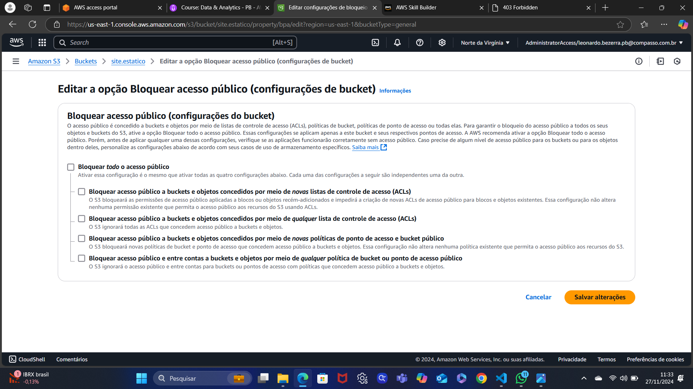

Site sem política de privacidade
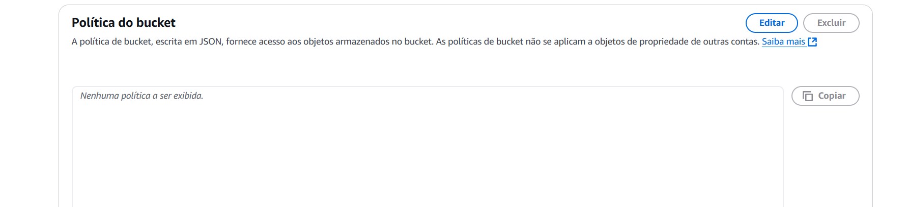

Adicionando uma política de privacidade ao site
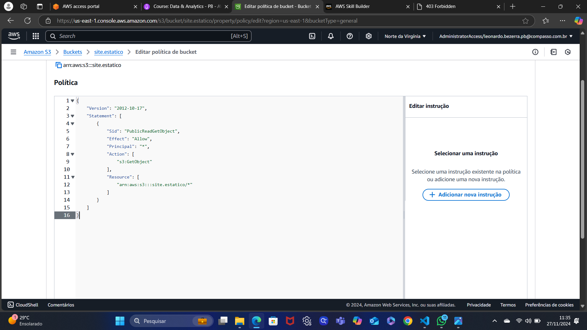

O bucket não possui arquivos index anexados (Não possui arquivos)
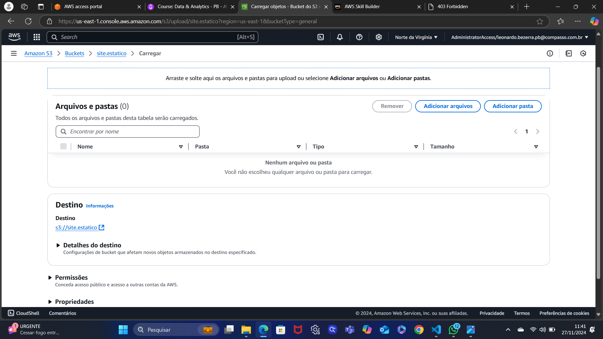

Adicionando o **index** e o **error**
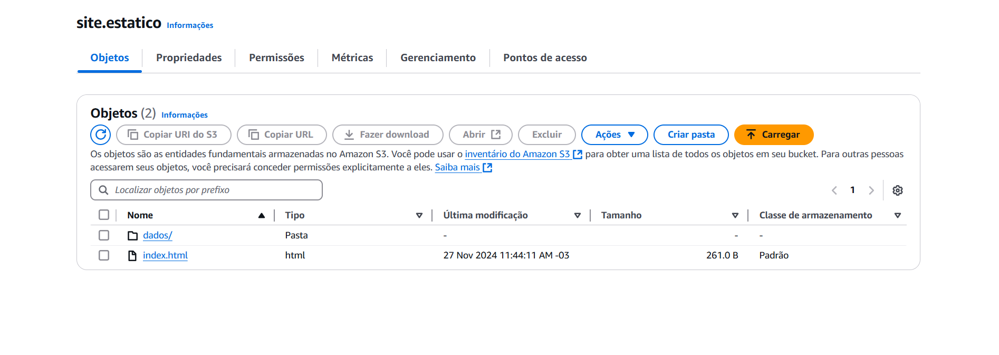

Adicionando o arquivo .csv
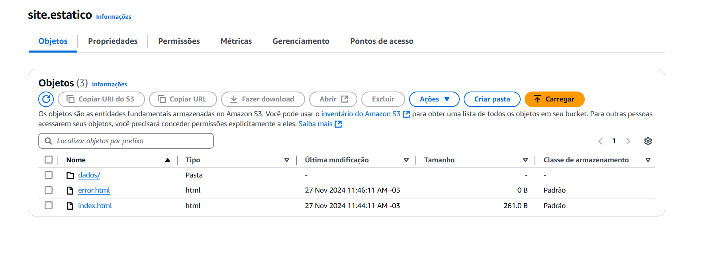

Finalização do site já rodando no bucket da aws
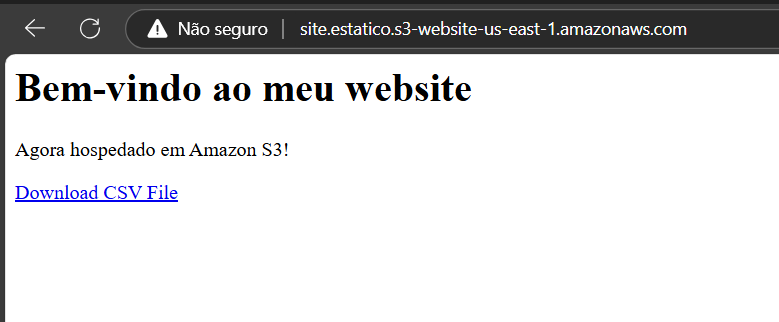

Baixando arquivos csv no site demonstrado
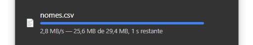

# Exercicios
Nesse exercicio foi pedido a criação de um bucket S3 para 

## ETAPA 1
### Criando um bucket na AWS

entrando na pagina **S3** da AWS

armazenar um site estático


Criando o bucket


inserindo o nome no bucket e escolhendo a região us-east-1.


Finalizando a criação do bucket - ***Apertar em Criar Bucket***


Bucket Criado com sucesso


## ETAPA 2
### Habilitando a hospedagem de site estático
Ao clicarmos no bucket que foi criado anteriormente, podemos acessar suas configurações

Podemos ver que não há nenhum arquivo (Objeto) no bucket em questão


Abrimos o submenu **Propriedades** e entramos em editar 


Ao acessarmos, devemos colocar os nomes dos documentos de index e error e confirmamos e ativarmos a **Hospedagem de site estático**


Ao criarmos um site estático e lançarmos o seu link no navegador, um erro ocorrerá, pois o site estará privado


Para resolvermos isso, devemos tornar o site público
## ETAPA 3
### editar as configurações do Bloqueio de acesso público

Para editarmos essa politica, devemos editar a aba **Bloquear acesso Público**
 

E desmarcar todas as janelas 


Após isso, removermos as marcações e salvamos


Agora com isso o site estará publico

## ETAPA 4
### Adicionar política de bucket que torna o conteúdo do bucket publicamente disponível

Agora iremos criar e atribuir uma política no Bucket

No submenu **Permissões** iremos até Política de Bucket


e adicionaremos a seguinte Política e o salvamos
```json
{
    "Version": "2012-10-17",
    "Statement": [
        {
            "Sid": "PublicReadGetObject",
            "Effect": "Allow",
            "Principal": "*",
            "Action": [
                "s3:GetObject"
            ],
            "Resource": [
                "arn:aws:s3:::Bucket-Name/*"
            ]
        }
    ]
}
``` 

então ficará da seguinte maneira


## ETAPA 5
### Configurar um documento de índice

Antes de tudo, lembras que o bucket ainda continua vazio.


Aqui criaremos um arquivo chamado ***index.html*** que irá receber o site a ser hospedado. Nele estará o seguinte código:
```html
<html xmlns="http://www.w3.org/1999/xhtml" >
<head>
    <title>Home Page do meu WebSite - Tutorial de S3</title>
</head>
<body>
  <h1>Bem-vindo ao meu website</h1>
  <p>Agora hospedado em Amazon S3!</p>
  <a href="nome do arquivo CSV a ser baixado">Download CSV File</a> 
</body>
</html>
```

## ETAPA 6
### configurar documento de erros

Apos a criação desse arquivo, também criaremos um arquivo com o nome **error.html** e em sequencia faremos upload para o bucket


Após adicionarmos os arquivos ao bucket, também adicionaremos um arquivo csv que foi nos entregue [nomes.csv](Exercicio/dados/nomes.csv)


## ETAPA 7
### testar o endpoint do site

Após todas essas etapas, chegou a hora de testar o site rodando no bucket da aws. E esse foi o resuldadr 


**Como pode ver, o site foi criado com sucesso e está funcionando normalmente**

Inclusive o botão de download é funcional e baixará os arquivos csv possivel


**E com isso o exercicio foi finalizado**


# Certificados

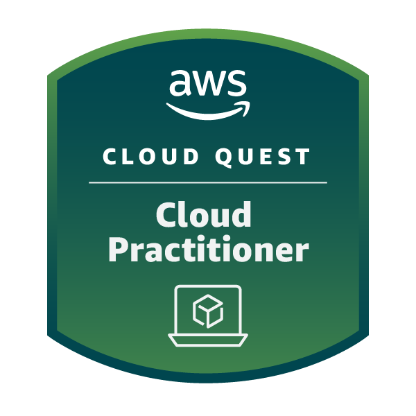

[Link do bandge](https://www.credly.com/badges/847909e0-9ec9-472e-9ec0-a1c3ef367d60/public_url)

