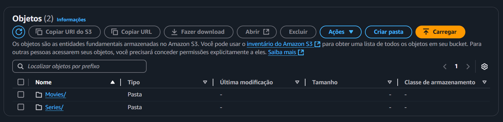

# Desafio
Neste desafio, foi proposta a criação de um script Python que realizasse o upload de um banco de dados de filmes e séries e, por meio da biblioteca boto3, enviasse esses arquivos para um bucket da AWS. Posteriormente, serão feitas algumas perguntas com base nesse banco de dados para realizar a análise do mesmo. Também foi solicitado que esse script Python fosse executado em um container com um volume no Docker. O caminho no bucket deverá seguir uma estrutura definida, que será explicada nas etapas seguintes.

## Perguntas

1. Quais os 25 filmes mais bem avaliados de animação e comédia?
2.  Quais os atores que dirigiram esses filmes?
3. qual a media de suas avaliações e qual gênero possui a maior média?
4. Qual decada os filmes de animações tiveram maior sucesso?

# Etapa 1
Nessa Etapa será explicada o código do Script que enviará o arquivo ao bucket:

```py
import boto3
import os
from datetime import datetime

# Cria a sessão com o perfil do usuario
session = boto3.Session(profile_name='xxxxxxxxxxxxxxxxxxxxxxx')

# Cria o cliente S3 a partir da sessão
s3_client = session.client('s3')

# Solicita o nome do bucket
bucket_name = 'data-lake-do-leonardo'

try:
    # Cria o bucket
    s3_client.create_bucket(Bucket=bucket_name)
    print(f"Bucket '{bucket_name}' criado com sucesso!")
except Exception as e:
    print(f"Erro ao criar o bucket: {e}")

# Caminho para a pasta onde estão o arquivo de filmes e series
arquivo = '/app/Filmes+e+Series'

# Fomartação da data
data = datetime.now()
ano = data.year
mes = f'{data.month:02d}'
dia = f'{data.day:02d}'

# Separação dos arquivos e do caminho que será enviado ao bucket
files_to_upload = {
    'movies.csv': f'Raw/Local/CSV/Movies/{ano}/{mes}/{dia}/movies.csv',
    'series.csv': f'Raw/Local/CSV/Series/{ano}/{mes}/{dia}/series.csv'
}

# Realiza o envio do arquivo
for local_file, s3_key in files_to_upload.items():
    file_path = os.path.join(arquivo, local_file)  # Caminho completo do arquivo no sistema
    if os.path.exists(file_path):
        try:
            # Faz o upload do arquivo
            s3_client.upload_file(file_path, bucket_name, s3_key)
            print(f"Arquivo '{local_file}' enviado com sucesso para '{s3_key}' no bucket '{bucket_name}'!")
        except Exception as e:
            print(f"Erro ao enviar o arquivo '{local_file}': {e}")
    else:
        print(f"Arquivo '{local_file}' não encontrado no diretório '{arquivo}'.")
```

Com esse código o Python irá ler o arquivo original **Filmes+e+Series** e enviará ao bucker com o seguinte caminho do arquivo

s3://bucket-do-fulano/Raw/Local/csv/\<Movies>/ano/mes/dia/\<Movies.csv>

ou

s3://bucket-do-fulano/Raw/Local/csv/\<Series>/ano/mes/dia/\<series.csv>

Será mostrado em evidências posteriores

# Etapa 2
Aqui criaremos o Dockerfile do arquivo
```Dockerfile
# Usando a imagem do python 3.9
FROM python:3.9

# Definindo o diretorio de trabalho
WORKDIR /app

# Copiando o arquivo requieiments
COPY requirements.txt .

# Baixando as dependencias do arquivo requirements
RUN pip install -r requirements.txt

# Copiando as credenciais da aws
COPY .aws /root/.aws

# Copiando o Script python que será executado no container
COPY Script.py .

# Definindo um volume
VOLUME [ "/data" ]

# Indica o caminho a ser executado, No caso: com o <Python>, execute o <Script.py>
CMD [ "python", "Script.py" ]
```

Na pasta **requirements.txt** está o código ***boto3*** que será instalado nas dependencias do Docker

Ao executarmos no terminal o comando

```shell
docker build -t python-digestao .
```

Criará uma imagem docker com as especificações do Dockerfile  a cima.

Podemos ver que não há imagem.


Após executarmos o comando a cima citado, a imagem é criada (com o nome: **python-digestao**)


# Etapa 3 

Aqui é onde rodaremos o container dessa imagem

Com o código a baixo, no terminal:

```shell
docker run -v $(pwd)/Filmes+e+Series:/app/Filmes+e+Series python-digestao
```

Criará um container que rodará em um volume (Bind Mount) com o caminho da pasta especificados: **/app/Filmes+e+Series**

Antes, podemos ver que não há containers nem volumes relacionados


Após executarmos o comando no terminal, o container e o volume são criados

O container criado foi o ultimo (O sexto container de cima para baixo)


# Etapa 4

Aqui serão criados o Bucket e a digestão dos arquivos no mesmo

Ao usarmos o camando para rodar a imagem em um container
```shell
docker run -v $(pwd)/Filmes+e+Series:/app/Filmes+e+Series python-digestao
```
Ele também rodará o Script python mostrado a cima.

e ao executarmos o código isso é retornado:


então ele criará um bucket com o nome: **data-lake-do-leonardo**

antes podemos ver que não há nehum Bucket com esse nome.


Após rodarmos ele criará o Bucket


É, também, enviará os arquivos na seguinte ordem: 
**s3://data-lake-do-leonardo/Raw/Local/csv/Movies/2024/12/16/movies.csv**

então os arquivos são armazenados nessa sequência:

**dentro do Bucket *data-lake-do-leonardo***





Com isso o Desafio é finalizado!
