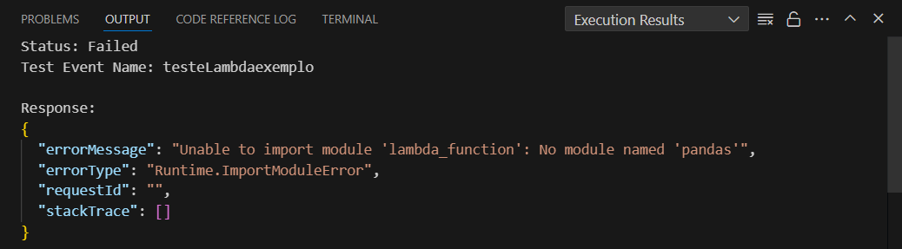

# Sprint 6
Nessa Sprint foi visto fundamentos e manipulações de dados, fundamentos de analytics e algumas ferramentas usadas pela AWS dentre outras coisas.

**Cursos AWS:**

> Noções básicas de Analytics na AWS – Parte 1:
- Explicar data analytics, análise de dados, tipos e técnicas de análise e os desafios da analytics. 
- Definir machine learning (ML), ML na AWS e diferentes níveis da AWS para serviços de ML. 
- Definir os 5 Vs do big data. 
- Explicar as formas comuns de armazenar dados, os desafios, as características dos sistemas de armazenamento de dados de origem e as soluções da AWS disponíveis. 
- Explicar o transporte de dados, as opções para diferentes ambientes e as soluções da AWS disponíveis. 
- Definir processamento de dados, as opções para cada tipo de processamento e as soluções da AWS disponíveis. 
- Identificar diferentes tipos de estruturas de dados, tipos de armazenamento de dados e soluções da AWS disponíveis. 
- Explicar onde ETL e ELT se encaixam em vários pontos do pipeline de analytics, os elementos de um processo de ETL e ELT e as soluções da AWS disponíveis. 
- Explicar o uso de ferramentas de business intelligence para obter valor de analytics e das soluções da AWS disponíveis. 

> Fundamentos de analytics na AWS – Parte 2:
- Explicar os data lakes, seus benefícios e funções. 
- Descrever a arquitetura básica de data lake, os serviços da AWS usados para criar um data lake e os desafios da criação de um data lake. 
- Explicar a arquitetura, os recursos e os benefícios do AWS Lake Formation. 
- Explicar o armazenamento de dados, os desafios de um data warehouse on-premises e as soluções disponíveis da AWS. 
- Explicar os pilares da arquitetura de dados moderna e seus conceitos. 
- Explicar os cenários de movimentação de dados. 
-Descrever o padrão da arquitetura da malha de dados, os benefícios e as soluções disponíveis da AWS. 
- Identificar os serviços da AWS disponíveis para criar arquiteturas de dados modernas. 
- Identificar os componentes da arquitetura de dados moderna. 
-Descrever os casos de uso comuns da arquitetura de dados moderna. 

> Serverless Analytics:
- Explicar a importância de conectar e processar dados provenientes de diferentes fontes para decisões baseadas em dados.
- Demonstrar o uso de ferramentas da AWS, como AWS IoT Analytics, Amazon Cognito, AWS Lambda e Amazon SageMaker, para sintetizar dados.
- Ensinar como agregar, processar, armazenar e disponibilizar dados de forma inovadora e poderosa.
- Mostrar aplicações práticas de agregação e análise de dados com as soluções da AWS.
- Informar que o curso possui transcrições/legendas traduzidas, com narração em inglês, e como habilitar as legendas.

> Introduction to Amazon Athena:
- Apresentar o serviço Amazon Athena e oferecer uma visão geral do seu ambiente operacional.
- Discutir as etapas básicas para implementar o Amazon Athena.
- Demonstrar a criação de um banco de dados no Amazon Athena usando o Console de Gerenciamento da AWS.
- Executar consultas SQL para validação dos dados no ambiente do Amazon Athena.
- Informar que o curso possui transcrições/legendas traduzidas, com narração em inglês, e como habilitar as legendas.

> AWS Glue Getting Started:
- Compreender como o AWS Glue funciona.
- Familiarizar-se com os conceitos técnicos do AWS Glue e do DataBrew.
- Listar casos de uso típicos para o AWS Glue e o DataBrew.
- Especificar o que seria necessário para implementar o AWS Glue e o DataBrew em um cenário do mundo real.
- Reconhecer os benefícios do AWS Glue e do DataBrew.
- Explicar a estrutura de custos do AWS Glue.
- Demonstrar como usar o AWS Glue e o DataBrew a partir do Console de Gerenciamento da AWS.

> Amazon EMR Getting Started:
- Compreender as diferentes opções de implantação disponíveis com o Amazon EMR.
- Entender como o Amazon EMR funciona.
Compreender os conceitos técnicos do Amazon EMR Serverless.
- Listar casos de uso típicos para o Amazon EMR Serverless.
Compreender os conceitos técnicos do Amazon EMR Cluster.
- Listar casos de uso típicos para o Amazon EMR Cluster.
Especificar o que seria necessário para implementar o Amazon EMR em um cenário do mundo real.
- Reconhecer os benefícios do Amazon EMR.
- Explicar a estrutura de custos do Amazon EMR.
- Utilizar o Amazon EMR Serverless e o Amazon EMR Cluster.

> Getting Started with Amazon Redshift:
- Entender como o Amazon Redshift funciona.
- Familiarizar-se com os conceitos técnicos do Amazon Redshift.
- Listar casos de uso típicos para o Amazon Redshift.
- Especificar o que é necessário para implementar o Amazon Redshift em um cenário do mundo real.
- Reconhecer quais são os benefícios do Amazon Redshift
Explicar a estrutura de custos do Amazon Redshift.
- Usar o Amazon Redshift no console de gerenciamento da AWS.

> Best Practices for Data Warehousing with Amazon Redshift:
- Aprender os conceitos de implementação de um data warehouse utilizando o Amazon Redshift.
- Explorar o design básico de tabelas e o armazenamento de dados no Amazon Redshift.
- Entender técnicas de ingestão de dados e gerenciamento de workload.
- Compreender o impacto do dimensionamento de nós e clusters no desempenho do data warehouse.

> Amazon QuickSight:
- Compreender como o QuickSight funciona.
- Familiarizar-se com os conceitos técnicos do QuickSight.
- Listar casos de uso típicos para o QuickSight.
- Reconhecer os benefícios do QuickSight.
- Explicar a estrutura de custos do QuickSight.
- Projetar, criar e personalizar dashboards no QuickSight para visualizar dados e extrair insights de negócios.

# Evidências
As evidências estão relacionadas ao exercicio e ao desafio da Sprint. São armazenadas, respectivamente, em [evidências dos exercicios](Exercicios/Evidencias_exercicios/) e [evidências do Desafio](Evidencias/)
Os exercicios serão explicados nesse readme e o Desafio será explicado no [Readme do desafio](Desafio/). As evidências seguem abaixo:

## Exercicio 1 e 2, Site estático e Athena

Mostrando o bucket do site estático


Arquivos armazenados no bucket do site estático


Criando um arquivo **queries**


Encontrando o Athena no AWS


Tela inicial do Athena


Interface do Athena


Configurando o Athena


Adicionando o caminho do bucket


Escolhendo o Bucket que será utilizado


Criando uma database no athena


Criando a tabela


Tabela Criada com sucesso


Mostrando os nomes na tabela


Resultado da query que mostra os top 3 nomes mais comuns entre os seculos de 50 até a atualidade
 


## Exercicio 3, Lambda

Procurando o lambda na AWS


Interface do Lambda


Criando uma função no Lambda


Código da função Lambda


Erro ao executar o teste no Lambda


Criando um dockerfile para o lambda


Antes da imagem ser criada


A imagem foi criada


Copiando o arquivo do Docker para o arquivo local


Upando o arquivo no Bucket


O lambda ainda não possui camadas


Criando uma camada para o Lambda


Selecionando um caminho para a camada


Adicionando o python à camada


Adicionando camada à função


Configurando a camada que foi adicionada


Configurando o tempo de exeução e a memoria usada


Camada criada e configurada


Testando código


## Desafio


# Exercicios 
## Exercicio 01, Site estático
Esse exercicio já havia sido realizado na Sprint passada (Sprint 5). Então será falado por cima no proximo exercicio.
## Exercicio 02, Athena
Nesse exercicio será usado o bucket do site criado no exercicio anterior, para, com o uso do Athena, ser feito um database.

Antes de iniciarmos, verificamos o bucket do site estático e seus arquivos que nele está armazenado.


Após termos verificado, criamos um arquivo chamado **queries** e o deixamos armazenado no bucker.


### Etapa 1
No console da AWS pesquisamos por Athena


Dentro do Athena iremos criar uma database, apertando em editor de consultas


Antes de criamor, deveremos localizar o arquivo que irá receber esse database, no caso o arquivo queries criado anteriormente.


Então escolheremos o caminho para apontar para esse arquivo


### Etapa 2 
Aqui criaremos o nosso banco de dados


com O comando ```CREATE DATABASE meubanco``` irá ser criado um banco de dados com o nome de **meubanco**

### Etapa 3
Aqui criaremos uma tabela dentro do database anterior


Com o código:
```sql
CREATE EXTERNAL TABLE IF NOT EXISTS meubanco_ex01 (
  nome string,
  sexo string,
  total int,
  ano int
)
ROW FORMAT SERDE 'org.apache.hadoop.hive.serde2.lazy.LazySimpleSerDe'
WITH SERDEPROPERTIES (
 'serialization.format' = ',',
 'field.delim' = ','
)
LOCATION 's3://site.estatico/dados/'
```

A tabela é criada com sucesso


Para verificarmos sua criação, vamos printar os primeiros 15 nomes que estão armazenados nela.

Com o comando:
```sql
select nome from meubanco_ex01 where ano = 1999 order by total limit 15;
```
Será mostrado todos os nomes do ano 1999


Agora o exercicio pede para listarmos os top 3 nomes mais usados em cada década desde 1950 até hoje.

O código é o seguinte:

```sql
-- função que converte o ano em decadas
WITH Decadas AS (
  SELECT 
    nome,
    FLOOR(ano / 10) * 10 AS decada,
    SUM(total) AS total_usado
  FROM meubanco_ex01
  WHERE ano >= 1950
  GROUP BY nome, FLOOR(ano / 10) * 10
),
-- Ordena os nomes pelo número maximo de usos (total)
Ordenar AS (
  SELECT 
    nome,
    decada,
    total_usado,
    ROW_NUMBER() OVER (PARTITION BY decada ORDER BY total_usado DESC) AS ordem
  FROM Decadas
)
-- Printa a decada o nome e o total de vezes que foi usado
SELECT 
  decada,
  nome,
  total_usado
FROM Ordenar
WHERE ordem <= 3
ORDER BY decada, ordem;
```

com isso a tabela retornará esse valor e o exercicio é finalizado


### Exercicio 3, Lambda
Agora iremos criar uma função lambda

Procuremos o Lambda no console da AWS


Depois de apertamos em criar função, devemos nomea-la e escolhermos a versão do python 3.9, e, em seguida, criar a função.


### Etapa 2
Aqui criaremos o código da função Lambda


Após substituirmos o código anterior por esse novo código, iremos salvar e rodar um teste

Código antigo:
```py
import json
 
def lambda_handler(event, context):
    # TODO implement
    return {
        'statusCode': 200,
        'body': json.dumps('Hello from Lambda!')
    }
```

Código atual:
```py
import json
import pandas
import boto3
 
 
def lambda_handler(event, context):
    s3_client = boto3.client('s3')
 
    bucket_name = '<coloque aqui o nome do seu bucket>'
    s3_file_name = 'dados/nomes.csv'
    objeto = s3_client.get_object(Bucket=bucket_name, Key=s3_file_name)
    df=pandas.read_csv(objeto['Body'], sep=',')
    rows = len(df.axes[0])
 
    return {
        'statusCode': 200,
        'body': f"Este arquivo tem {rows} linhas"
    }
```

Ao executarmos um teste um erro é apresentado


Esse erro ocorre pois o lambda não possui a biblioteca pandas intalada, devemos intala-la por meio de uma layer (camada).

### Etapa 3 
Aqui criaremos a camada

Antes devemos criar um dockerfile com o seguinte código


rodamos o código:
```shell
docker build -t amazonlinuxpython39 .
```
para a imagem ser construida.

Podemos ver que não há imagens relacionada a esse exemplo.


Depois de executarmos o código, a imagem é construida


Agora usando o comando:
```sh
docker run -it amazonlinuxpython39 bash
```
Abrira um terminal linux.

No terminal, deve ser usado os seguintes comandos para que a importação da biblioteca pandas ocorra com sucesso.

Os comandos devem ser executados na seguinte ordem:
```shell
cd ~
mkdir layer_dir
cd layer_dir/
mkdir python
cd python/
pwd
```
No final você estará com a estrutura de diretórios assim: ***/root/layer_dir/python***

Agora baixaremos as bibliotecas dentro dessa pasta com o comando: 
```pip3 install pandas -t .```

Depois compactamos a pasta:
```shell
cd ..
zip -r minha-camada-pandas.zip .
```

Verificamos os containers criados:
```docker container ls```

E copiamos o arquivo zipado para nossa pasta local:
```docker cp <id do container>:/root/layer_dir/minha-camada-pandas.zip ./```


e upamos o arquivo para o bucket


**Agora iremos iniciar a criação de uma camada**

Podemos ver que não há camadas criadas anteriormente


Ao clicarmos em criar camadas devemos colocar um nome e um caminho da pasta.


Depois disso, deve-se adicionar o python **na versão 3.9** à camada (Na imagem está a versão 3.13, porem foi corigido ao finalizar o exercício)


### Etapa 4

Agora que a camada foi criada, devemos adiciona-la a função Lambda. Clicando em adicionar camada


Após isso, selecionamos a camada que acabamos de criar


Agora podemos ver que a camada foi criada e adicionada com sucesso.


Ao executarmos o teste novamente temos esse retorno


Isso indica que a função está funcionando corretamente e que o exercicio foi concluido.

# Certificados


