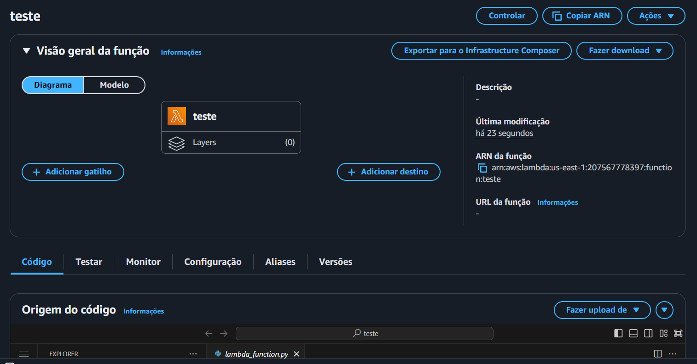
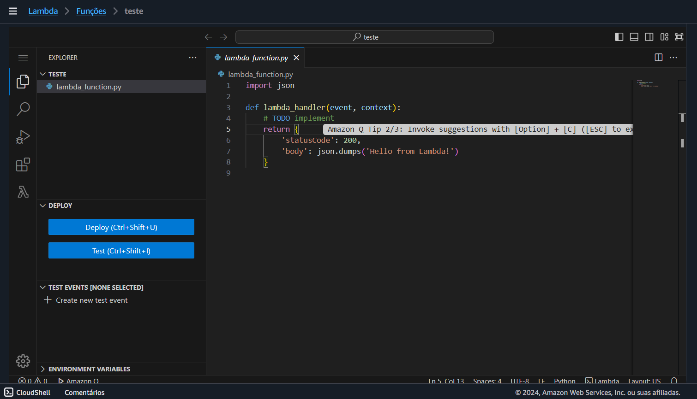
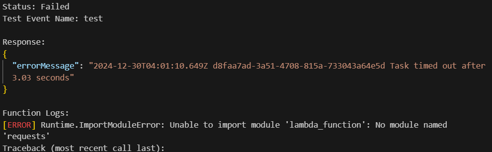
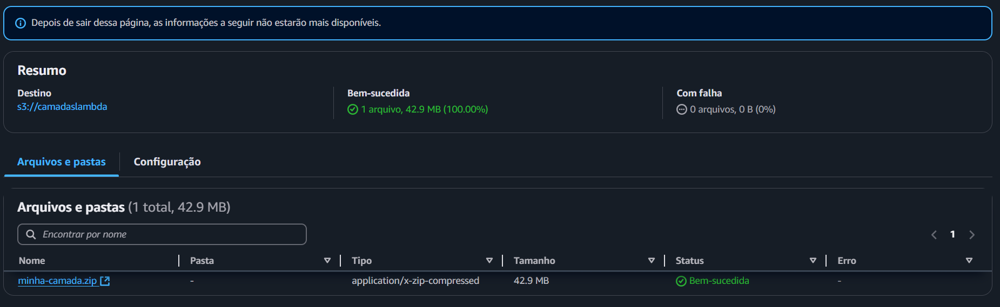
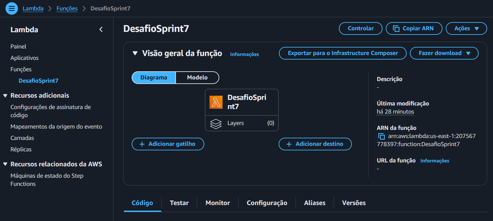
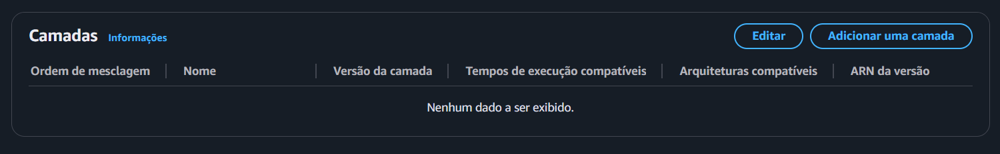
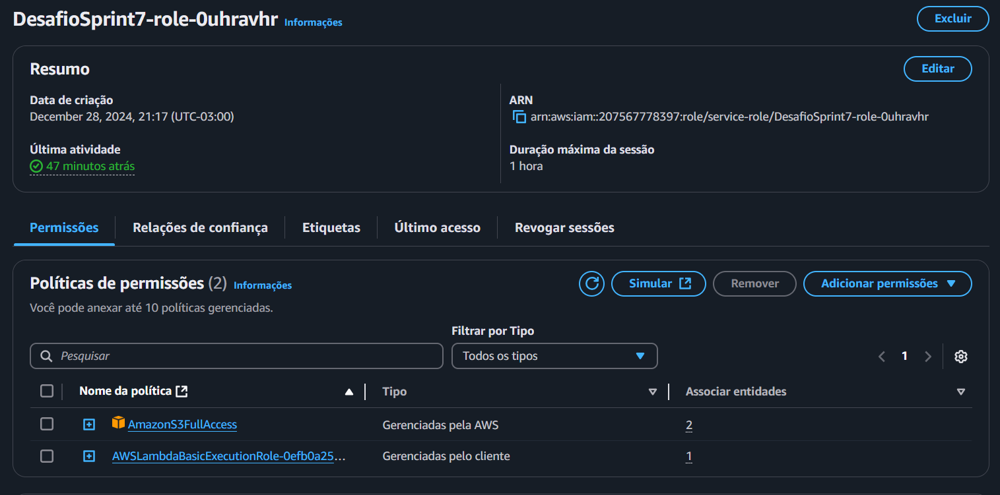
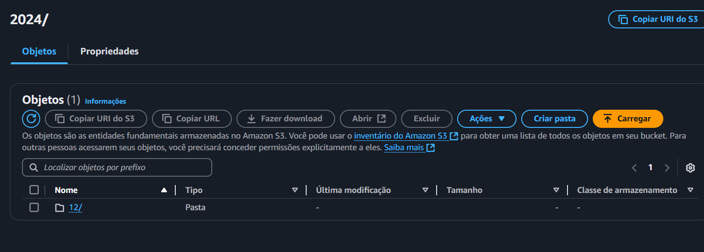

# Desafio
Esse desafio dará continuação ao desafio da Sprint passada. Essa é a **etapa 2** da elaboração do desafio final. nessa etapa
vamos realizar a digestão de uma api do TMDB via AWS Lambda. Os dados deverão ser armazenados na camada Raw Zone e o arquivo deve ser no formato json.

# Etapa 1
Nessa etapa iremos criar um script que pegue informações adicionais ao arquivo **Filmes+e+Series.csv**

Código:

```py
import csv
import requests
import json
import pandas as pd

# Definindo a chave da API TMDB e as URLs para os endpoints
api_key = "7ac33345c0f52862959af97e38df7616"
search_url = "https://api.themoviedb.org/3/search/movie"
details_url = "https://api.themoviedb.org/3/movie"
credits_url = "https://api.themoviedb.org/3/movie/{}/credits"

# Função para buscar informações de um filme pelo título original
def buscar_dados_tmdb(titulo_original):
    print(f"Procurando informações sobre: {titulo_original}")
    params = {
        "api_key": api_key,
        "language": "pt-BR",
        "query": titulo_original
    }
    response = requests.get(search_url, params=params)
    if response.status_code == 200:
        resultados = response.json().get("results", [])
        if resultados:
            return resultados[0]
    return None

# Função para obter os detalhes de um filme pelo ID
def obter_detalhes_tmdb(movie_id):
    response = requests.get(f"{details_url}/{movie_id}", params={"api_key": api_key, "language": "pt-BR"})
    if response.status_code == 200:
        return response.json()
    return None

# Função para obter informações sobre os créditos (atores e diretor) do filme
def obter_creditos_tmdb(movie_id):
    response = requests.get(f"{credits_url.format(movie_id)}", params={"api_key": api_key, "language": "pt-BR"})
    if response.status_code == 200:
        return response.json()
    return None

# Função para ler o arquivo CSV e filtrar filmes de comédia e animação com nota maior que 7
def ler_csv_filtrado(arquivo_csv):
    df = pd.read_csv(arquivo_csv, delimiter='|', encoding="utf-8")
    
    # Remover linhas com valores ausentes ou inválidos
    df = df[df['genero'].notna() & (df['genero'] != '\\N')]  
    
    # Garantir que cada filme seja único
    df = df.drop_duplicates(subset='id')
    
    # Filtrar filmes de comédia e animação com nota maior que 7
    df_filtrado = df[df['genero'].str.contains("Comedy|Animation", case=False, na=False)]
    df_filtrado = df_filtrado[df_filtrado['notaMedia'] > 7]
    
    return df_filtrado

# Função para processar os filmes e adicionar informações do TMDB
def processar_filmes(filmes_df):
    filmes_comedia = []
    filmes_animated = []

    # Filtrar os filmes de comédia e animação
    filmes_comedia_df = filmes_df[filmes_df['genero'].str.contains("Comedy", case=False, na=False)]
    filmes_animated_df = filmes_df[filmes_df['genero'].str.contains("Animation", case=False, na=False)]

    # Selecionar os 20 filmes mais votados de cada gênero
    filmes_comedia_top20 = filmes_comedia_df.nlargest(20, 'numeroVotos')
    filmes_animated_top20 = filmes_animated_df.nlargest(20, 'numeroVotos')

    # Processar filmes de comédia
    for index, filme in filmes_comedia_top20.iterrows():
        titulo_original = filme["tituloOriginal"]
        dados_tmdb = buscar_dados_tmdb(titulo_original)
        
        if dados_tmdb:
            generos = [genero["name"] for genero in dados_tmdb.get("genres", [])]
            detalhes = obter_detalhes_tmdb(dados_tmdb["id"])
            
            if detalhes:
                creditos = obter_creditos_tmdb(dados_tmdb["id"])
                diretor = ""
                principais_atores = []
                
                if creditos:
                    for crew_member in creditos.get("crew", []):
                        if crew_member["job"] == "Director":
                            diretor = crew_member["name"]
                            break
                    
                    for cast_member in creditos.get("cast", [])[:3]:
                        principais_atores.append(cast_member["name"])
                
                paises = [pais["name"] for pais in detalhes.get("production_countries", [])]
                
                filme_completo = {
                    "id_csv": filme["id"],
                    "tituloPincipal": filme["tituloPincipal"],
                    "anoLancamento": filme["anoLancamento"],
                    "tmdb_id": detalhes["id"],
                    "titulo_tmdb": detalhes.get("title"),
                    "sinopse": detalhes.get("overview"),
                    "popularidade": detalhes.get("popularity"),
                    "nota_media": detalhes.get("vote_average"),
                    "votos": detalhes.get("vote_count"),
                    "data_lancamento": detalhes.get("release_date"),
                    "generos": generos,
                    "idioma_original": detalhes.get("original_language", ""),
                    "faturamento": detalhes.get("revenue"),
                    "orcamento": detalhes.get("budget"),
                    "diretor": diretor,
                    "principais_atores": principais_atores,
                    "pais_producao": paises,
                }
                filmes_comedia.append(filme_completo)

    # Processar filmes de animação
    for index, filme in filmes_animated_top20.iterrows():
        titulo_original = filme["tituloOriginal"]
        dados_tmdb = buscar_dados_tmdb(titulo_original)
        
        if dados_tmdb:
            generos = [genero["name"] for genero in dados_tmdb.get("genres", [])]
            detalhes = obter_detalhes_tmdb(dados_tmdb["id"])
            
            if detalhes:
                creditos = obter_creditos_tmdb(dados_tmdb["id"])
                diretor = ""
                principais_atores = []
                
                if creditos:
                    for crew_member in creditos.get("crew", []):
                        if crew_member["job"] == "Director":
                            diretor = crew_member["name"]
                            break
                    
                    for cast_member in creditos.get("cast", [])[:3]:
                        principais_atores.append(cast_member["name"])
                
                paises = [pais["name"] for pais in detalhes.get("production_countries", [])]
                
                filme_completo = {
                    "id_csv": filme["id"],
                    "tituloPincipal": filme["tituloPincipal"],
                    "anoLancamento": filme["anoLancamento"],
                    "tmdb_id": detalhes["id"],
                    "titulo_tmdb": detalhes.get("title"),
                    "sinopse": detalhes.get("overview"),
                    "popularidade": detalhes.get("popularity"),
                    "nota_media": detalhes.get("vote_average"),
                    "votos": detalhes.get("vote_count"),
                    "data_lancamento": detalhes.get("release_date"),
                    "generos": generos,
                    "idioma_original": detalhes.get("original_language", ""),
                    "faturamento": detalhes.get("revenue"),
                    "orcamento": detalhes.get("budget"),
                    "diretor": diretor,
                    "principais_atores": principais_atores,
                    "pais_producao": paises,
                }
                filmes_animated.append(filme_completo)

    return filmes_comedia, filmes_animated

# Caminho para o arquivo CSV
arquivo_csv = 'movies.csv'

# Filtrando e processando os filmes
df_filtrado = ler_csv_filtrado(arquivo_csv)
filmes_comedia, filmes_animated = processar_filmes(df_filtrado)

# Salvando os resultados em um arquivo JSON
with open('filmes_comedia_animacao.json', 'w', encoding='utf-8') as f:
    json.dump({"comedia": filmes_comedia, "animacao": filmes_animated}, f, ensure_ascii=False, indent=4)
```

Com esse código buscamos informações adicionais, como: Atores, Diretores, bilheteria e faturamento.
Além disso, esse código salva o arquivo em [arquivo .json](./filmes_comedia_animacao.json). na estrutura pedida pelo desafio da Sprint

exemplo do arquivo:
```js
{
    "comedia": [
        {
            "id_csv": "tt0993846",
            "tituloPincipal": "The Wolf of Wall Street",
            "anoLancamento": "2013",
            "tmdb_id": 106646,
            "titulo_tmdb": "O Lobo de Wall Street",
            "sinopse": "Durante seis meses, Jordan Belfort (Leonardo DiCaprio) trabalhou duro em uma corretora de Wall Street, seguindo os ensinamentos de seu mentor Mark Hanna (Matthew McConaughey). Quando finalmente consegue ser contratado como corretor da firma, acontece o Black Monday, que faz com que as bolsas de vários países caiam repentinamente. Sem emprego e bastante ambicioso, ele acaba trabalhando para uma empresa de fundo de quintal que lida com papéis de baixo valor, que não estão na bolsa de valores. É lá que Belfort tem a idéia de montar uma empresa focada neste tipo de negócio, cujas vendas são de valores mais baixos mas, em compensação, o retorno para o corretor é bem mais vantajoso. Ao lado de Donnie (Jonah Hill) e outros amigos dos velhos tempos, ele cria a Stratton Oakmont, uma empresa que faz com que todos enriqueçam rapidamente e, também, levem uma vida dedicada ao prazer.",
            "popularidade": 125.461,
            "nota_media": 8.033,
            "votos": 24055,
            "data_lancamento": "2013-12-25",
            "generos": [],
            "idioma_original": "en",
            "faturamento": 392000000,
            "orcamento": 100000000,
            "diretor": "Martin Scorsese",
            "principais_atores": [
                "Leonardo DiCaprio",
                "Jonah Hill",
                "Margot Robbie"
            ],
            "pais_producao": [
                "United States of America"
            ]
        },
        {
            "id_csv": "tt0088763",
            "tituloPincipal": "Back to the Future",
            "anoLancamento": "1985",
            "tmdb_id": 105,
            "titulo_tmdb": "De Volta para o Futuro",
            "sinopse": "Marty McFly, um típico adolescente americano dos anos 80, acidentalmente é enviado de volta ao ano de 1955 em um carro modificado para ser uma máquino do tempo, inventada por um cientista louco. Durante sua fantástica e maluca viagem no tempo, McFly tem que fazer com que seus futuros pais se encontrem e se apaixonem, para que assim ele possa ir de volta para o futuro.",
            "popularidade": 79.501,
            "nota_media": 8.317,
            "votos": 20029,
            "data_lancamento": "1985-07-03",
            "generos": [],
            "idioma_original": "en",
            "faturamento": 381109762,
            "orcamento": 19000000,
            "diretor": "Robert Zemeckis",
            "principais_atores": [
                "Michael J. Fox",
                "Christopher Lloyd",
                "Crispin Glover"
            ],
            "pais_producao": [
                "United States of America"
            ]
```

# Etapa 2
Agora iremos criar uma função no lambda que realize o mesmo Script, e que mande o arquivo para um Bucket no s3 com o caminho: ```none do bucket>\<canada de armazenamento:\<origen do dado>\<formato do dado>\<especificação do dado>\<data de processamento separado por ano\mesidias\<arquivo>```
Ou seja

**S3: \\data-lake-do-fulano\Raw\TMDB\JSON\2022185\82\prt-uty-nfd.json**

## Etapa 2.1
Primeiro pesquisaremos o Lambda na aws e iremos criar uma função


Dentro do lambda iremos nomear uma função e apertamos em **criar função**, a versão do python deverá ser a 3.9


Ao criarmos a função, seremos redirecionados a tela principal, e nela veremos o código base da função (Código que será substituido pelo do nosso Script)





Substituimos o código para o do nosso Script e executamos

Código do Script na AWS Lambda
```py
import boto3
import csv
import requests
import json
import pandas as pd
from io import StringIO
from datetime import datetime

# Configuração da API TMDB
API_KEY = "xxxxxxxxxxxxxxxxxxxxxxxxxxx"
TMDB_BASE_URL = "https://api.themoviedb.org/3"
SEARCH_URL = f"{TMDB_BASE_URL}/search/movie"
DETAILS_URL = f"{TMDB_BASE_URL}/movie"
CREDITS_URL = f"{TMDB_BASE_URL}/movie/{{}}/credits"

# Inicialização do cliente S3
s3 = boto3.client('s3')

# Função para buscar informações de um filme
def buscar_dados_tmdb(titulo_original):
    print(f"Buscando dados para: {titulo_original}")
    params = {
        "api_key": API_KEY,
        "language": "pt-BR",
        "query": titulo_original
    }
    response = requests.get(SEARCH_URL, params=params)
    if response.ok:
        resultados = response.json().get("results", [])
        return resultados[0] if resultados else None
    return None

# Função para obter detalhes do filme
def obter_detalhes_tmdb(movie_id):
    response = requests.get(f"{DETAILS_URL}/{movie_id}", params={"api_key": API_KEY, "language": "pt-BR"})
    return response.json() if response.ok else None

# Função para obter créditos do filme
def obter_creditos_tmdb(movie_id):
    response = requests.get(CREDITS_URL.format(movie_id), params={"api_key": API_KEY, "language": "pt-BR"})
    return response.json() if response.ok else None

# Função para ler e filtrar o CSV do S3
def ler_csv_filtrado(bucket_name, arquivo_csv):
    print(f"Lendo arquivo {arquivo_csv} do bucket {bucket_name}")
    response = s3.get_object(Bucket=bucket_name, Key=arquivo_csv)
    content = response['Body'].read().decode('utf-8')
    df = pd.read_csv(StringIO(content), delimiter='|', encoding="utf-8")
    
    # Filtrando dados
    df = df[df['genero'].notna() & (df['genero'] != '\\N')].drop_duplicates(subset='id')
    return df[(df['genero'].str.contains("Comedy|Animation", case=False, na=False)) & (df['notaMedia'] > 7)]

# Função para processar filmes e enriquecer os dados com informações do TMDB
def processar_filmes(filmes_df):
    filmes_processados = {"comedia": [], "animacao": []}
    
    for genero, chave in [("Comedy", "comedia"), ("Animation", "animacao")]:
        filmes_top20 = filmes_df[filmes_df['genero'].str.contains(genero, case=False, na=False)].nlargest(20, 'numeroVotos')
        
        for _, filme in filmes_top20.iterrows():
            dados_tmdb = buscar_dados_tmdb(filme["tituloOriginal"])
            if not dados_tmdb:
                continue
            
            detalhes = obter_detalhes_tmdb(dados_tmdb["id"])
            creditos = obter_creditos_tmdb(dados_tmdb["id"]) if detalhes else None
            
            filme_completo = {
                "id_csv": filme["id"],
                "tituloPincipal": filme["tituloPincipal"],
                "anoLancamento": filme["anoLancamento"],
                "tmdb_id": detalhes.get("id") if detalhes else None,
                "titulo_tmdb": detalhes.get("title") if detalhes else None,
                "sinopse": detalhes.get("overview") if detalhes else None,
                "popularidade": detalhes.get("popularity") if detalhes else None,
                "nota_media": detalhes.get("vote_average") if detalhes else None,
                "votos": detalhes.get("vote_count") if detalhes else None,
                "data_lancamento": detalhes.get("release_date") if detalhes else None,
                "generos": [genero["name"] for genero in dados_tmdb.get("genres", [])] if dados_tmdb else [],
                "diretor": next((membro["name"] for membro in creditos.get("crew", []) if membro["job"] == "Director"), "") if creditos else "",
                "principais_atores": [ator["name"] for ator in (creditos.get("cast", [])[:3] if creditos else [])],
                "pais_producao": [pais["name"] for pais in (detalhes.get("production_countries", []) if detalhes else [])],
                "orcamento": detalhes.get("budget") if detalhes else None,
                "faturamento": detalhes.get("revenue") if detalhes else None,
            }
            filmes_processados[chave].append(filme_completo)
    
    return filmes_processados

# Função principal (Lambda Handler)
def lambda_handler(event, context):
    bucket_name = 'data-lake-do-leonardo'
    arquivo_csv = 'Raw/Local/CSV/Movies/2024/12/17/movies.csv'
    print("Iniciando processamento...")

    # Processando o CSV
    df_filtrado = ler_csv_filtrado(bucket_name, arquivo_csv)
    filmes_enriquecidos = processar_filmes(df_filtrado)
    
    # Gravando os resultados no S3
    data_atual = datetime.now().strftime('%Y/%m/%d')
    arquivo_json = f'Raw/TMDB/JSON/{data_atual}/movies_comedia_animacao.json'
    s3.put_object(
        Bucket=bucket_name,
        Key=arquivo_json,
        Body=json.dumps(filmes_enriquecidos, ensure_ascii=False, indent=4),
        ContentType='application/json'
    )
    print(f"Arquivo JSON gerado com sucesso: {arquivo_json}")
    
    return {
        'statusCode': 200,
        'body': json.dumps(f'Arquivo JSON salvo em {arquivo_json}')
    }

```

Ao executarmos esse Script será retornado um erro



Esse erro indica que o lambda não possui a biblioteca necessaria para realizar esse Script, e teremos que adicionalas manualmente.

# etapa 3
Aqui criaremos um Dockfile para enviarmos os arquivos da biblioteca para o lambda

Arquivo Dockfile


Com isso Abriremos o terminal no vscode e incluiremos os seguintes comandos:

```shell
docker build -t linux_aws_desafio7 .
```

com isso a imagem será criada


então executamos o comando ```docker run - it 8a20```
para rodarmos essa imagem em um terminal interativo.

dentro desse terminal interativo, inserimos os seguintes comandos:

```shell
# Vai para o diretorio do usuario
cd ~ 

# Cria um arquivo chamado layer_dir
mkdir layer_dir

# vai para o arquivo layer_dir
cd layer_dir/

# Cria um arquivo chamado python dentro do arquivo layer_dir
mkdir python

# Entra no direrotio python que acabara de criar
cd python/

# Mostra o caminho do diretorio atual
pwd
```

A saida do código deverá ser 

**/root/layer_dir/python**

## Etapa 3.1
Aqui instalaremos as bibliotecas no diretorio **python**

Faremos isso utilizando os comando no terminal:

```shell
# Instala a biblioteca pandas
pip3 install pandas -t .

# Instala a biblioteca requests
pip3 install requests -t .
```

com as bibliotecas instaladas, vamos zipar o diretorio layer_dir para enviarmos ao lambda, para isso usaremos os seguintes comandos:

```shell

# Volta para o diretorio anterior (No caso, layer_dir)
cd ..

# zipa o arquivo com as bibliotecas instaladas
zip -r minha-camada.zip .
```

Agora iremos copiar o arquivo para nosso computador


com o id do container executamos o seguinte código

```docker cp 66f39:/root/layer_dir/minha-camada.zip ./```

Com isso temos o arquivo [minha-camada.zip](./minha-camada.zip) salvo no nosso computador

# Etapa 4
Aqui enviaremos o arquivo para o lambda

Obs: A AWS recomenda que, se o arquivo tiver mais de 10mb deve ser enviado por meio de um bucket

Então, criaremos um Bucket e armazenaremos o arquivo que acabamos de criar, com as bibliotecas que precisamos, para o s3



Na imagem a cima, o arquivo já está armazenado no bucket.

Com isso, voltaremos ao lambda e criaremos uma layer (camada)




Nessa camada, daremos um nome e indicaremos o bucket no qual está armazenado o qruivo que contem as bibliotecas.


Após criarmos, temos que adicionar a camada ao lambda. Descendo a tela inicial do lambda, iremos encontrar uma parte chamado **Camadas** apertaremos em editar camadas



Escolhemos a camada e a versão do python e adicionamos


Ao voltarmos para a tela inicial do lambda, podemos ver que há uma camada adicionada.


# Etapa 4.1
Antes de testarmos o código, vamos dar permissão ao Lambda para acessar o s3

Iremos em **configurações** na tela inicial do lambda, e em seguida em **permisões**


Apertamos no link que está logo abaixo do **Nome da função** e seremos redirecionado para o serviço IAM da AWS



Iremos em **adicionar permissões** e, em seguida, em anexar políticas


Aqui devemos perquisar pela política **s3FullAcess** e a adicionarmos


# Etapa 5
Ao realizarmos tudo, vamos rodar novamente o código.

Ao executarmos novamente, a mensagem retornada será:


Vamos verificar o Bucket para vermos se o código funcionou.

Dentro do bucket, vamos até o **Raw**


TMDB


JSON


ANO


Mes



Dia


E aqui podemos ver que o arquivo foi enviado com sucesso


Com isso o Desafio é finalizado