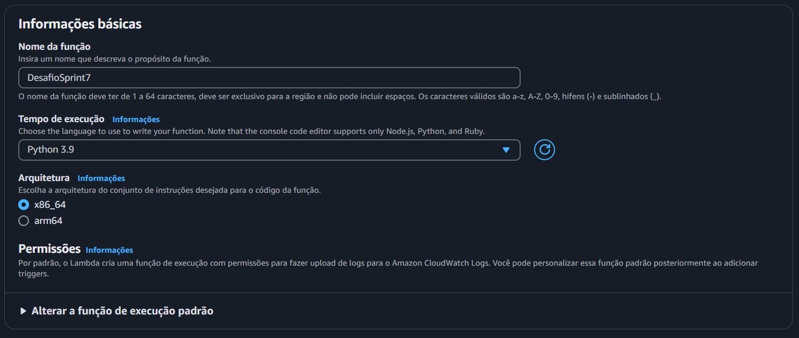
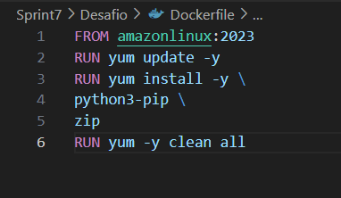
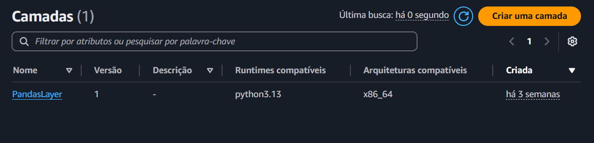
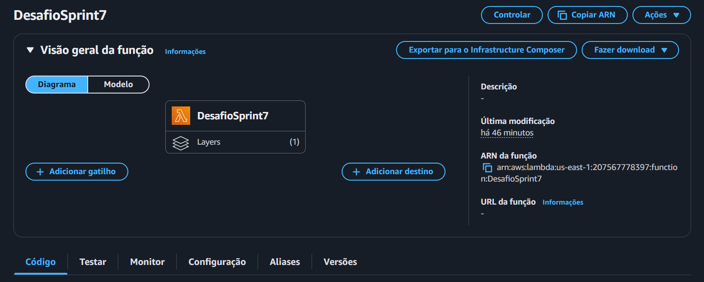
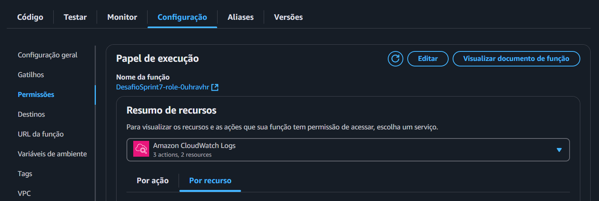
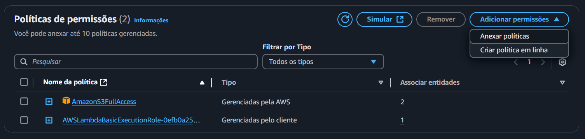
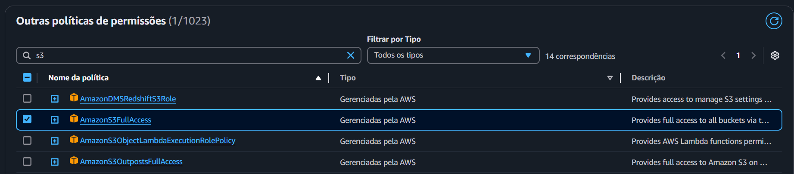
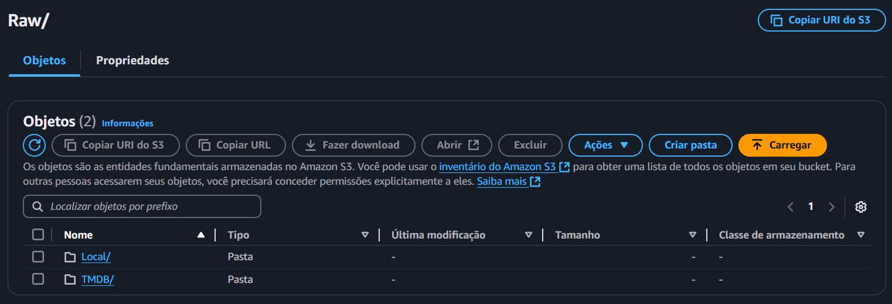
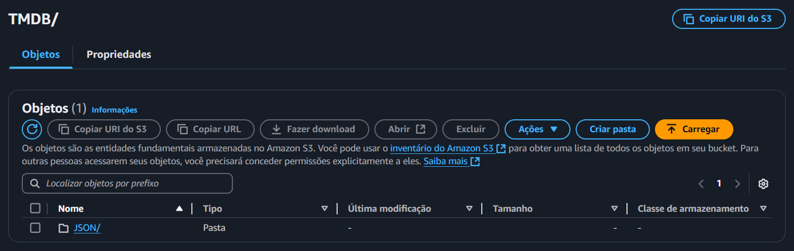
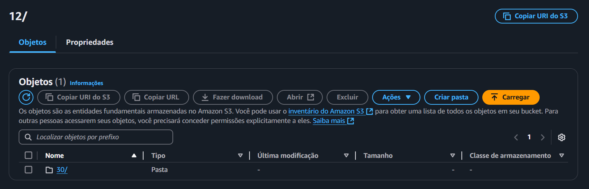

# Desafio
Esse desafio dará continuação ao desafio da Sprint passada. Essa é a **etapa 2** da elaboração do desafio final. nessa etapa
vamos realizar a digestão de uma api do TMDB via AWS Lambda. Os dados deverão ser armazenados na camada Raw Zone e o arquivo deve ser no formato json.

# Etapa 1
Nessa etapa iremos criar um script que pegue informações adicionais ao arquivo **Filmes+e+Series.csv**

Código:

```py
import requests
import json

# Chave de API e URLs base
api_key = "7ac33345c0f52862959af97e38df7616"
base_url = "https://api.themoviedb.org/3/discover/movie"
movie_details_url = "https://api.themoviedb.org/3/movie"

# Parâmetros para buscar filmes de comédia
params_comedia = {
    "api_key": api_key,
    "language": "pt-BR",
    "with_genres": "35",  
    "sort_by": "popularity.desc",
    "page": 1
}

# Parâmetros para buscar filmes de animação
params_animacao = {
    "api_key": api_key,
    "language": "pt-BR",
    "with_genres": "16",  
    "sort_by": "popularity.desc",
    "page": 1
}

# Função para buscar até 25 filmes de um gênero
def get_filmes(params):
    filmes = []
    page = 1
    
    while len(filmes) < 25:  # Limita a 25 filmes
        params["page"] = page
        response = requests.get(base_url, params=params)
        
        if response.status_code != 200:
            print(f"Erro ao acessar API. Código: {response.status_code}")
            break

        data = response.json()
        filmes_pagina = data.get('results', [])
        filmes.extend(filmes_pagina)

        if len(filmes_pagina) == 0: 
            break
        
        page += 1

    return filmes[:25]  

# Obter filmes de comédia e animação
filmes_comedia = get_filmes(params_comedia)
filmes_animacao = get_filmes(params_animacao)

# Combina as duas listas
todos_filmes = filmes_comedia + filmes_animacao

print(f"Total de filmes encontrados: {len(todos_filmes)}")

# Detalhes completos dos filmes
filmes_completos = []
for filme in todos_filmes:
    movie_id = filme.get("id")
    detalhes_resposta = requests.get(f"{movie_details_url}/{movie_id}", params={"api_key": api_key, "language": "pt-BR"})
    
    if detalhes_resposta.status_code == 200:
        detalhes = detalhes_resposta.json()

        # Obter informações de elenco, equipe e faturamento
        creditos_resposta = requests.get(f"{movie_details_url}/{movie_id}/credits", params={"api_key": api_key, "language": "pt-BR"})
        diretor = "Não informado"
        atores_principais = []
        
        if creditos_resposta.status_code == 200:
            creditos = creditos_resposta.json()
            # Buscar diretor
            for pessoa in creditos.get("crew", []):
                if pessoa.get("job") == "Director":
                    diretor = pessoa.get("name")
                    break
            
            # Obter até 3 atores principais
            elenco = creditos.get("cast", [])
            atores_principais = [ator.get("name") for ator in elenco[:3]]

        # Adiciona informações de receita e orçamento
        receita = detalhes.get("revenue", 0)
        orcamento = detalhes.get("budget", 0)

        filme_completo = {
            "id": filme.get("id"),
            "titulo": filme.get("title"),
            "descricao": filme.get("overview"),
            "data_lancamento": filme.get("release_date"),
            "generos": filme.get("genre_ids"),
            "idioma_original": filme.get("original_language"),
            "popularidade": filme.get("popularity"),
            "nota_media": filme.get("vote_average"),
            "contagem_votos": filme.get("vote_count"),
            "diretor": diretor,
            "atores_principais": atores_principais,
            "orcamento": orcamento,
            "receita": receita
        }

        filmes_completos.append(filme_completo)
    else:
        print(f"Erro ao obter detalhes do filme ID {movie_id}")

# Salvar os filmes no arquivo JSON
output_file = "top25_filmes_comedia_animacao.json"
with open(output_file, "w", encoding="utf-8") as file:
    json.dump(filmes_completos, file, ensure_ascii=False, indent=4)

print(f"Dados salvos no arquivo '{output_file}'.")

```

Com esse código buscamos informações adicionais, como: Atores, Diretores, bilheteria e faturamento.
Além disso, esse código salva o arquivo em [arquivo .json](./top25_filmes_comedia_animacao.json). na estrutura pedida pelo desafio da Sprint

exemplo do arquivo:
```js
[
    {
        "id": 845781,
        "titulo": "Operação Natal",
        "descricao": "Depois que o Papai Noel – codinome: Das Neves – é sequestrado, o Chefe de Segurança do Polo Norte deve se unir ao mais infame caçador de recompensas do mundo em uma missão global e cheia de ação para salvar o Natal.",
        "data_lancamento": "2024-10-31",
        "generos": [
            28,
            14,
            35
        ],
        "idioma_original": "en",
        "popularidade": 4760.061,
        "nota_media": 7.0,
        "contagem_votos": 1552,
        "diretor": "Jake Kasdan",
        "atores_principais": [
            "Dwayne Johnson",
            "Chris Evans",
            "Lucy Liu"
        ],
        "orcamento": 250000000,
        "receita": 182861176
    },
    {
        "id": 939243,
        "titulo": "Sonic 3: O Filme",
        "descricao": "Sonic, Knuckles e Tails se reúnem contra um novo e poderoso adversário, Shadow, um vilão misterioso com poderes diferentes de tudo que eles já enfrentaram antes. Com suas habilidades superadas em todos os sentidos, a Equipe Sonic deve buscar uma aliança improvável na esperança de parar Shadow e proteger o planeta.",
        "data_lancamento": "2024-12-19",
        "generos": [
            28,
            878,
            35,
            10751
        ],
        "idioma_original": "en",
        "popularidade": 4338.285,
        "nota_media": 7.7,
        "contagem_votos": 181,
        "diretor": "Jeff Fowler",
        "atores_principais": [
            "Ben Schwartz",
            "Jim Carrey",
            "Keanu Reeves"
        ],
        "orcamento": 122000000,
        "receita": 211552146
    },
    {
        "id": 1241982,
        "titulo": "Moana 2",
        "descricao": "Depois de receber um chamado inesperado de seus ancestrais navegadores, Moana vai viajar para mares distantes da Oceania, em águas perdidas em uma aventura perigosa.",
        "data_lancamento": "2024-11-21",
        "generos": [
            16,
            12,
            10751,
            35
        ],
        "idioma_original": "en",
        "popularidade": 2845.684,
        "nota_media": 7.0,
        "contagem_votos": 640,
        "diretor": "David G. Derrick Jr.",
        "atores_principais": [
            "Auliʻi Cravalho",
            "Dwayne Johnson",
            "Hualālai Chung"
        ],
        "orcamento": 150000000,
        "receita": 882105425
    }
```

# Etapa 2
Agora iremos criar uma função no lambda que realize o mesmo Script, e que mande o arquivo para um Bucket no s3 com o caminho: ```none do bucket>\<canada de armazenamento:\<origen do dado>\<formato do dado>\<especificação do dado>\<data de processamento separado por ano\mesidias\<arquivo>```
Ou seja

**S3: \\data-lake-do-fulano\Raw\TMDB\JSON\2022185\82\prt-uty-nfd.json**

## Etapa 2.1
Primeiro pesquisaremos o Lambda na aws e iremos criar uma função


Dentro do lambda iremos nomear uma função e apertamos em **criar função**, a versão do python deverá ser a 3.9



Ao criarmos a função, seremos redirecionados a tela principal, e nela veremos o código base da função (Código que será substituido pelo do nosso Script)


Substituimos o código para o do nosso Script e executamos

Código do Script na AWS Lambda
```py
import boto3
import json
import requests
import os
from datetime import datetime

# Inicializa o cliente S3
s3_client = boto3.client('s3')

def get_filmes(params, base_url):
    filmes = []
    page = 1
    while len(filmes) < 25:
        params["page"] = page
        response = requests.get(base_url, params=params)
        if response.status_code != 200:
            print(f"Erro ao acessar API. Código: {response.status_code}")
            break
        data = response.json()
        filmes.extend(data.get('results', []))
        if len(data.get('results', [])) == 0:
            break
        page += 1
    return filmes[:25]

def get_detalhes_filme(filme, movie_details_url, api_key):
    movie_id = filme.get("id")
    detalhes_resposta = requests.get(f"{movie_details_url}/{movie_id}", params={"api_key": api_key, "language": "pt-BR"})
    if detalhes_resposta.status_code != 200:
        print(f"Erro ao obter detalhes do filme ID {movie_id}")
        return None

    detalhes = detalhes_resposta.json()

    # Obter informações de elenco e equipe
    creditos_resposta = requests.get(f"{movie_details_url}/{movie_id}/credits", params={"api_key": api_key, "language": "pt-BR"})
    diretor = "Não informado"
    atores_principais = []
    if creditos_resposta.status_code == 200:
        creditos = creditos_resposta.json()
        # Buscar diretor
        for pessoa in creditos.get("crew", []):
            if pessoa.get("job") == "Director":
                diretor = pessoa.get("name")
                break
        # Obter até 3 atores principais
        elenco = creditos.get("cast", [])
        atores_principais = [ator.get("name") for ator in elenco[:3]]

    # Adiciona receita e orçamento ao dicionário
    receita = detalhes.get("revenue", 0)  
    orcamento = detalhes.get("budget", 0)  

    filme_completo = {
        "id": filme.get("id"),
        "titulo": filme.get("title"),
        "descricao": filme.get("overview"),
        "data_lancamento": filme.get("release_date"),
        "generos": filme.get("genre_ids"),
        "idioma_original": filme.get("original_language"),
        "popularidade": filme.get("popularity"),
        "nota_media": filme.get("vote_average"),
        "contagem_votos": filme.get("vote_count"),
        "diretor": diretor,
        "atores_principais": atores_principais,
        "orcamento": orcamento,
        "receita": receita
    }
    return filme_completo

def lambda_handler(event, context):
    bucket_name = "data-lake-do-leonardo" 
    camada_armazenamento = "Raw"
    origem_dado = "TMDB"
    formato_dado = "JSON"
    especificacao_dado = "top25_filmes"
    
    # data atual
    data_processamento = datetime.now()
    ano = data_processamento.strftime("%Y")
    mes = data_processamento.strftime("%m")
    dia = data_processamento.strftime("%d")
    
    # Caminho do arquivo no S3
    arquivo_nome = "top25_filmes_comedia_animacao.json"
    arquivo_s3 = f"{camada_armazenamento}/{origem_dado}/{formato_dado}/{ano}/{mes}/{dia}/{arquivo_nome}"
    arquivo_local = "/tmp/top25_filmes.json"

    api_key = "7ac33345c0f52862959af97e38df7616"
    base_url = "https://api.themoviedb.org/3/discover/movie"
    movie_details_url = "https://api.themoviedb.org/3/movie"

    params_comedia = {
        "api_key": api_key,
        "language": "pt-BR",
        "with_genres": "35",
        "sort_by": "popularity.desc",
        "page": 1
    }

    params_animacao = {
        "api_key": api_key,
        "language": "pt-BR",
        "with_genres": "16",
        "sort_by": "popularity.desc",
        "page": 1
    }

    try:
        # Obtém os filmes
        filmes_comedia = get_filmes(params_comedia, base_url)
        filmes_animacao = get_filmes(params_animacao, base_url)
        todos_filmes = filmes_comedia + filmes_animacao

        # Obter detalhes completos dos filmes
        filmes_completos = []
        for filme in todos_filmes:
            detalhes = get_detalhes_filme(filme, movie_details_url, api_key)
            if detalhes:
                filmes_completos.append(detalhes)

        # Salva os filmes em um arquivo JSON
        with open(arquivo_local, "w", encoding="utf-8") as file:
            json.dump(filmes_completos, file, ensure_ascii=False, indent=4)
        print(f"Arquivo {arquivo_local} criado com sucesso.")

        # Faz o upload para o bucket S3
        s3_client.upload_file(arquivo_local, bucket_name, arquivo_s3)
        print(f"Arquivo {arquivo_s3} enviado para o bucket {bucket_name} com sucesso.")
        return {
            "statusCode": 200,
            "body": json.dumps({"message": "Arquivo enviado com sucesso para o S3"})
        }
    except Exception as e:
        print(f"Erro: {str(e)}")
        return {
            "statusCode": 500,
            "body": json.dumps({"message": "Erro ao processar a solicitação", "error": str(e)})
        }

```

Ao executarmos esse Script será retornado um erro


Esse erro indica que o lambda não possui a biblioteca necessaria para realizar esse Script, e teremos que adicionalas manualmente.

# etapa 3
Aqui criaremos um Dockfile para enviarmos os arquivos da biblioteca para o lambda

Arquivo Dockfile



Com isso Abriremos o terminal no vscode e incluiremos os seguintes comandos:

```shell
docker build -t linux_aws_desafio7 .
```

com isso a imagem será criada


então executamos o comando ```docker run - it 8a20```
para rodarmos essa imagem em um terminal interativo.

dentro desse terminal interativo, inserimos os seguintes comandos:

```shell
# Vai para o diretorio do usuario
cd ~ 

# Cria um arquivo chamado layer_dir
mkdir layer_dir

# vai para o arquivo layer_dir
cd layer_dir/

# Cria um arquivo chamado python dentro do arquivo layer_dir
mkdir python

# Entra no direrotio python que acabara de criar
cd python/

# Mostra o caminho do diretorio atual
pwd
```

A saida do código deverá ser 

**/root/layer_dir/python**

## Etapa 3.1
Aqui instalaremos as bibliotecas no diretorio **python**

Faremos isso utilizando os comando no terminal:

```shell
# Instala a biblioteca pandas
pip3 install pandas -t .

# Instala a biblioteca requests
pip3 install requests -t .
```

com as bibliotecas instaladas, vamos zipar o diretorio layer_dir para enviarmos ao lambda, para isso usaremos os seguintes comandos:

```shell

# Volta para o diretorio anterior (No caso, layer_dir)
cd ..

# zipa o arquivo com as bibliotecas instaladas
zip -r minha-camada.zip .
```

Agora iremos copiar o arquivo para nosso computador


com o id do container executamos o seguinte código

```docker cp 66f39:/root/layer_dir/minha-camada.zip ./```

Com isso temos o arquivo [minha-camada.zip](./minha-camada.zip) salvo no nosso computador

# Etapa 4
Aqui enviaremos o arquivo para o lambda

Obs: A AWS recomenda que, se o arquivo tiver mais de 10mb deve ser enviado por meio de um bucket

Então, criaremos um Bucket e armazenaremos o arquivo que acabamos de criar, com as bibliotecas que precisamos, para o s3


Na imagem a cima, o arquivo já está armazenado no bucket.

Com isso, voltaremos ao lambda e criaremos uma layer (camada)




Nessa camada, daremos um nome e indicaremos o bucket no qual está armazenado o qruivo que contem as bibliotecas.


Após criarmos, temos que adicionar a camada ao lambda. Descendo a tela inicial do lambda, iremos encontrar uma parte chamado **Camadas** apertaremos em editar camadas


Escolhemos a camada e a versão do python e adicionamos


Ao voltarmos para a tela inicial do lambda, podemos ver que há uma camada adicionada.



# Etapa 4.1
Antes de testarmos o código, vamos dar permissão ao Lambda para acessar o s3

Iremos em **configurações** na tela inicial do lambda, e em seguida em **permisões**



Apertamos no link que está logo abaixo do **Nome da função** e seremos redirecionado para o serviço IAM da AWS


Iremos em **adicionar permissões** e, em seguida, em anexar políticas



Aqui devemos perquisar pela política **s3FullAcess** e a adicionarmos



# Etapa 5
Ao realizarmos tudo, vamos rodar novamente o código.

Ao executarmos novamente, a mensagem retornada será:


Vamos verificar o Bucket para vermos se o código funcionou.

Dentro do bucket, vamos até o **Raw**


TMDB



JSON



ANO


Mes


Dia



E aqui podemos ver que o arquivo foi enviado com sucesso


Com isso o Desafio é finalizado