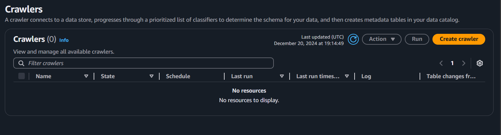
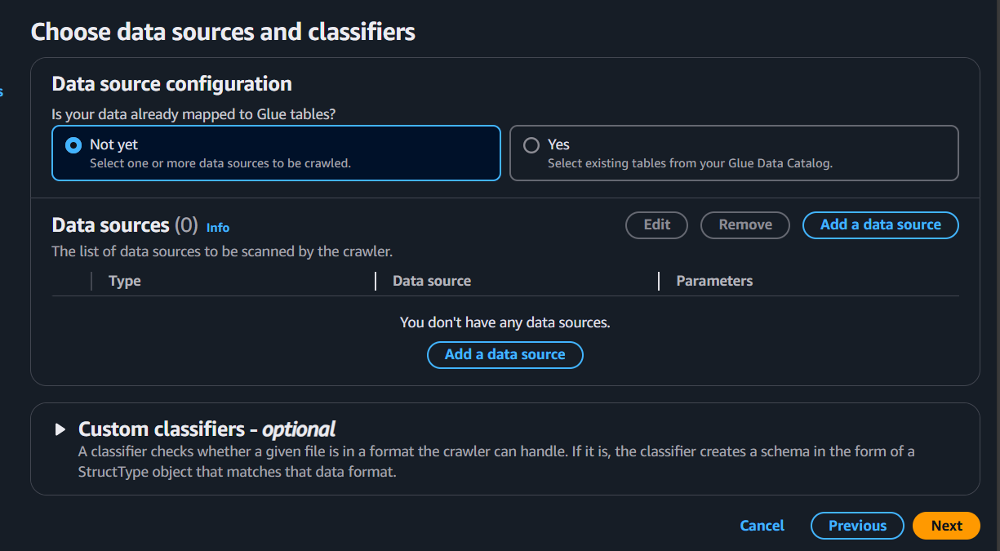
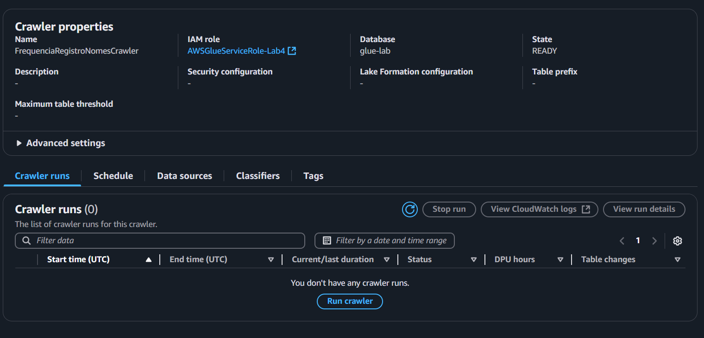

# Sprint 7
Essa Sprint foi aprofundada em Apache Spark. Onde foram vistos seus fundamentos e realizado algumas praticas em laboratorio na aws e exercicios

### Curso

> **Spark:** 
- Aprender a instalar e configurar o Spark

- Conhecer o principal objeto de dados: DataFrames do Spark

- Processar DataFrames através de transformações e ações

- Consultar Dados no Spark com Sintaxe SQL
- Criar Views e fazer Joins

- Persistir dados em disco, criando tabelas em formatos como Parquet e ORC

- Importar dados de fontes como Mongodb, PostgreSQL e arquivos como Json e Parquet

- Criar aplicações que você pode rodar na linha de comendo

- Machine Learning com Spark: crie modelos e faça previsões

- Construa Pipelines de Marchine Learning

- Processe dados em tempo real com Spark Structured Streaming

- Otimize o Spark com Cache, Persistência, Particionamento e Bucketing

- Use Spark com Jupyter Notebooks

- Use Spark com Pandas e outras bibliotecas do Python

- Construa um Cluster!

# Evidêncîas

As evidências estão relacionadas ao exercicio e ao desafio da Sprint. São armazenadas, respectivamente, em [evidências dos exercicios](Exercicios/Evidencias_exercicios/) e [evidências do Desafio](Evidencias/)
Os exercicios serão explicados nesse readme e o Desafio será explicado no [Readme do desafio](Desafio/). As evidências seguem a baixo:

## Exercicio 1 - Contador de palavras

Instalando o Apache Spark


Iniciando seção no Spark


Resultado do contador de palavras


## Exercicio 2 - TMDB

Entrando do site do TMDB


Criando uma conta no TMDB


Perfil criado


Criando API


Modo developer da API


Resultado do código 


## Laboratório AWS - Glue

Bucket que será trabalhado


Pesquisando IAM


Serviços do IAM


Adicionando funções 


Configurando permições


Pesquisando pelo glue


Tela inicial do Glue


Sem roles criadas


Criando roles


Alterando as permissões das roles


Configurando a role


Procurando pelo lake formation


Criando um data lake


Data lake criado


Criando um Script no glue


Query padrão do Glue


Configurando job 


Depois de configurar os jobs


Rodando o job


Job no Bucket


Indo para a aba tables


Criando uma table



Nomeando e configurando a table





Rodando um crawler



Após executar um crawler


Crawler excecutado com sucesso


Resultado da tabela


# Desafio

pesquisando o lambda


Tela inicial do lambda


Criando uma função no lambda


dentro da função


código base da função


Mensagem de erro


Dockfile


Imagem criada no docker


Copiando o arquivo para o pc


Enviando o arquivo para o bucket


Criando uma camada no lambda


configurando a camada


Adicionando a camada ao lambda


Camada adicionada


Configurando permissões no IAM


Adicionando permissões


Script executado com sucesso


Caminho do bucket depois da execução do Script


# Exercicios 
## Exercicio 1 - Contador de palavras com o Apache Spark
**Observação: esse exercicio foi feito com o google colab**

O arquivo do exercicio é: [contadorPalavra.ipynb](./Exercicios/contadorPalavra.ipynb) 

Priemiramente tivemos que fazer a instalação do Spark no colab, foi feito usando o seguinte código


Após instalarmos, iremos testa-lo, para isso iniciamos uma sessão no Spark


Com isso ele printará a versão que foi instalada do Spark, ou seja, printrá 

**Versão do Spark: 3.5.3**

Agora criaremos o código que contará as palavras do readme de apresentação

Código:
```py
from pyspark.sql import SparkSession
from urllib.request import urlopen

# Criando a sessão Spark
spark = SparkSession.builder.master("local[*]").appName("ContadorDePalavras").getOrCreate()
sc = spark.sparkContext

# URL do arquivo README no GitHub
url = "https://raw.githubusercontent.com/L3onVictor/contedor_palavra/refs/heads/main/README.md"

# Baixando o conteúdo do README
conteudo = urlopen(url).read().decode("utf-8")

# Salvando o conteúdo em um arquivo local
with open("README.md", "w") as arquivo:
    arquivo.write(conteudo)

# Lendo o arquivo usando Spark
rdd = sc.textFile("README.md")

# Realizando a contagem de palavras
contagem_palavras = (
    rdd.flatMap(lambda linha: linha.split())
       .map(lambda palavra: (palavra, 1))
       .reduceByKey(lambda a, b: a + b)
       .sortBy(lambda x: x[1], ascending=False)
)

# Printando as palavras
for palavra, quantidade in contagem_palavras.collect():
    print(f"'{palavra}': {quantidade}")


spark.stop()
```

Há algumas maneiras de fazermos ele ler o arquivo do readme, mas acabei criando um repositorio publico e clonei o readme de apresentação para ele, pegando apenas o seu link, para ser mais rapido a sua análise.

Ao executarmos esse código, esse será o resultado:


## Exercicio 2 - TMDB
Nesse exercicio devemos realizar uma extração usando a api do TMDB

Primeiramente, vamos acessar o site do tmdb


Agora devemos criar uma conta


Depois que a conta foi criada devemos criar a nossa API

Perfil: 


Criando api


Configurado a api


Depois de criada, vamos testar a api do tmdb

Com o seguinte código:
```py
import requests
import pandas as pd
from IPython.display import display

api_key = 'xxxxxxxxxxxxxxxxxxxxxxxxxxxx'
url = f"https://api.themoviedb.org/3/movie/top_rated?api_key={api_key}&language=pt-BR"
response = requests.get (url)
data = response.json()

filmes = []

for movie in data['results']:
    df = {'Titulo': movie['title'],
    'Data de lançamento': movie['release_date'],
    'Visão geral': movie['overview'],
    'Votos' : movie['vote_count' ],
    "Média de votos:": movie['vote_average']}

    filmes.append(df)

df = pd. DataFrame(filmes)
display(df)
```

Vamos listar os filmes presentes no tmdb, a saída do código será:


## Laboratório AWS - Glue
Nesse exercicio criaremos um ETL com o aws glue.

Primeiramente devemos criar um bucket na aws com a segunte estrutura **s3://{BUCKET}/lab-glue/input/nomes.csv**

O nome do bucket é **lab-4-glue-s3** como na imagem a seguir


## Etapa 1
Agora iremos criar um IAM

Buscando IAM na AWS


Tela inicial IAM


No console, acessamos a página do serviço Identity and Access Management (IAM) e clicamos no 
menu Roles à esquerda. Na sequência, clicamos no botão Create Role.

Aba de funções (roles)


Na primeira etapa, Select trusted entity, escolhemos AWS Service e para Use Case, infomamos **Glue**. 
Clique em Next.


Adicionamos as seguintes permissões à função e avançamos


## Etapa 2
Aqui configuraremos a conta para usarmos o aws glue

Pesquisando pelo glue


Tela inicial do Glue


Na tela inicial devemos selecionar a opção:  “Set up roles and users” 
no card “Prepare your account for AWS Glue”.


Podemos ver que não há roles criadas


Selecionamos a role que foi criada no IAM anteriormete


E configuramos a role para dar o acesso total


marcamos a opção “Update the standard AWS Glue service role and set it as the default 
(recommended)” e finalizamos o processo, clicando em Next e depois Apply changes


## Etapa 3
Aqui iremos configurar o lake formation

Procurando pelo lake formation


Vamos criar um data lake


## Etapa 4
Após criarmos o data lake devemos criar um job no AWS Glue

Para armazenamos o arquivo **nomes.csv** no Bucket que será utilizado nesse exercicio (que foi citado anteriormente) e voltamos a pagina do glue.

Após acessar a página inicial do glue, vamos na opção Visual ETL em ETL jobs no menu à 
esquerda. Depois em Script editor.


Query padrão do Glue


Configuramos o nome e a engine


e vamos para a aba de job details e mudamos as seguintes opções e salvamos:

- Name: Corresponde ao nome do job. Informe job_aws_glue_lab_4;
- IAM Role: Informe AWSGlueServiceRole-Lab4;
- Type: Mantenha Spark. 
- Glue version: Glue 3.0
- Language: Python 3 
- Worker Type: Escolha G 1x, ou seja, opção com menos vCPUs e RAM.
- Opção Automatically scale the number of workers deve estar desmarcada.
- Requested number of workers: 2. 
- Number of retries: 0. 
- Job timeout (minutes): 5.


Depois de configurarmos o job, O glue icará dessa maneira


## Etapa 5

Agora devemos criar um script no glue que deverá:

- Ler o arquivo nomes.csv no S3 (lembre-se de realizar upload do arquivo antes). 
- Imprimir o schema do dataframe gerado no passo anterior. 
- Escrever o código necessário para alterar a caixa dos valores da coluna nome para 
MAIÚSCULO. 
- Imprimir a contagem de linhas presentes no dataframe. 
- Imprimir a contagem de nomes, agrupando os dados do dataframe pelas colunas ano e sexo. 
Ordene os dados de modo que o ano mais recente apareça como primeiro registro do 
dataframe.
- Apresentar qual foi o nome feminino com mais registros e em que ano ocorreu. 
- Apresentar qual foi o nome masculino com mais registros e em que ano ocorreu.
- Apresentar o total de registros (masculinos e femininos) para cada ano presente no dataframe. 
Considere apenas as primeiras 10 linhas, ordenadas pelo ano, de forma crescente. 
- Escrever o conteúdo do dataframe com os valores de nome em maiúsculo no S3. 

> Atenção aos requisitos:

- A gravação deve ocorrer no subdiretório frequencia_registro_nomes_eua do path 
s3:///lab-glue/ 
- O formato deve ser JSON
- O particionamento deverá ser realizado pelas colunas sexo e ano (nesta ordem)

O meu código do seguinte Script é:

```py
import sys
from awsglue.transforms import *
from awsglue.utils import getResolvedOptions
from pyspark.context import SparkContext
from awsglue.context import GlueContext
from awsglue.job import Job
from pyspark.sql.functions import upper, desc

## @params: [JOB_NAME]
args = getResolvedOptions(sys.argv, ['JOB_NAME'])

sc = SparkContext()
glueContext = GlueContext(sc)
spark = glueContext.spark_session
job = Job(glueContext)
job.init(args['JOB_NAME'], args)

# Caminho para o arquivo no Bucket s3
caminho_arquivo = "s3://lab4-glue-s3/lab-glue/input/nomes.csv"
df = spark.read.csv(caminho_arquivo, header=True, inferSchema=True)

# Printando o Schema.
print('Schema:')
df.printSchema()

# Colocando os nomes em maiusculo
df = df.withColumn("nome", upper(df["nome"]))

# Quantidade de linhas
print(f"Linhas: {df.count()}")

df_nomes = df.groupBy("ano", "sexo").count().orderBy(desc("ano"))
df_nomes.show()

# Nome feminino mais registrado
feminino = df.filter(df["sexo"] == "F") \
    .groupBy("nome", "ano").count() \
    .orderBy(desc("count")).limit(1)
print("Nome feminino mais registrado:")
feminino.show()

# Nome masculino mais registrado
masculino = df.filter(df["sexo"] == "M") \
    .groupBy("nome", "ano").
```

Então, rodamos o Script


Podemos ver que funcionou ao acessamor o Bucket e perceber que o arquivo foi criado


## Etapa 6
Agora devemos criar um crawler 

Na página do serviço, escolha a opção Crawlers no 
menu à esquerda. Na sequência, clique no botão Create.


Agora apertamos em **criar Crawler**


informe FrequenciaRegistroNomesCrawler no campo Name. Clique em Next.


Em Choose data sources and classifiers, devemos informar o caminho do S3 a ser 
monitorado.


Em Set output and scheduling, no campo Target database, informamos glue-lab. Em Crawler 
schedule, no campo Frequency, definimos On Demand.


Rodando um crawler


Crawler excecutado com sucesso


Apos rodarmos o crawler, Visimatos o AWS Athena e verificamos a saída da tabela.

essa saída é:


Com isso o exercicio é finalizado.

# Certificados
Não houve certificados da AWS nessa Sprint