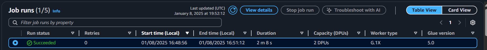

# Desafio
Esse desafio dará continuação ao desafio da Sprint anterior. Essa é a **etapa 3** da elaboração do Desafio final. Nessa etapa iremos adicionar os dados que estão na camada **Raw** para a camada **Trusted** por meio de um job no **AWS Glue**. Esse job deve enviar o arquivo **csv** bruto, que foi armazenado na **Sprint 6** e o arquivo **json** que fiu elaborado na **Sprint 7** e, posteriormente, acessar esses dados por meio do Amazon Athena.

> Camada Trusted: A camada Trusted de um data lake corresponde àquela em que os dados
encontram-se limpos e são confiáveis. É resultado da integração das diversas fontes de origem, que encontram-se na
camada anterior, que chamamos de Raw.
## Perguntas relacionadas a análise do banco de dados
1. Qual a média de custos dos filmes do gênero de comédia e animação.
2. Em qual década os filmes de aimação tiveram maior sucesso.
3. Em média, qual a diferença de faturamento entre os filmes desses 2 gêneros (Qual é mais lucrativo).
4. Quais atores são mais populares nos filmes de comédia.
5. Qual o gênero mais rentavel (com base no lucro e orçamento).
# Etapa 1 - Configurando e Executando um job no Glue

Primeiramenta iremos pesquisar pelo aws Glue


Interface do AWS Glue

Para criar um job, devemos clicar no botão **Go to ETL jobs**


Agora Iremos criar e configurar um Job

Clicando em Script editor, e em seguida escolhemos a engine que será utilizada, (No nosso caso, Spark)


Depois de criarmos um Job, iremos configura-lo.

Adicionamos um nome e mudamos algumas configurações conforme pedido no Desafio.

- **Work type**: informe G 1x

- **Requested number of workers**: Informe 2

- **Job timeout (minutes)**: Mantenha em 60 ou menos


Após a criação e configuração, daremos continuidade para desenvolver o Código que enviará o arquivo (nesse exemplo o arquivo json gerado na Sprint anterior) para a camada Trusted de um datalake.


Código que enviará o Arquivo json à camada Trusted:
```py
import sys
from pyspark.context import SparkContext
from pyspark.sql import SparkSession
from pyspark.sql.functions import col
from datetime import datetime

# Inicializar o Spark
sc = SparkContext()
spark = SparkSession(sc)

# Configuração do Spark
spark.conf.set("spark.sql.files.ignoreCorruptFiles", "true")

# Definir o caminho do S3
caminho_s3 = "s3://data-lake-do-leonardo/Raw/TMDB/JSON/2025/01/07/movies_comedia_animacao.json"

# Definir a data de processamento (ano, mês, dia)
data_processamento = datetime.now()
ano = data_processamento.strftime('%Y')
mes = data_processamento.strftime('%m')
dia = data_processamento.strftime('%d')

# Definir o caminho de saída do arquivo Parquet
arquivo = f"s3://data-lake-do-leonardo/Raw/Trusted/TMDB/PARQUET/comedia_animacao/{ano}/{mes}/{dia}"

# Carregar o arquivo JSON
df = spark.read.option("multiline", "true").json(caminho_s3)

df.show()

# Transformar os dados para o formato Parquet e gravar no S3
df.write.parquet(arquivo, mode="overwrite")

print(f"Arquivo Parquet salvo em: {arquivo}")

```

Após criarmos o código, devemos salvar e rodar o mesmo


Com isso percebemos que o job está sendo executado e esperamos a sua conclusão.

Antes do job ser concluido, nota-se que não há nenhuma camada Trusted no Bucket


Apôs ser executado, podemos ver o caminho que foi criado no Bucket para a transferencia do arquivo .json.

> O caminho para qual o arquivo deve ser armazenado deve seguir a seguinte estrutura:

```Origem do dado\formato do dado\especificação do dado\data de processamento separada por ano\mes\dia\arquivo```

> Job concluido com sucesso


> Diretorio trusted criado depois do diretorio **Raw** 


> Origem do dado **TMDB**


> Formato do dado **PARQUET**


> Especificação do dado **comedia_animacao**


> Ano


> Mês


> Dia


Ao final desse caminho O arquivo .PARQUET estará armazenado


# Etapa 2 - Criando um Crawler para visualização da tabela no Athena

Agora, usando o Glue Data Catalog, iremos criar um Crawler para visualizarmos as Tabelas dos arquivos enviados.

No canto Esquerdo da interface no Glue, clicamos em crawler e, em seguida, em create crawler


Agora iremos configurar o crawler

> Adicionamos o seu nome


> Em seguida o caminho do s3 que ele irá acessar.


> Nome da tabela e o local que ela será armazenada, no nosso caso, o local de armazenamento será o default

O nome da tabela será: **exemplo_tabela_athena_json**


Depois de configurado, o crawler será criado com sucesso, agora devemos o por em execução.

Clicando em **run crawler** ele será executado.


Com isso podemos ver que o crawler foi executado


# Etapa 3 - Visualizando a tabela no Amazon Athena

Nessa etapa, iremos visualizar a tabela que acabara de criar na etapa anterior.

Antes de tudo, iremos pesquisar pelo Amazon athena.


Podemos ver que no lado esquerdo há uma tabela chamada **exemplo_tabela_athena_json**, é nela que iremos realizar as consultas.


Com esse código iremos pegar todas as colunas da tabela especifica e mostrar as 10 primeiras linhas


O resultado da tabela está da seguinte maneira:


# Etapa 4 - Job para enviar o arquivo .csv

Como mostrado em exemplos anteriores, iremos criar um job, e configura-lo, como mostrado na **etapa 1**

Agora Criaremos o código que enviará o arquivo **csv**


Código:
```py
import sys
from pyspark.context import SparkContext
from pyspark.sql import SparkSession
from pyspark.sql.functions import col, explode, split
from awsglue.context import GlueContext
from awsglue.utils import getResolvedOptions
from datetime import datetime

# Inicializar o Spark
sc = SparkContext()
glueContext = GlueContext(sc)
spark = glueContext.spark_session

args = getResolvedOptions(sys.argv, ["JOB_NAME"])
glueContext = GlueContext(SparkContext.getOrCreate())

job_name = args["JOB_NAME"]

# Caminho do arquivo CSV no S3
caminho_csv = "s3://data-lake-do-leonardo/Raw/Local/CSV/Movies/2024/12/17/movies.csv"

# Obter a data atual para organizar o caminho de saída
data_atual = datetime.now()
ano = data_atual.strftime('%Y')
mes = data_atual.strftime('%m')
dia = data_atual.strftime('%d')

# Caminho de saída no formato Parquet
parquet_file = f"s3://data-lake-do-leonardo/Raw/Trusted/Local/PARQUET/Movies/{ano}/{mes}/{dia}"

# Lendo o arquivo CSV com Glue
df = spark.read.option("header", "true") \
               .option("delimiter", "|") \
               .option("inferSchema", "true") \
               .csv(caminho_csv)

df = df.withColumn("genero_filtro", explode(split(col("genero"), ",")))

# Filtrar apenas os filmes de comédia e animação
df_filtrado = df.filter((col("genero_filtro") == "Comedy") | (col("genero_filtro") == "Animation"))

# Remover duplicatas com base no ID do filme
df_unicos = df_filtrado.dropDuplicates(["id"])

# Reduzir para um único arquivo
df_unico_arquivo = df_unicos.coalesce(1)

# Exibir os dados filtrados
df_unico_arquivo.show()

# Gravando os dados em formato Parquet no bucket S3
df_unico_arquivo.write.mode("overwrite").parquet(parquet_file)

print(f"Processamento concluído. Arquivo Parquet único salvo em: {parquet_file}")

```

Com isso realizado, vamos rodar o job.




Agora voltando ao Bucket, vamos verificar o que mudou

> No diretorio Trusted foi criado a pasta **Local** que seria a origem do dado.


> O tipo de dado **PARQUET**


> Especificações do dad**Movie**


> Ano


> Mês


> Dia


E, ao findar desse caminho, o arquivo **.csv** estará armazenado


Agora devemos criar um crawler para visualizarmos a tabela desse arquivo no Athena, para isso repetimos as etapas anteriores.

Agora com o crawler criado vamos ao Athena 

Com esse código ele mostrara todas as colunas da tabela e mostrará as 10 primeiras linhas


Resultado do código anterior


Com isso o Desafio foi finalizado. todos os arquivos enviados seguem a mesma estrutura de caminho, que seria: ```Origem do dado\formato do dado\especificação do dado\data de processamento separada por ano\mes\dia\arquivo```.