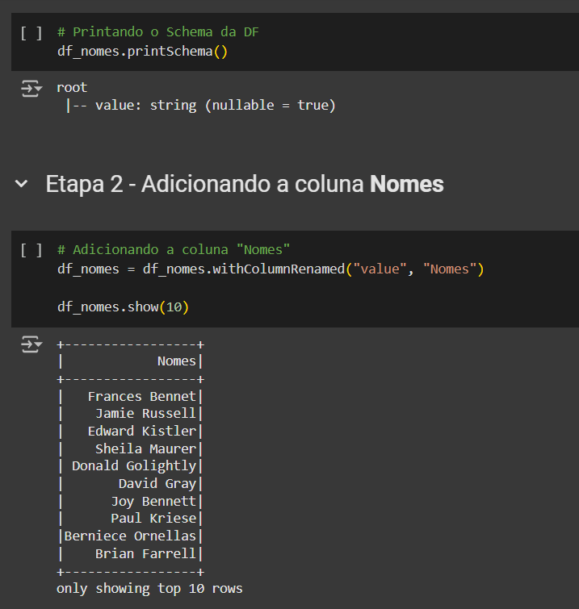

# Sprint 8
Nessa Sprint refinamos o nosso conhecimento no Apache Spark. Realizando exercícios e utilizamos a ferramenta glue da aws.

## Cursos
Não houve cursos obrigatórios nesssa Sprint

# Evidências
As evidências estão relacionadas ao exercicio e ao desafio da Sprint. São armazenadas, respectivamente, em [evidências dos exercicios](Exercicios/Evidencias_exercicios/) e [evidências do Desafio](Evidencias/)
Os exercicios serão explicados nesse readme e o Desafio será explicado no [Readme do desafio](Desafio/). As evidências seguem a baixo:
## Exercícios
**Observação:** Todos os exercícios foram feito usando o google colab 
### Exercicio 1 - Geração e massa de dados

#### Etapa 1
Criando uma lista com 250 números inteiros e aleatórios


#### Etapa 2

Criando uma lista com 20 nomes de animais e ordenando-a posteriormente. Armazenando esses animais em um arquivo csv, um em cada linha


#### Etapa 3

Instalando a biblioteca nomes


Criando um dataset com nomes aleatórios e armazenando-os em um arquivo txt, um em cada linha.


### Exercicio 2 - Apache Spark
Instalando o Spark no colab


Lendo o arquivo **nomes_aleatorios.txt** gerado na atividade anterios


Mostrando o Schema da tabela e alterando a caluna **value** para **Nomes**



Adicionando a coluna **Escolaridade**


Adicionando a coluna pais


Exibindo a coluna pais


Adicionando a coluna **AnoNascimento**


Listando a quantidade de pessoas que nasceram nesse século -XXI.


Repetindo a tarefa anterios, mas utilizando o SQL Spark


Mostrando a quantidade de pessoas da geração **Millenium**


Repetindo a atividade anterior, mas utilizando o SQL Spark


Obtendo as pessoas de cada pais e de cada geração usando o SQL Spark


Resultado do código anterior


### Exercicio 3 - TMDB
Esse exercicio foi realizado na Sprint anterior (Sprint 7).

Entrando do site do TMDB


Criando uma conta no TMDB


Perfil criado


Criando API


Modo developer da API


Código:

```py
import requests
import pandas as pd
from IPython.display import display

api_key = 'xxxxxxxxxxxxxxxxxxxxx'
url = f"https://api.themoviedb.org/3/movie/top_rated?api_key={api_key}&language=pt-BR"
response = requests.get (url)
data = response.json()

filmes = []

for movie in data['results']:
    df = {'Titulo': movie['title'],
    'Data de lançamento': movie['release_date'],
    'Visão geral': movie['overview'],
    'Votos' : movie['vote_count' ],
    "Média de votos:": movie['vote_average']}

    filmes.append(df)

df = pd. DataFrame(filmes)
display(df)
```

Resultado do código 


## Desafio

# Exercicios
**Observação:** Todos os exercícios realizados nessa Sprint foram feitos utilizando o **google colab**.

## Exercicio 1 - Geração e massa de dados
Nesse exercício devemos gerar dados a serem processados em cada etapa da atividade
### Etapa 1
Devemos criar e inicializar uma lista contendo 250 inteiros obtidos de forma aleatória. Após, aplicar o método reverse sobre o conteúdo da lista e imprimir o resultado.


### Etapa 2
declaramos e Inicializamos uma lista contendo o nome de 20 animais. Ordenamos em ordem
crescente e iteramos sobre os itens, imprimindo um a um. Na sequência,
armazenamos o conteúdo da lista em um arquivo de texto, um item em cada linha, na formato CSV.


[Arquivo csv](./Exercicios/animais.csv)

### Etapa 3
Agora devemos Elaborar um código Python para gerar um dataset de nomes de pessoas, devemos Seguir os passos a mostrados para realizar a atividade;

>Passo 1: Instalar biblioteca names para geração de nomes aleatórios, O comanda de instalação é pip install
names
>
>Passo 2: Importar as bibliotecas random, time, os e names em seu código
>
>Passo 3: Definir os parâmetros para geração da dataset, ou seja, a quantidades de names aleatários e a
quantidade de nomes que devem ser únicos.
>
>Define a semente de aleatoriedade

Primeiramente, vamos instalar a biblioteca nomes


A seguir o código que executará o resto dos passos citadoa a cima:


O Arquivo Ficara dá seguinte forma:


## Exercicio 2 - Apache Spark
Nesse exercicio iremos aplicar recursos de manipulação de dataframes usando o Apache Spark

### Etapa 1 - instalar o Apache Spark no colab


### Etapa 1.1
Agora com o apache instalado, devemos realizar a leitura do arquivo nomes_aleatorios.txt, criado no exercicio anterior.

Faremos isso com o seguinte código:


### Etapa 2
Ao fazermos a leitura do arquivo usando o Spark, ele definiu todas as colunas como Strings, vemos isso no comando ```df_nomes.printSchema()```

Posteriormente a isso, devemos renomear a coluna para **Nomes** e imprimir as 10 primeiras linhas. Faremos isso com o Seguite código:


### Etapa 3 - Adicionar a coluna Escolaridade
Aqui devemos criar uma nova coluna chamada **Escolaridade**, que receberá, de forma aleatória, os valores de: Fundamental, Médio e Superior

Assim ficará o código:


### Etapa 4 - Adicionando a coluba **Pais**
Igual ao exercício anterior, devemos criar uma coluna chamada **pais** e preencher de maneira aleatória com um dos 13 paises da America do Sul.

O código ficará assim:


E a tabela completa ficará assim:


### Etapa 5 - Adicionando a coluna AnoNascimento
Assim Como as etapas anteriores, devemos criar uma nova coluna que receberá valores aleatórios entre os anos de 1945 e 2010.

O código ficará da seguinte maneira:


### Etapa 6 - Selecionando as pessoas que nasceram nesse século
Agora, usando o select, devemos selecionar as pessoas que nasceram nesse seculo e armazenar em outro dataframe.

O Script ficará dessa forma:


### Etapa 7 - Selecionando as pessoas que nasceram nesse Século, mas udando o Spark SQL
Nessa etapa, será realizado o mesmo exercício da etapa anterior (Etapa 6), Porém utilizando o Spark SQL

Sendo assim, o Script ficará da seguinte forma:


### Etapa 8 - Quantidade de pessoas da geração Millennials
Utilizando o método filter, vamos contar a quantidade de pessoas da geração Y (Millennials), nascidad entre os anos de 1980 e 1994.

Código:


### Etapa 9
Aqui faremos a mesma coisa realizada na **etapa 8**, porém utilizando o Spark SQL

Código:


### Etapa 10 - Quantidade de pessoas por pais e geração
Usando Spark SQL, obtenha a quantidade de pessoas de cada pais para cada uma das gerações abaixo. Armazene o
resultado em um novo dataframe e depois mostre todas as linhas em ordem crescente de Pais, Geração e Quantidade.

> Baby Boomers - nascidos entre 1944 e 1964;

> Geração X - nascidos entre 1965 e 1979;

> Millennials (Geração Y) - nascidos entre 1980 e 1994;

> Geração Z - nascidos entre 1995 e 2015.

Script:


Resultado do Script:


## Exercício 3 - TMDB
Nesse exercicio devemos realizar uma extração usando a api do TMDB

Primeiramente, vamos acessar o site do tmdb


Agora devemos criar uma conta


Depois que a conta foi criada devemos criar a nossa API

Perfil: 


Criando api


Configurado a api


Depois de criada, vamos testar a api do tmdb

Com o seguinte código:
```py
import requests
import pandas as pd
from IPython.display import display

api_key = 'xxxxxxxxxxxxxxxxxxxxxxxxxxxxxxx'
url = f"https://api.themoviedb.org/3/movie/top_rated?api_key={api_key}&language=pt-BR"
response = requests.get (url)
data = response.json()

filmes = []

for movie in data['results']:
    df = {'Titulo': movie['title'],
    'Data de lançamento': movie['release_date'],
    'Visão geral': movie['overview'],
    'Votos' : movie['vote_count' ],
    "Média de votos:": movie['vote_average']}

    filmes.append(df)

df = pd. DataFrame(filmes)
display(df)
```

Vamos listar os filmes presentes no tmdb, a saída do código será:


# Certificados
Não houve certificados da AWS nessa Sprint. 