# Desafio
Nessa Sprint estaremos realizando a quarta entrega do desafio final. Essa etapa é basicamente o refinamento dos dados encontrados na camada **Trusted** e enviarmos esses dados já refinados à camada **Refined** 

> A camada Refined corresponde à camada de um data lake em que os
dados estão prontos para análise e extração de insights. Sua origem corresponde aos dados da camada anterior,
a Trusted.

# Etapa 1 Criando o modelo Dimensional
Aqui realizaremos a criação do modelo dimensional e a tabela fato do nosso banco de dados de filmes.

A criação tem em vista, visualizarmos apenas as colunas que usaremos em nossa análise.

Com base nisso, o nosso modelo dimensional ficou assim:


**Modelo feito no dbeaver**


# Etapa 2 Criando o job no Glue
Para iniciarmos, criaremos um job no glue que pegará o arquivo parquet armazenado na camada Trusted de um Bucket

Pesquisamos o glue na aws

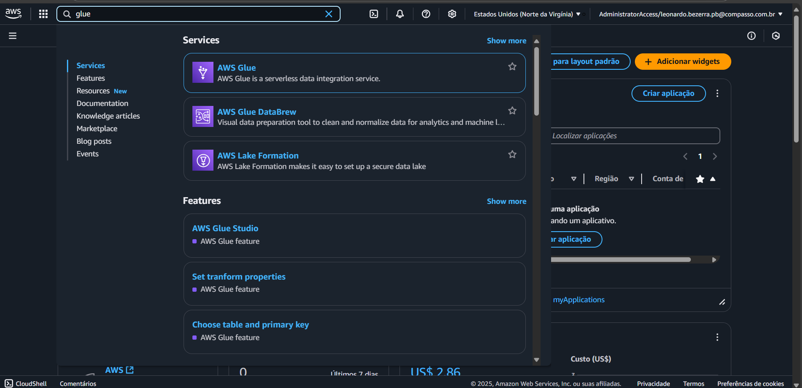

Dentro da interface do glue, criaremos um job

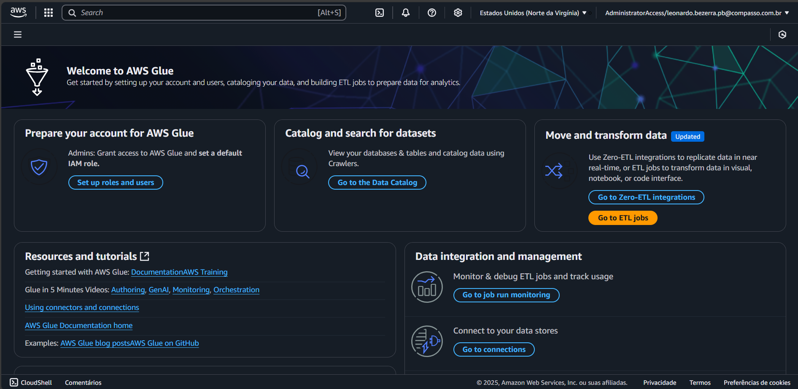


Com o job Criado, faremos o script que criará as tabelas e enviará para a camada Refined

Código:
```py
import sys
from awsglue.transforms import *
from awsglue.utils import getResolvedOptions
from pyspark.context import SparkContext
from awsglue.context import GlueContext
from awsglue.job import Job
from pyspark.sql.functions import col, explode, expr
import datetime

# Configurações do Glue Job
args = getResolvedOptions(sys.argv, ["JOB_NAME"])
sc = SparkContext()
glueContext = GlueContext(sc)
spark = glueContext.spark_session
job = Job(glueContext)
job.init(args["JOB_NAME"], args)

# Caminho do arquivo Parquet no S3
nomeBucket = "data-lake-do-leonardo"
bucket = f"s3://{nomeBucket}/Trusted/TMDB/PARQUET/comedia_animacao/2025/01/23/part-00000-fb266c25-5dc4-405c-9623-c4e14fd62f28-c000.snappy.parquet"

# Lendo o arquivo Parquet
df = spark.read.parquet(bucket)

# Criando DimFilmes
dim_filmes = df.selectExpr(
    "tmdb_id",
    "tituloPincipal AS titulo_original",
    "genero_principal"
).dropDuplicates()

# Criando DimDiretor
dim_diretor = df.selectExpr(
    "ROW_NUMBER() OVER (ORDER BY diretor) AS id_diretor",
    "diretor AS nome_diretor"
).dropDuplicates(["nome_diretor"])

# Criando DimAtores
dim_atores = df.select(explode("principais_atores").alias("nome_ator")) \
    .dropDuplicates() \
    .withColumn("id_ator", expr("ROW_NUMBER() OVER (ORDER BY nome_ator)"))

# Criando DimPais
dim_pais = df.select(explode("pais_producao").alias("nome_pais")) \
    .dropDuplicates() \
    .withColumn("id_pais", expr("ROW_NUMBER() OVER (ORDER BY nome_pais)"))

# Criando FatoFilme e explodindo as listas
df_exploded_pais_atores = df.withColumn("pais", explode(df["pais_producao"])) \
                            .withColumn("ator", explode(df["principais_atores"]))

# join com as tabelas de fato
fato_filme = df_exploded_pais_atores \
    .join(dim_diretor, df["diretor"] == dim_diretor["nome_diretor"], "left") \
    .join(dim_pais, df_exploded_pais_atores["pais"] == dim_pais["nome_pais"], "left") \
    .join(dim_atores, df_exploded_pais_atores["ator"] == dim_atores["nome_ator"], "left") \
    .withColumn("id_filme", expr("ROW_NUMBER() OVER (ORDER BY tmdb_id)")) \
    .selectExpr(
        "id_filme",
        "tmdb_id",
        "id_diretor",
        "anoLancamento AS ano_lancamento",
        "nota_media",
        "faturamento",
        "orcamento",
        "popularidade",
        "id_pais",
        "id_ator"
    )

# Obtendo a data atual
data_atual = datetime.datetime.now()
ano = data_atual.year
mes = data_atual.month
dia = data_atual.day

# Caminho de saída para dimensões e fato
diretorioDim = f"s3://{nomeBucket}/Refined/dim/PARQUET/{ano}/{mes:02d}/{dia:02d}/"
diretorioFato = f"s3://{nomeBucket}/Refined/fato/PARQUET/{ano}/{mes:02d}/{dia:02d}/"

# salvar no S3
def enviar_arquivo(df, table_name, output_path):
    df.write.mode("overwrite").parquet(f"{output_path}{table_name}.parquet")

# Enviar as tabelas para o bucket
enviar_arquivo(dim_filmes, "DimFilmes", diretorioDim)
enviar_arquivo(dim_diretor, "DimDiretor", diretorioDim)
enviar_arquivo(dim_atores, "DimAtores", diretorioDim)
enviar_arquivo(dim_pais, "DimPais", diretorioDim)

enviar_arquivo(fato_filme, "FatoFilme", diretorioFato)

job.commit()
```
Com isso salvamos e executamos o job


Antes de executarmos, podemos ver que o Bucket está sem nehum diretório chamado **Refined**


Então, executamos o job


Ao ser executado com sucesso, o mesmo criará o diretorio **Refined** e suas demais pastas 

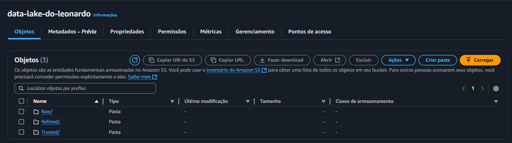

Criará uma pasta que seguirá esse caminho, separada por **dim/** e **fato/**
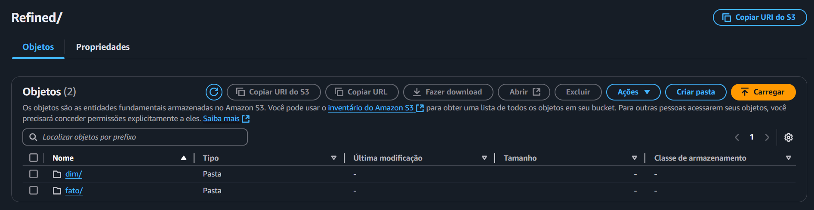

Tipo de arquivo


ano


mes

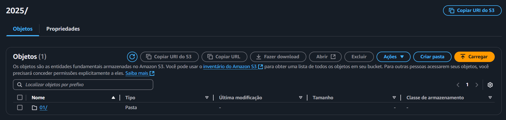

dia

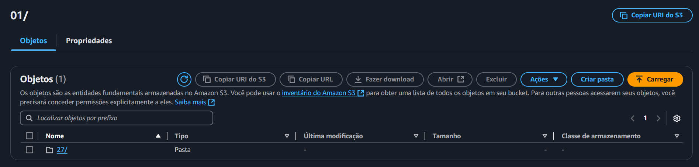

Arquivos que compõem a tabela dim

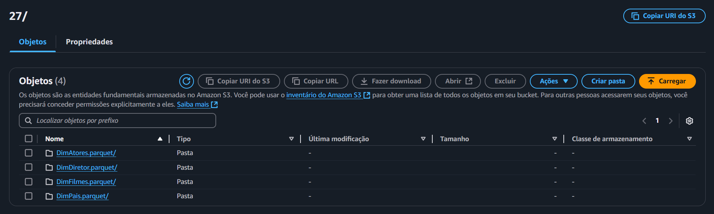

o arquivo que compoe a tabela fato também tem o seu caminho igual à o modelo Dimensional.

Sendo ele:

**Refined/fato/Parquet/ano/mes/dia/<arquivo.parquet>/**

Ao final ficará assim:


# Etapa 3 Criando o crawler
Aqui realizaremos a criação do crawler para a visualização das tabelas no Athena

Criando um crawler 


Configurando o crawler 

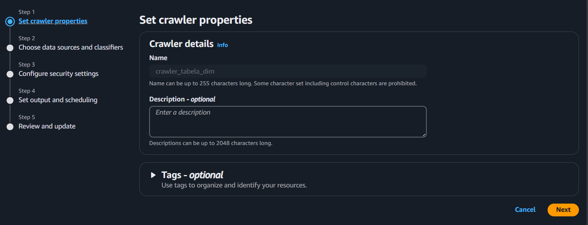

Indicando os caminhos onde estão localizados os arquivos no S3


Após criamos e configurarmos o crawler, vamos executa-lo

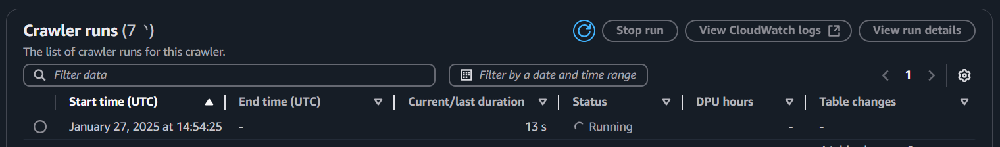

Crawler rodado com sucesso

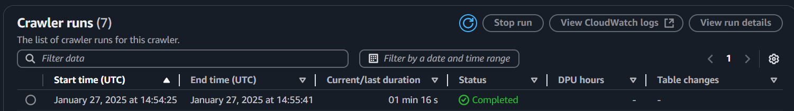

# Etapa 4 Conferindo as tabelas no Amazon Athena
Aqui iremos conferir as tabelas no AWS Athena

Podemos ver que as tabelas dimensionais foram criadas
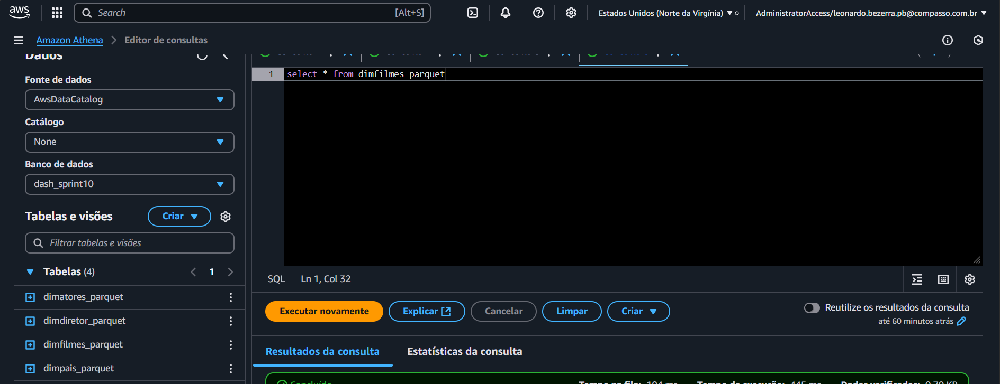

Após executarmos a query que está na imagem a cima, isso é apresentado


# Etapa 5 - Criando um crawler para a tabela fato
Aqui repetiremos a **etapa 3** para criarmos um crawler que pegará o arquivo da tabela fato

Após a criação do mesmo, executaremos o crawler


Após ser executado, conferimos sua criação no AWS Athena


Com isso podemos ver que a tabela foi criada com sucesso.

Agora com uma simples query, mostraremos os resultados dessa tabela:

```select distinct * from fatofilme_parquet;```

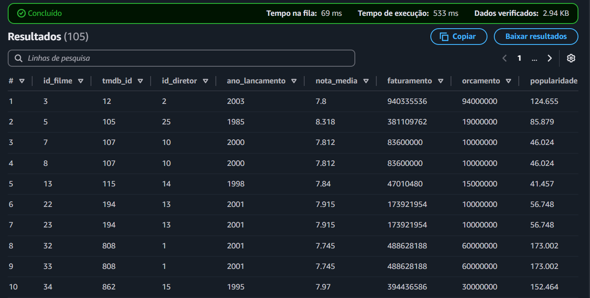

Com isso o desafio é finalizado.