# Sprint 9
Nessa Sprint elaboramos as demais entregas do desafio final, mais esoecificamente a quarta entrega, que seria o refinamento dos dados da camada Trusted

**Nessa Sprint não houve certificados ou exercicios**

# Evidências
As evidências a seguir estão relacionadas a pasta [Desafio](./Desafio/)

Modelo dimensional e tabela fato

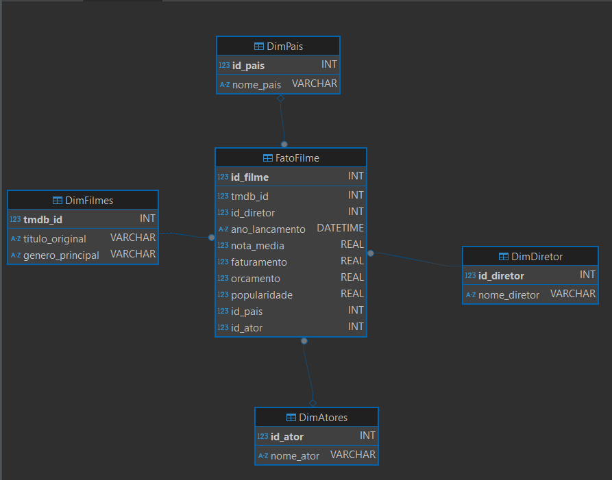

Pesquisando o Glue na AWS

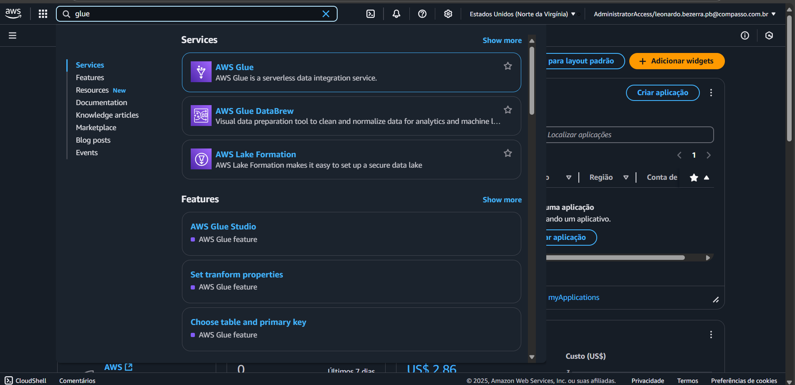

Tela de inicio do Glue

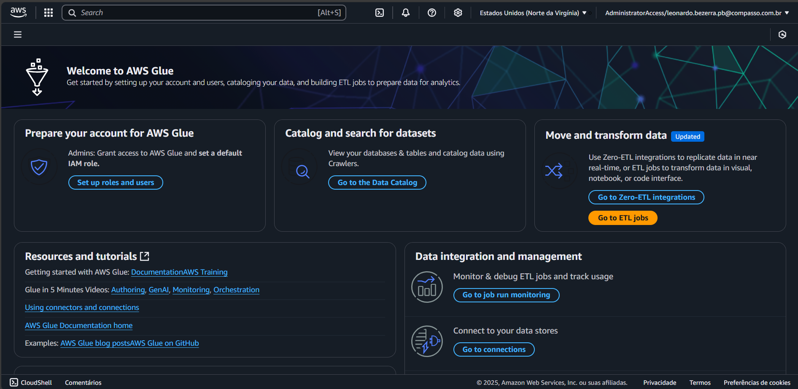

Criando job no Glue

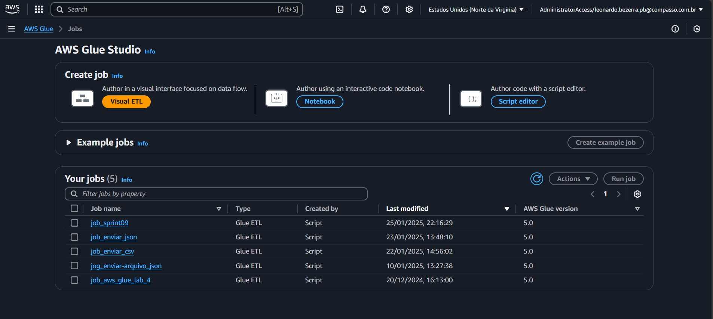

Job criando

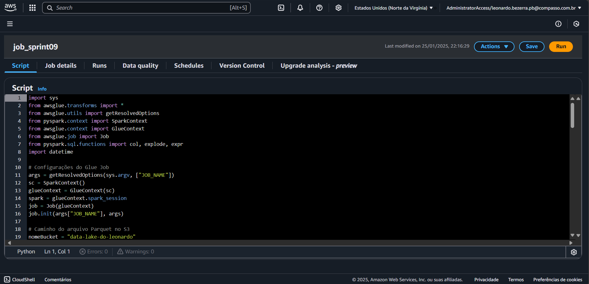

Bucket antes da execução do job

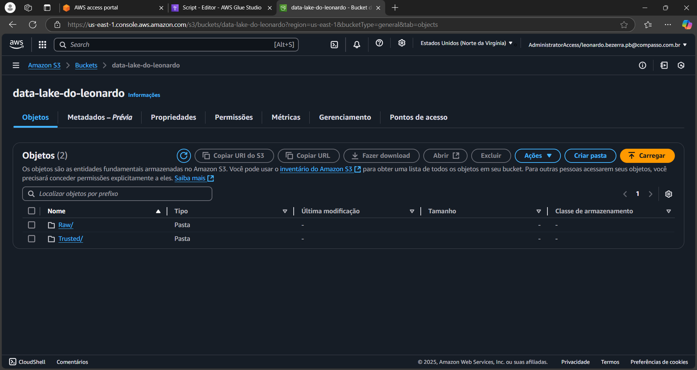

Executando job

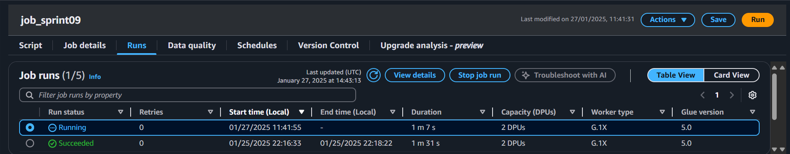

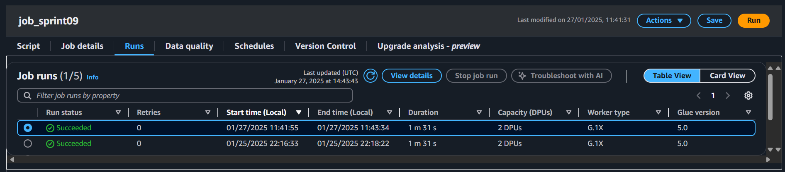

Caminho até os arquivos gerados 

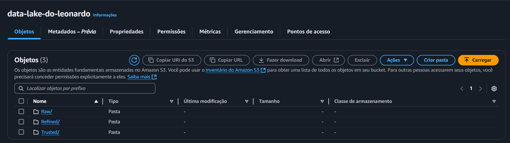

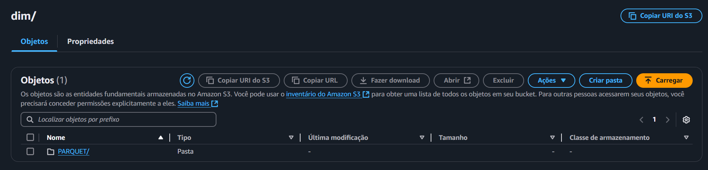

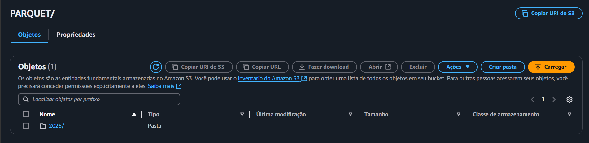

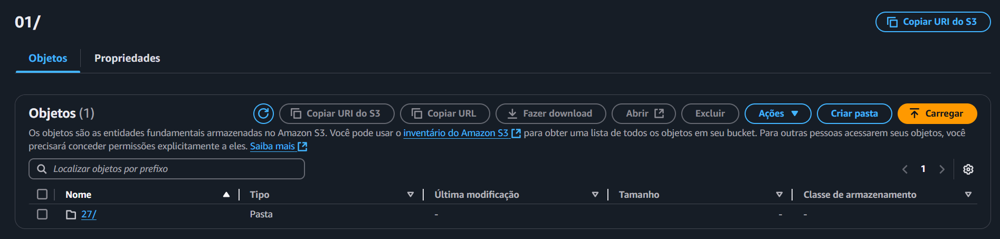

Criando crawler

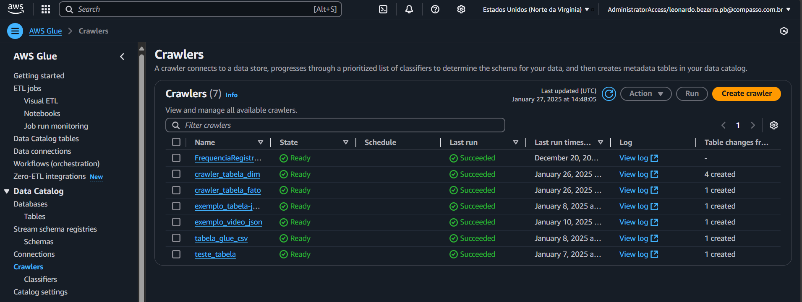

Configurando o crawler

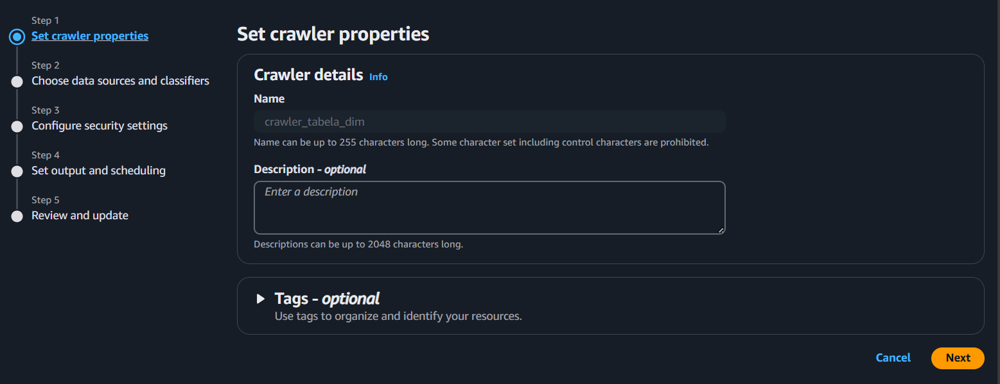

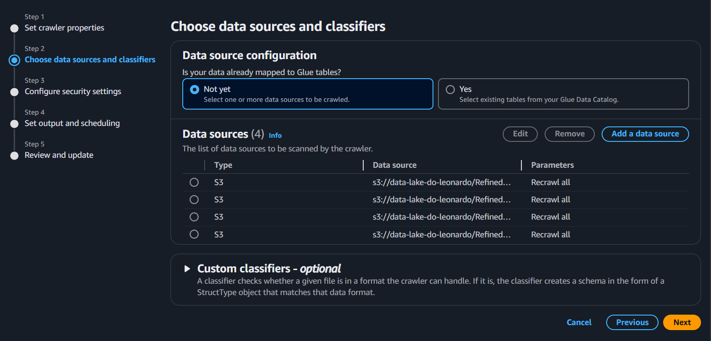

Executando crawler

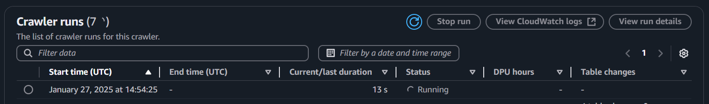

Crawler rodado com sucesso

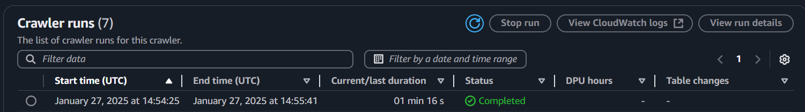

Tabelas dimensionais criadas no Amazon Athena

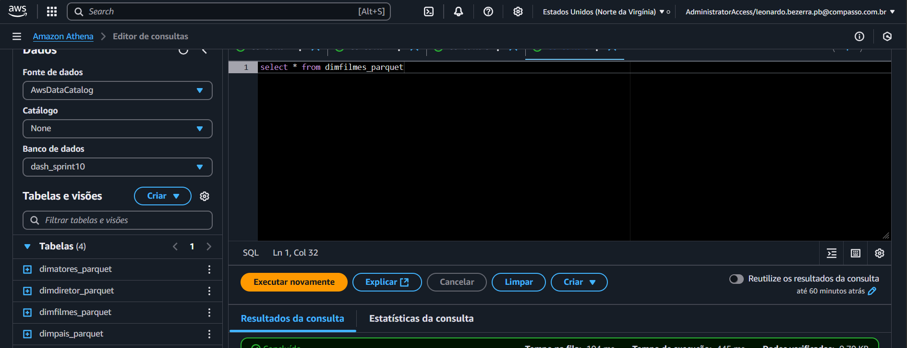

Resultado da tabela filmes

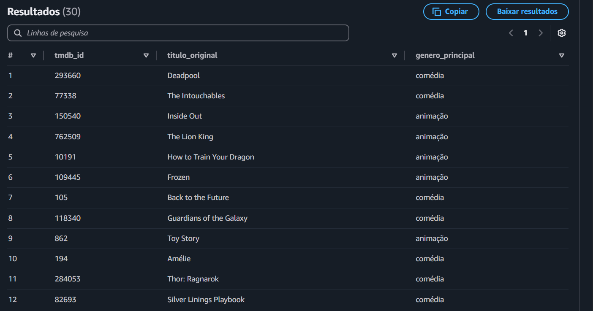

Rodando o crawler da tabela fato

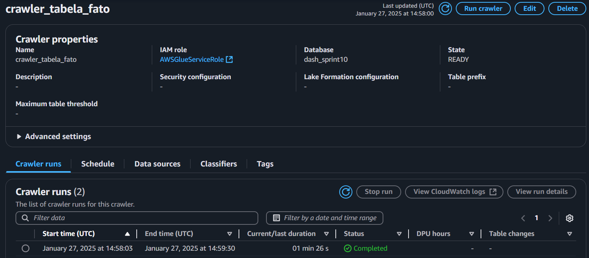

Tabela fato criada

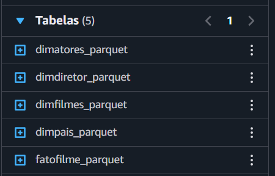

Resultado da tabela fato

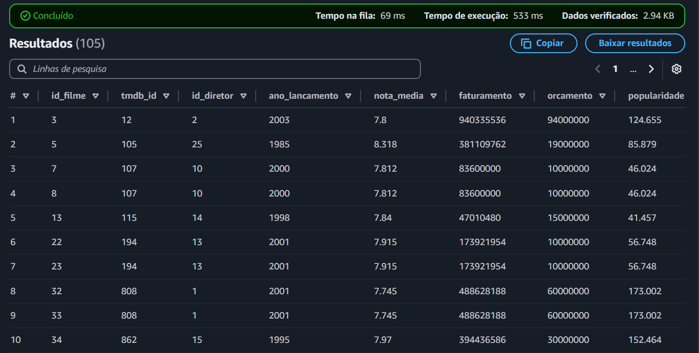

# certificados
Não houve certificados e/ou cursos nessa Sprint