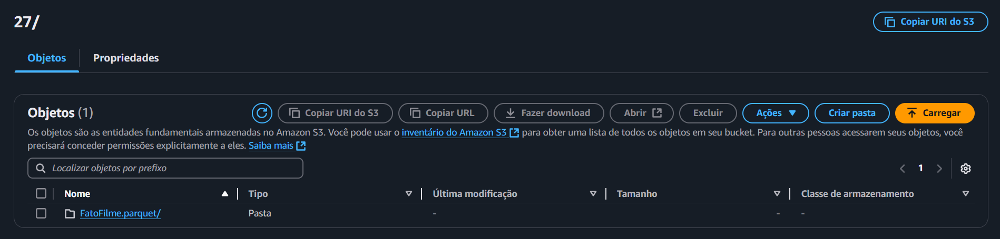

# Sprint 9
Nessa Sprint elaboramos as demais entregas do desafio final, mais esoecificamente a quarta entrega, que seria o refinamento dos dados da camada Trusted

**Nessa Sprint não houve certificados ou exercicios**

# Evidências
As evidências a seguir estão relacionadas a pasta [Desafio](./Desafio/)

Modelo dimensional e tabela fato

Pesquisando o Glue na AWS

Tela de inicio do Glue

Criando job no Glue

Job criando

Bucket antes da execução do job

Executando job

Caminho até os arquivos gerados 

Criando crawler

Configurando o crawler

Executando crawler

Crawler rodado com sucesso

Tabelas dimensionais criadas no Amazon Athena

Resultado da tabela filmes

Rodando o crawler da tabela fato

Tabela fato criada

Resultado da tabela fato

# certificados
Não houve certificados e/ou cursos nessa Sprint